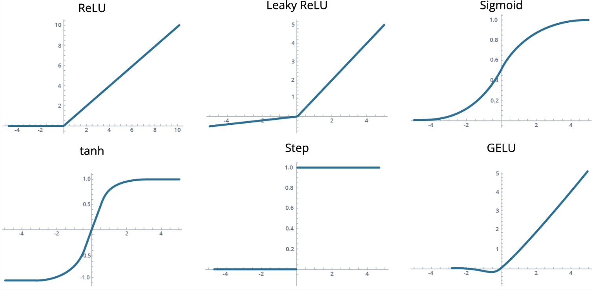
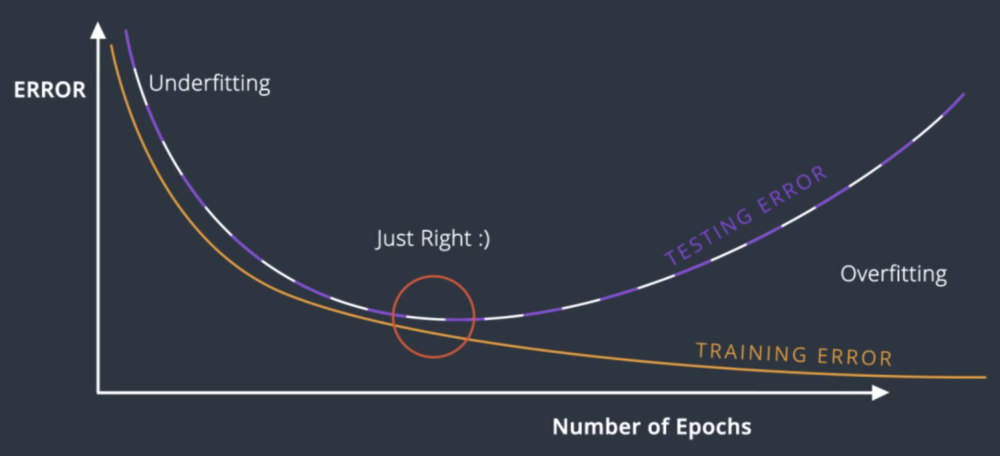

# S-1: Introduction to Deep Learning

# C-1: Foundations of Deep Learning Theory

1. Introduction to Deep Learning
    - Relationship Between AI, ML, and Deep Learning
    - Deep Learning Lifecycle
    - Training Tools and Management
    - When to Use Deep Learning vs Traditional ML
2. Understanding Error Functions and Optimization
    - Error Function Fundamentals
    - Log-Loss and Cross-Entropy
    - Maximum Likelihood Estimation
    - Gradient Calculation Principles
3. Gradient Descent and Backpropagation
    - Gradient Descent Algorithm
    - Types of Gradient Descent
    - Backpropagation Mechanics
    - Weight Update Processes
4. Neural Network Architecture
    - Perceptrons and Their Limitations
    - Multilayer Perceptrons (MLPs)
    - Feedforward Networks
    - Decision Boundaries and Network Complexity

#### Introduction to Deep Learning

Deep learning represents a specialized subset of machine learning that focuses on neural network models with multiple
layers. To fully grasp deep learning, we need to understand its position within the broader landscape of artificial
intelligence and explore when and how to apply these powerful techniques.

##### Relationship Between AI, ML, and Deep Learning

The relationship between Artificial Intelligence (AI), Machine Learning (ML), and Deep Learning (DL) can be understood
as nested fields, with each representing a more specialized approach:

- **Artificial Intelligence (AI)**: The broadest field encompassing various algorithmic approaches designed to create
  systems that can perform tasks requiring human-like intelligence. This includes techniques like local search
  algorithms, logic programming, and rule-based systems.
- **Machine Learning (ML)**: A subset of AI focusing on specific modeling techniques that allow computers to learn from
  data without being explicitly programmed. This includes approaches like logistic regression, decision trees, and
  support vector machines.
- **Deep Learning (DL)**: A specialized subset of ML specifically focused on neural network models with multiple layers
  (hence "deep"). These models can automatically learn hierarchical representations of data, enabling them to tackle
  highly complex tasks.

##### Deep Learning Lifecycle

The deep learning lifecycle consists of several distinct phases that take a model from conception to deployment:

1. **Problem Definition**: We begin by clearly articulating what we're trying to solve and how we'll measure success.
2. **Development**: This is where the code gets written and the model architecture is designed.
3. **Training**: The critical phase where our model learns patterns from our data through iterative optimization.
4. **Deployment**: When our trained model goes out into the world for practical use. This often involves collaboration
   with front-end developers.
5. **Monitoring**: Continuous evaluation of the model's performance in production to identify potential issues and
   opportunities for improvement.

For our purposes, we'll focus primarily on the development and training phases of deep learning models.

##### Training Tools and Management

Effective development of deep learning models requires specialized tools for experiment tracking and model versioning:

1. **Experiment Management Tools**:
    - TensorBoard: A visualization toolkit that allows observation of accuracy and loss metrics during training
    - Weights and Biases: A platform for tracking experiments, visualizing results, and comparing model performance
2. **Model Versioning Tools**:
    - DVC (Data Version Control): Similar to Git but specialized for machine learning models and datasets
    - Neptune: A metadata store for MLOps
    - Pachyderm: A platform for data lineage and model versioning

These tools help maintain organization and reproducibility in the often complex and iterative process of model
development.

##### When to Use Deep Learning vs Traditional ML

Deep learning is powerful but not always the optimal choice. Understanding when to apply it requires consideration of
several factors:

**Task Types and Appropriateness**:

- **Classification Tasks**:
    - For binary classification with complex decision boundaries, deep learning excels
    - For simpler boundaries, alternatives like logistic regression, decision trees, or SVMs may be sufficient
- **Multi-class Classification**:
    - Deep learning works well with complex patterns and many classes
    - Traditional methods like decision trees or SVMs may be adequate for simpler problems
- **Regression Tasks**:
    - Deep learning handles non-linear relationships effectively
    - Linear regression or decision trees may work better for simpler relationships

**Data Considerations**:

- **By Data Type**:
    - Images: Deep learning (particularly CNNs) typically excels
    - Text: Deep learning approaches (Transformers, RNNs) are generally preferred
    - Tabular data: Traditional ML methods often perform better
- **By Dataset Size**:
    - Large datasets: Deep learning thrives with abundant data
    - Small datasets: Traditional ML methods usually perform better

**When to Use Deep Learning**:

- When dealing with complex, non-linear patterns
- When large amounts of data are available
- For unstructured data like images or text
- When automatic feature extraction is needed
- When state-of-the-art performance is required

**When to Avoid Deep Learning**:

- With small datasets
- When model interpretability is essential
- For simple, linear relationships
- With limited computational resources
- When quick iteration is required

A fundamental principle to remember is to start with the simplest solution that might work. Consider deep learning only
after simpler approaches have proven inadequate for your specific problem.

#### Understanding Error Functions and Optimization

Error functions and optimization techniques form the mathematical foundation of how neural networks learn from data.
Understanding these concepts is essential for effectively training deep learning models.

##### Error Function Fundamentals

Error functions (also called loss or cost functions) measure how far our model's predictions are from the true values.
They provide a quantitative way to assess model performance and guide the learning process.

An error function is simply a mathematical formula that measures the distance between our current predictions and the
desired outputs. The fundamental goal in training neural networks is to minimize this error function through an
iterative process.

When using error functions, we need to ensure they have certain properties:

1. They must be continuous to allow for small, incremental improvements
2. They should be differentiable to enable gradient-based optimization
3. They generally need to be non-negative, reaching zero only with perfect predictions

The choice of error function depends significantly on the type of problem we're solving:

- For regression tasks (predicting continuous values), functions like Mean Squared Error (MSE) or Mean Absolute Error
  (MAE) are appropriate
- For classification tasks (predicting categories), functions like Log-Loss or Cross-Entropy are more suitable

For regression problems, the Mean Squared Error can be expressed as:

$$MSE = \frac{1}{n} \sum_{i=1}^{n} (y_{true} - y_{pred})^2$$

This formula squares the differences between predictions and actual values, which both penalizes larger errors more
heavily and ensures the error is always positive.

##### Log-Loss and Cross-Entropy

Log-Loss (logarithmic loss) and Cross-Entropy are closely related error functions primarily used for classification
problems. They measure the performance of a model whose output is a probability value between 0 and 1.

For binary classification, the binary cross-entropy or log-loss function is defined as:

$$L(y, \hat{y}) = -\frac{1}{N} \sum_{i=1}^{N} [y_i \log(\hat{y}_i) + (1-y_i) \log(1-\hat{y}_i)]$$

Where:

- $N$ is the number of samples
- $y_i$ is the true label (0 or 1)
- $\hat{y}_i$ is the predicted probability of the positive class

This function heavily penalizes confident but incorrect predictions. For instance, if the true label is 1 but our model
predicts a probability of 0.01, the loss will be very high.

For multi-class classification problems, the formula extends to:

$$L(y, \hat{y}) = -\frac{1}{N} \sum_{i=1}^{N} \sum_{j=1}^{M} y_{ij} \log(\hat{y}_{ij})$$

Where:

- $M$ is the number of classes
- $y_{ij}$ is 1 if sample $i$ belongs to class $j$, and 0 otherwise
- $\hat{y}_{ij}$ is the predicted probability that sample $i$ belongs to class $j$

Cross-entropy is particularly useful because it:

- Provides a probabilistic interpretation of our model's output
- Is differentiable, making it suitable for gradient-based optimization
- Handles imbalanced datasets more effectively than some alternatives
- Produces smoother gradients compared to discrete error measures

##### Maximum Likelihood Estimation

Maximum Likelihood Estimation (MLE) provides a statistical framework that helps us understand why certain error
functions are appropriate for certain tasks. It's particularly relevant for understanding the connection between the
sigmoid function and cross-entropy loss.

The core idea of MLE is to find the parameters that maximize the likelihood of observing our training data. For binary
classification using a sigmoid function:

$$\sigma(z) = \frac{1}{1 + e^{-z}}$$

We model the probability of the positive class as:

$$P(Y=1|X) = \sigma(w^TX + b)$$

The likelihood function for a dataset with $n$ independent samples is:

$$L(w, b) = \prod_{i=1}^n P(Y=y_i|X_i) = \prod_{i=1}^n [\sigma(w^TX_i + b)]^{y_i} [1 - \sigma(w^TX_i + b)]^{(1-y_i)}$$

Taking the logarithm (which doesn't change the position of the maximum but simplifies calculations), we get the
log-likelihood:

$$\ell(w, b) = \sum_{i=1}^n [y_i \log(\sigma(w^TX_i + b)) + (1-y_i) \log(1 - \sigma(w^TX_i + b))]$$

Maximizing this log-likelihood is mathematically equivalent to minimizing the negative log-likelihood, which is
precisely the cross-entropy loss function. This provides a theoretical justification for using cross-entropy loss with
sigmoid activation for binary classification.

##### Gradient Calculation Principles

To minimize our error function, we need to calculate its gradient with respect to our model parameters. The gradient is
a vector that points in the direction of steepest increase of the error function, so moving in the opposite direction
leads to a decrease in error.

For logistic regression with the sigmoid function, the derivative of the sigmoid has a convenient form:

$$\sigma'(x) = \sigma(x)(1 - \sigma(x))$$

This can be proven using the quotient rule:

$$\sigma'(x) = \frac{\partial}{\partial x} \left[\frac{1}{1 + e^{-x}}\right] = \frac{e^{-x}}{(1 + e^{-x})^2} = \frac{1}{1 + e^{-x}} \cdot \frac{e^{-x}}{1 + e^{-x}} = \sigma(x)(1 - \sigma(x))$$

For a single training example in binary classification, the gradient of the cross-entropy error with respect to a weight
$w_j$ is:

$$\frac{\partial E}{\partial w_j} = -(y - \hat{y})x_j$$

And the gradient with respect to the bias is:

$$\frac{\partial E}{\partial b} = -(y - \hat{y})$$

These elegant formulas tell us that the magnitude of the gradient depends on:

1. How wrong our prediction is (the difference between $y$ and $\hat{y}$)
2. The value of the input feature $x_j$ (for weight updates)

With these gradients calculated, we can update our model parameters using gradient descent:

$$w_j := w_j - \alpha \frac{\partial E}{\partial w_j} = w_j + \alpha(y - \hat{y})x_j$$
$$b := b - \alpha \frac{\partial E}{\partial b} = b + \alpha(y - \hat{y})$$

Where $\alpha$ is the learning rate that controls the size of our steps.

Understanding these gradient calculations is essential because they form the foundation of how neural networks learn
through backpropagation, which extends these principles to multiple layers using the chain rule of calculus.

   
   
Figure: AI, ML, and DL Relationship

   
   
Figure: Cross-Entropy Visualization

   
   
Figure: Perceptron Structure

   
   
Figure: Step Function Visualization

   
   
Figure: MLP Structure

   
   
Figure: Backpropagation Network

   
   
Figure: MLP Structure

   
   
Figure: Activation Functions

   
   
Figure: Model Complexity Graph

   
   
Figure: Activation Functions

   
   
Figure: Certain Function

   
   
Figure: Regularization Penalty Visualization

   
   
Figure: Training Board Visualization

   
   
Figure: Activation Functions

