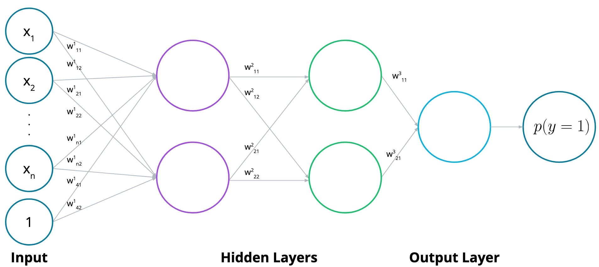

# S-1: Introduction to Deep Learning

# C-1: Foundations of Deep Learning Theory

1. Introduction to Deep Learning
    - Relationship Between AI, ML, and Deep Learning
    - Deep Learning Lifecycle
    - Training Tools and Management
    - When to Use Deep Learning vs Traditional ML
2. Understanding Error Functions and Optimization
    - Error Function Fundamentals
    - Log-Loss and Cross-Entropy
    - Maximum Likelihood Estimation
    - Gradient Calculation Principles
3. Gradient Descent and Backpropagation
    - Gradient Descent Algorithm
    - Types of Gradient Descent
    - Backpropagation Mechanics
    - Weight Update Processes
4. Neural Network Architecture
    - Perceptrons and Their Limitations
    - Multilayer Perceptrons (MLPs)
    - Feedforward Networks
    - Decision Boundaries and Network Complexity

#### Introduction to Deep Learning

Deep learning represents a specialized subset of machine learning that focuses on neural network models with multiple
layers. To fully grasp deep learning, we need to understand its position within the broader landscape of artificial
intelligence and explore when and how to apply these powerful techniques.

##### Relationship Between AI, ML, and Deep Learning

The relationship between Artificial Intelligence (AI), Machine Learning (ML), and Deep Learning (DL) can be understood
as nested fields, with each representing a more specialized approach:

- **Artificial Intelligence (AI)**: The broadest field encompassing various algorithmic approaches designed to create
  systems that can perform tasks requiring human-like intelligence. This includes techniques like local search
  algorithms, logic programming, and rule-based systems.
- **Machine Learning (ML)**: A subset of AI focusing on specific modeling techniques that allow computers to learn from
  data without being explicitly programmed. This includes approaches like logistic regression, decision trees, and
  support vector machines.
- **Deep Learning (DL)**: A specialized subset of ML specifically focused on neural network models with multiple layers
  (hence "deep"). These models can automatically learn hierarchical representations of data, enabling them to tackle
  highly complex tasks.

##### Deep Learning Lifecycle

The deep learning lifecycle consists of several distinct phases that take a model from conception to deployment:

1. **Problem Definition**: We begin by clearly articulating what we're trying to solve and how we'll measure success.
2. **Development**: This is where the code gets written and the model architecture is designed.
3. **Training**: The critical phase where our model learns patterns from our data through iterative optimization.
4. **Deployment**: When our trained model goes out into the world for practical use. This often involves collaboration
   with front-end developers.
5. **Monitoring**: Continuous evaluation of the model's performance in production to identify potential issues and
   opportunities for improvement.

For our purposes, we'll focus primarily on the development and training phases of deep learning models.

##### Training Tools and Management

Effective development of deep learning models requires specialized tools for experiment tracking and model versioning:

1. **Experiment Management Tools**:
    - TensorBoard: A visualization toolkit that allows observation of accuracy and loss metrics during training
    - Weights and Biases: A platform for tracking experiments, visualizing results, and comparing model performance
2. **Model Versioning Tools**:
    - DVC (Data Version Control): Similar to Git but specialized for machine learning models and datasets
    - Neptune: A metadata store for MLOps
    - Pachyderm: A platform for data lineage and model versioning

These tools help maintain organization and reproducibility in the often complex and iterative process of model
development.

##### When to Use Deep Learning vs Traditional ML

Deep learning is powerful but not always the optimal choice. Understanding when to apply it requires consideration of
several factors:

**Task Types and Appropriateness**:

- **Classification Tasks**:
    - For binary classification with complex decision boundaries, deep learning excels
    - For simpler boundaries, alternatives like logistic regression, decision trees, or SVMs may be sufficient
- **Multi-class Classification**:
    - Deep learning works well with complex patterns and many classes
    - Traditional methods like decision trees or SVMs may be adequate for simpler problems
- **Regression Tasks**:
    - Deep learning handles non-linear relationships effectively
    - Linear regression or decision trees may work better for simpler relationships

**Data Considerations**:

- **By Data Type**:
    - Images: Deep learning (particularly CNNs) typically excels
    - Text: Deep learning approaches (Transformers, RNNs) are generally preferred
    - Tabular data: Traditional ML methods often perform better
- **By Dataset Size**:
    - Large datasets: Deep learning thrives with abundant data
    - Small datasets: Traditional ML methods usually perform better

**When to Use Deep Learning**:

- When dealing with complex, non-linear patterns
- When large amounts of data are available
- For unstructured data like images or text
- When automatic feature extraction is needed
- When state-of-the-art performance is required

**When to Avoid Deep Learning**:

- With small datasets
- When model interpretability is essential
- For simple, linear relationships
- With limited computational resources
- When quick iteration is required

A fundamental principle to remember is to start with the simplest solution that might work. Consider deep learning only
after simpler approaches have proven inadequate for your specific problem.

#### Understanding Error Functions and Optimization

Error functions and optimization techniques form the mathematical foundation of how neural networks learn from data.
Understanding these concepts is essential for effectively training deep learning models.

##### Error Function Fundamentals

Error functions (also called loss or cost functions) measure how far our model's predictions are from the true values.
They provide a quantitative way to assess model performance and guide the learning process.

An error function is simply a mathematical formula that measures the distance between our current predictions and the
desired outputs. The fundamental goal in training neural networks is to minimize this error function through an
iterative process.

When using error functions, we need to ensure they have certain properties:

1. They must be continuous to allow for small, incremental improvements
2. They should be differentiable to enable gradient-based optimization
3. They generally need to be non-negative, reaching zero only with perfect predictions

The choice of error function depends significantly on the type of problem we're solving:

- For regression tasks (predicting continuous values), functions like Mean Squared Error (MSE) or Mean Absolute Error
  (MAE) are appropriate
- For classification tasks (predicting categories), functions like Log-Loss or Cross-Entropy are more suitable

For regression problems, the Mean Squared Error can be expressed as:

$$MSE = \frac{1}{n} \sum_{i=1}^{n} (y_{true} - y_{pred})^2$$

This formula squares the differences between predictions and actual values, which both penalizes larger errors more
heavily and ensures the error is always positive.

##### Log-Loss and Cross-Entropy

Log-Loss (logarithmic loss) and Cross-Entropy are closely related error functions primarily used for classification
problems. They measure the performance of a model whose output is a probability value between 0 and 1.

For binary classification, the binary cross-entropy or log-loss function is defined as:

$$L(y, \hat{y}) = -\frac{1}{N} \sum_{i=1}^{N} [y_i \log(\hat{y}_i) + (1-y_i) \log(1-\hat{y}_i)]$$

Where:

- $N$ is the number of samples
- $y_i$ is the true label (0 or 1)
- $\hat{y}_i$ is the predicted probability of the positive class

This function heavily penalizes confident but incorrect predictions. For instance, if the true label is 1 but our model
predicts a probability of 0.01, the loss will be very high.

For multi-class classification problems, the formula extends to:

$$L(y, \hat{y}) = -\frac{1}{N} \sum_{i=1}^{N} \sum_{j=1}^{M} y_{ij} \log(\hat{y}_{ij})$$

Where:

- $M$ is the number of classes
- $y_{ij}$ is 1 if sample $i$ belongs to class $j$, and 0 otherwise
- $\hat{y}_{ij}$ is the predicted probability that sample $i$ belongs to class $j$

Cross-entropy is particularly useful because it:

- Provides a probabilistic interpretation of our model's output
- Is differentiable, making it suitable for gradient-based optimization
- Handles imbalanced datasets more effectively than some alternatives
- Produces smoother gradients compared to discrete error measures

##### Maximum Likelihood Estimation

Maximum Likelihood Estimation (MLE) provides a statistical framework that helps us understand why certain error
functions are appropriate for certain tasks. It's particularly relevant for understanding the connection between the
sigmoid function and cross-entropy loss.

The core idea of MLE is to find the parameters that maximize the likelihood of observing our training data. For binary
classification using a sigmoid function:

$$\sigma(z) = \frac{1}{1 + e^{-z}}$$

We model the probability of the positive class as:

$$P(Y=1|X) = \sigma(w^TX + b)$$

The likelihood function for a dataset with $n$ independent samples is:

$$L(w, b) = \prod_{i=1}^n P(Y=y_i|X_i) = \prod_{i=1}^n [\sigma(w^TX_i + b)]^{y_i} [1 - \sigma(w^TX_i + b)]^{(1-y_i)}$$

Taking the logarithm (which doesn't change the position of the maximum but simplifies calculations), we get the
log-likelihood:

$$\ell(w, b) = \sum_{i=1}^n [y_i \log(\sigma(w^TX_i + b)) + (1-y_i) \log(1 - \sigma(w^TX_i + b))]$$

Maximizing this log-likelihood is mathematically equivalent to minimizing the negative log-likelihood, which is
precisely the cross-entropy loss function. This provides a theoretical justification for using cross-entropy loss with
sigmoid activation for binary classification.

##### Gradient Calculation Principles

To minimize our error function, we need to calculate its gradient with respect to our model parameters. The gradient is
a vector that points in the direction of steepest increase of the error function, so moving in the opposite direction
leads to a decrease in error.

For logistic regression with the sigmoid function, the derivative of the sigmoid has a convenient form:

$$\sigma'(x) = \sigma(x)(1 - \sigma(x))$$

This can be proven using the quotient rule:

$$\sigma'(x) = \frac{\partial}{\partial x} \left[\frac{1}{1 + e^{-x}}\right] = \frac{e^{-x}}{(1 + e^{-x})^2} = \frac{1}{1 + e^{-x}} \cdot \frac{e^{-x}}{1 + e^{-x}} = \sigma(x)(1 - \sigma(x))$$

For a single training example in binary classification, the gradient of the cross-entropy error with respect to a weight
$w_j$ is:

$$\frac{\partial E}{\partial w_j} = -(y - \hat{y})x_j$$

And the gradient with respect to the bias is:

$$\frac{\partial E}{\partial b} = -(y - \hat{y})$$

These elegant formulas tell us that the magnitude of the gradient depends on:

1. How wrong our prediction is (the difference between $y$ and $\hat{y}$)
2. The value of the input feature $x_j$ (for weight updates)

With these gradients calculated, we can update our model parameters using gradient descent:

$$w_j := w_j - \alpha \frac{\partial E}{\partial w_j} = w_j + \alpha(y - \hat{y})x_j$$
$$b := b - \alpha \frac{\partial E}{\partial b} = b + \alpha(y - \hat{y})$$

Where $\alpha$ is the learning rate that controls the size of our steps.

Understanding these gradient calculations is essential because they form the foundation of how neural networks learn
through backpropagation, which extends these principles to multiple layers using the chain rule of calculus.

#### Gradient Descent and Backpropagation

Gradient descent and backpropagation represent the fundamental algorithms that enable neural networks to learn from
data. Together, they provide the mathematical framework that allows models to iteratively improve their predictions.

##### Gradient Descent Algorithm

Gradient descent is an optimization algorithm used to minimize the error (or loss) function of a machine learning model.
The core idea is elegantly simple: we calculate the gradient of the error function with respect to each parameter, then
take a step in the opposite direction of the gradient to reduce the error.

The gradient descent process follows these key steps:

1. Initialize the model parameters (weights and biases) randomly
2. Calculate the predictions using the current parameters
3. Compute the error between predictions and actual targets
4. Calculate the gradient of the error with respect to each parameter
5. Update the parameters by moving in the opposite direction of the gradient
6. Repeat steps 2-5 until convergence or for a set number of iterations

Mathematically, the parameter update rule is:

$$\theta_{new} = \theta_{old} - \eta \nabla J(\theta)$$

Where:

- $\theta$ represents a model parameter (weight or bias)
- $\eta$ (eta) is the learning rate, controlling the step size
- $\nabla J(\theta)$ is the gradient of the error function with respect to $\theta$

The learning rate is a critical hyperparameter that influences the optimization process:

- If too large: The algorithm may overshoot the minimum, potentially diverging
- If too small: Convergence becomes extremely slow, and the algorithm may get stuck in local minima

The beauty of gradient descent lies in its ability to navigate complex error landscapes by always moving in the
direction that most rapidly decreases the error. This makes it particularly well-suited for optimizing neural networks
with their highly non-linear error surfaces.

##### Types of Gradient Descent

There are several variants of gradient descent that offer different trade-offs between computation speed and update
accuracy:

1. **Batch Gradient Descent**:

    - Uses the entire dataset to compute the gradient in each iteration

    - Provides stable, accurate gradient estimates

    - Computationally expensive for large datasets

    - Memory-intensive as all data must fit in memory

    - Implementation:

        ```python
        for epoch in range(num_epochs):    # Calculate gradient using all data    gradient = compute_gradient(X_entire_dataset, y_entire_dataset, weights)    # Update parameters    weights = weights - learning_rate * gradient
        ```

2. **Stochastic Gradient Descent (SGD)**:

    - Uses a single randomly selected data point for each update

    - Much faster per iteration than batch gradient descent

    - Introduces noise in the gradient estimates, which can help escape local minima

    - May never converge to the exact minimum, but often oscillates around it

    - Implementation:

        ```python
        for epoch in range(num_epochs):    for i in range(len(X)):        # Select a random sample        random_idx = np.random.randint(0, len(X))        x_i, y_i = X[random_idx], y[random_idx]        # Calculate gradient using this single sample        gradient = compute_gradient(x_i, y_i, weights)        # Update parameters        weights = weights - learning_rate * gradient
        ```

3. **Mini-Batch Gradient Descent**:

    - Uses a small random subset of data (mini-batch) for each update

    - Combines the best aspects of batch and stochastic methods

    - More stable than SGD but still computationally efficient

    - The batch size becomes an additional hyperparameter to tune

    - Implementation:

        ```python
        for epoch in range(num_epochs):    # Shuffle data    indices = np.random.permutation(len(X))    X, y = X[indices], y[indices]    # Process in mini-batches    for i in range(0, len(X), batch_size):        X_batch = X[i:i+batch_size]        y_batch = y[i:i+batch_size]        # Calculate gradient using the mini-batch        gradient = compute_gradient(X_batch, y_batch, weights)        # Update parameters        weights = weights - learning_rate * gradient
        ```

In practice, mini-batch gradient descent has become the dominant approach for training neural networks, as it provides a
good balance between computational efficiency and update quality. Typical mini-batch sizes range from 32 to 256 samples.

##### Backpropagation Mechanics

Backpropagation is the algorithm that enables gradient descent to work efficiently in multi-layer neural networks. It
leverages the chain rule from calculus to propagate error gradients from the output layer back through the network.

The fundamental challenge backpropagation solves is: How do we calculate the contribution of each weight in a deep
network to the final error? This is non-trivial because weights in earlier layers affect the output indirectly through
multiple subsequent layers.

The backpropagation process follows these steps:

1. **Forward Pass**: Calculate the network's output given the current weights
2. **Compute Error**: Calculate the error between the predicted and actual output
3. **Output Layer Gradient**: Calculate the error gradient for the output layer
4. **Backward Pass**: Propagate the error gradient backward through each layer
5. **Weight Update**: Adjust weights based on their contribution to the error

For neurons in the output layer, the error term is:

$$\delta_k^o = (y_k - \hat{y}_k) f'(a_k)$$

Where:

- $\delta_k^o$ is the error term for output unit $k$
- $y_k$ is the true value
- $\hat{y}_k$ is the predicted value
- $f'(a_k)$ is the derivative of the activation function at unit $k$

For neurons in the hidden layers, the error term is:

$$\delta_j^h = \sum_k W_{jk} \delta_k^o f'(h_j)$$

Where:

- $\delta_j^h$ is the error term for hidden unit $j$
- $W_{jk}$ is the weight connecting hidden unit $j$ to output unit $k$
- $\delta_k^o$ is the error term of output unit $k$
- $f'(h_j)$ is the derivative of the activation function at the input to unit $j$

This formula elegantly shows how errors are propagated backward: the error in a hidden unit is proportional to the sum
of the errors in the output units to which it is connected, weighted by the corresponding connection strengths.

##### Weight Update Processes

Once we've calculated the error terms for each neuron using backpropagation, we can update the weights throughout the
network. The weight update rule follows the general form of gradient descent:

For weights between the hidden and output layers:

$$\Delta W_j = \eta \delta^o a_j$$

For weights between the input and hidden layers:

$$\Delta w_{ij} = \eta \delta_j^h x_i$$

Where:

- $\eta$ is the learning rate
- $\delta^o$ is the output layer error term
- $\delta_j^h$ is the hidden layer error term
- $a_j$ is the activation of hidden unit $j$
- $x_i$ is the input value

Let's walk through a concrete example for a simple network with:

- Two input units
- One hidden unit
- One output unit
- Sigmoid activation functions

For the forward pass with input values $[0.4, 0.3]$ and target $y = 1$:

1. Calculate input to hidden unit: $h = 0.1 \times 0.4 - 0.2 \times 0.3 = -0.02$
2. Apply sigmoid: $a = \sigma(-0.02) = 0.495$
3. Calculate output: $\hat{y} = \sigma(0.1 \times 0.495) = 0.512$

For the backward pass:

1. Output error term: $\delta^o = (1 - 0.512) \times 0.512 \times (1 - 0.512) = 0.122$
2. Hidden error term: $\delta^h = 0.1 \times 0.122 \times 0.495 \times (1 - 0.495) = 0.003$

Weight updates (with learning rate $\eta = 0.5$):

1. Hidden to output weight: $\Delta W = 0.5 \times 0.122 \times 0.495 = 0.0302$
2. Input to hidden weights: $\Delta w_1 = 0.5 \times 0.003 \times 0.4 = 0.0006$,
   $\Delta w_2 = 0.5 \times 0.003 \times 0.3 = 0.00045$

This example illustrates a key issue with deep networks that use sigmoid activations: the vanishing gradient problem.
Notice how the error term diminishes significantly as we move backward through the network (from 0.122 to 0.003). This
occurs because the maximum derivative of the sigmoid function is 0.25, so gradients are reduced by at least 75% as they
pass through each layer. In deep networks, this can lead to extremely small weight updates in early layers, severely
hindering learning.

Modern neural networks often address this problem by using alternative activation functions like ReLU, which maintains a
derivative of 1 for all positive inputs, helping gradients flow more effectively through deep networks.

#### Neural Network Architecture

Neural networks draw inspiration from the structure of biological brains, using interconnected artificial neurons to
process information. Understanding their architecture helps us design networks that can effectively learn complex
patterns in data.

##### Perceptrons and Their Limitations

The perceptron is the fundamental building block of neural networks, representing the simplest form of an artificial
neuron. Developed by Frank Rosenblatt in 1958, perceptrons laid the groundwork for modern neural network architectures.

A perceptron has a specific structure:

1. **Inputs**: It receives multiple inputs ($x_1, x_2, ..., x_n$)
2. **Weights**: Each input is associated with a weight ($W_1, W_2, ..., W_n$)
3. **Bias**: An additional input with a constant value of 1 and its associated weight $b$
4. **Weighted Sum**: It calculates a linear combination of inputs and weights: $Wx + b = \sum_{i=1}^n W_i x_i + b$
5. **Activation**: It applies an activation function to this sum to produce an output

In the original perceptron model, a step function was used as the activation function:

- If $Wx + b \geq 0$, the output is 1 ("Yes")
- If $Wx + b < 0$, the output is 0 ("No")

Geometrically, a perceptron defines a linear decision boundary in the input space. The equation $Wx + b = 0$ represents
a hyperplane, and inputs on one side are classified differently from inputs on the other side.

Despite their elegance, perceptrons have a critical limitation: they can only learn linearly separable functions. This
limitation was famously highlighted in the 1969 book "Perceptrons" by Minsky and Papert, who demonstrated that
perceptrons cannot solve the XOR problem. In an XOR gate, the output is 1 only when exactly one of the two inputs is 1,
creating a pattern that cannot be separated by a single straight line.

This limitation nearly ended neural network research for a decade until researchers realized that combining multiple
perceptrons could overcome this constraint, leading to the development of multilayer networks.

##### Multilayer Perceptrons (MLPs)

Multilayer Perceptrons (MLPs) extend the basic perceptron model by introducing one or more hidden layers between the
input and output layers. This architecture enables the network to learn non-linear patterns and overcome the limitations
of single perceptrons.

An MLP consists of:

1. **Input layer**: Nodes that receive the initial data
2. **Hidden layer(s)**: Intermediate processing layers
3. **Output layer**: Produces the final prediction

The power of MLPs lies in their ability to use hidden layers to transform the input space into new representations where
patterns become linearly separable. Each layer essentially performs a different transformation of the data, with later
layers building upon the representations created by earlier ones.

For a simple MLP with one hidden layer, the calculations proceed as follows:

1. **Input to hidden layer**: For each hidden unit $j$, calculate: $$h_j = \sum_i w_{ij}x_i + b_j$$ where $w_{ij}$ is
   the weight from input unit $i$ to hidden unit $j$
2. **Hidden layer activation**: Apply an activation function: $$a_j = f(h_j)$$ where $f$ is typically a non-linear
   function like sigmoid or ReLU
3. **Hidden to output layer**: For each output unit $k$, calculate: $$o_k = \sum_j W_{jk}a_j + B_k$$ where $W_{jk}$ is
   the weight from hidden unit $j$ to output unit $k$
4. **Output layer activation**: Apply an appropriate activation function: $$\hat{y}_k = g(o_k)$$ where $g$ is chosen
   based on the task (e.g., sigmoid for binary classification)

The use of matrix operations greatly simplifies the implementation of MLPs. For instance, the calculation from inputs to
hidden layer activations can be expressed as:

```python
hidden_inputs = np.dot(inputs, weights_input_to_hidden) + hidden_biases
hidden_outputs = activation_function(hidden_inputs)
```

This matrix-based approach is not just elegant but also computationally efficient, especially when implemented using
libraries optimized for such operations.

##### Feedforward Networks

Feedforward networks represent the standard neural network architecture where information flows in one direction—from
input to output—without any loops or cycles. The term "feedforward" emphasizes this unidirectional flow of information
through the network.

The feedforward process transforms input data into output predictions through a series of mathematical operations. For a
network with one hidden layer, this can be represented as:

$$\hat{y} = \sigma \circ W^{(2)} \circ \sigma \circ W^{(1)}(x)$$

Where:

- $x$ is the input vector
- $W^{(1)}$ represents the weights of the first layer
- $W^{(2)}$ represents the weights of the second layer
- $\sigma$ is the activation function
- $\circ$ denotes function composition

This process can be broken down into steps:

1. **Linear transformation**: Apply the first layer weights to the input
2. **Non-linear activation**: Apply the activation function
3. **Repeat**: Apply subsequent layers of weights and activations
4. **Output**: Produce the final prediction

The key insight is that feedforward networks create a complex non-linear function by composing simpler functions. Each
layer contributes to this transformation, with earlier layers detecting simple patterns and later layers combining these
patterns into more complex features.

Mathematically, feedforward networks perform a sequence of alternating linear and non-linear transformations on the
data. The linear transformations (weight matrices) create new representations of the data, while the non-linear
activations enable the network to learn complex, non-linear relationships.

Despite their apparent simplicity, feedforward networks with sufficient hidden units can approximate any continuous
function to arbitrary precision—a property known as universal approximation. This theoretical guarantee underpins the
remarkable success of neural networks across diverse applications.

##### Decision Boundaries and Network Complexity

Neural networks excel at creating complex decision boundaries that separate different classes in the input space. The
complexity of these boundaries is directly related to the network's architecture.

Decision boundaries are hypersurfaces in the feature space that separate different classes. For binary classification:

- Points on one side of the boundary are classified as one class
- Points on the other side are classified as the other class

The shape and complexity of these boundaries depend on several factors:

1. **Network Depth**: Deeper networks (more layers) can create more complex, hierarchical boundaries
2. **Network Width**: Wider networks (more neurons per layer) can capture more detailed variations
3. **Activation Functions**: Non-linear activations enable non-linear decision boundaries

A single neuron with a sigmoid activation creates a soft linear boundary. When we combine multiple neurons in a hidden
layer, each neuron creates its own boundary, and their combination results in more complex shapes. As we add more
layers, the network can create increasingly intricate boundaries, enabling it to model complex relationships in the
data.

This ability to create complex, non-linear decision boundaries by combining simpler functions is what makes neural
networks so powerful. However, it also raises important considerations:

1. **Model Complexity vs. Data Size**: More complex networks require more data to train effectively
2. **Overfitting Risk**: Highly complex networks may fit training data noise rather than the underlying pattern
3. **Computational Requirements**: More complex architectures require more computational resources

The ideal network complexity depends on the intrinsic complexity of the task. For some problems, a simple network with
few parameters might be sufficient, while others may require deep, wide architectures. The challenge lies in finding the
right balance—a network complex enough to capture the underlying patterns in the data, but not so complex that it
overfits or becomes computationally intractable.

In practice, determining the appropriate network architecture often involves experimentation and validation. Starting
with simpler models and gradually increasing complexity while monitoring validation performance is a common approach to
finding an appropriate architecture for a specific problem.

<div align="center">
   
   <p>Figure: AI, ML, and DL Relationship</p>
</div>

<div align="center">
   
   <p>Figure: Cross-Entropy Visualization</p>
</div>

<div align="center">
   
   <p>Figure: Perceptron Structure</p>
</div>

<div align="center">
   
   <p>Figure: Step Function Visualization</p>
</div>

<div align="center">
   
   <p>Figure: MLP Structure</p>
</div>

<div align="center">
   
   <p>Figure: Backpropagation Network</p>
</div>

<div align="center">
   
   <p>Figure: MLP Structure</p>
</div>

<div align="center">
   
   <p>Figure: Activation Functions</p>
</div>

<div align="center">
   
   <p>Figure: Model Complexity Graph</p>
</div>

<div align="center">
   
   <p>Figure: Activation Functions</p>
</div>

<div align="center">
   
   <p>Figure: Certain Function</p>
</div>

<div align="center">
   
   <p>Figure: Regularization Penalty Visualization</p>
</div>

<div align="center">
   
   <p>Figure: Training Board Visualization</p>
</div>

<div align="center">
   
   <p>Figure: Activation Functions</p>
</div>
