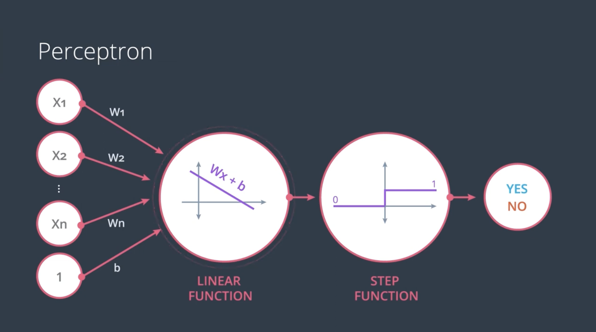

   
   
Figure: AI, ML, and DL Relationship

   
   
Figure: Cross-Entropy Visualization

   
   
Figure: Perceptron Structure

   
   
Figure: Step Function Visualization

   
   
Figure: MLP Structure

   
   
Figure: Backpropagation Network

   
   
Figure: MLP Structure

   
   
Figure: Activation Functions

   
   
Figure: Model Complexity Graph

   
   
Figure: Activation Functions

   
   
Figure: Certain Function

   
   
Figure: Regularization Penalty Visualization

   
   
Figure: Training Board Visualization

   
   
Figure: Activation Functions

