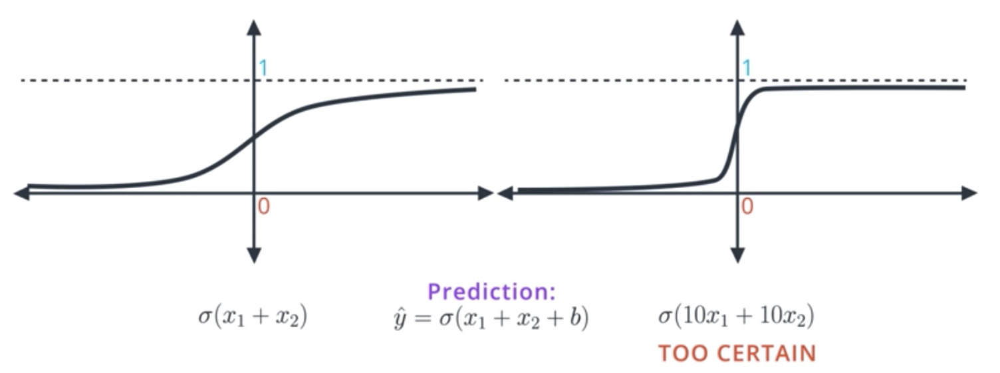
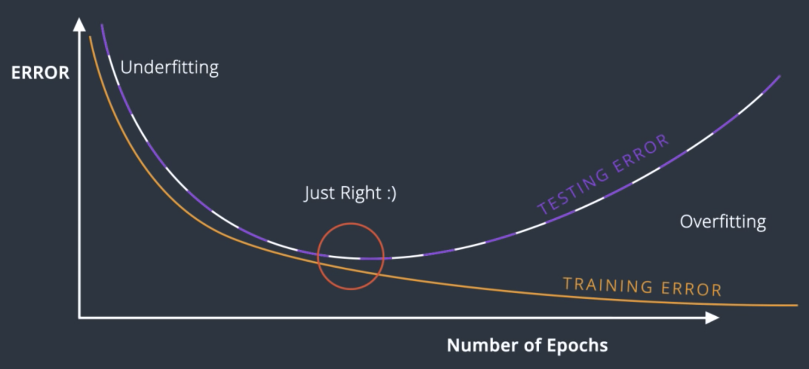
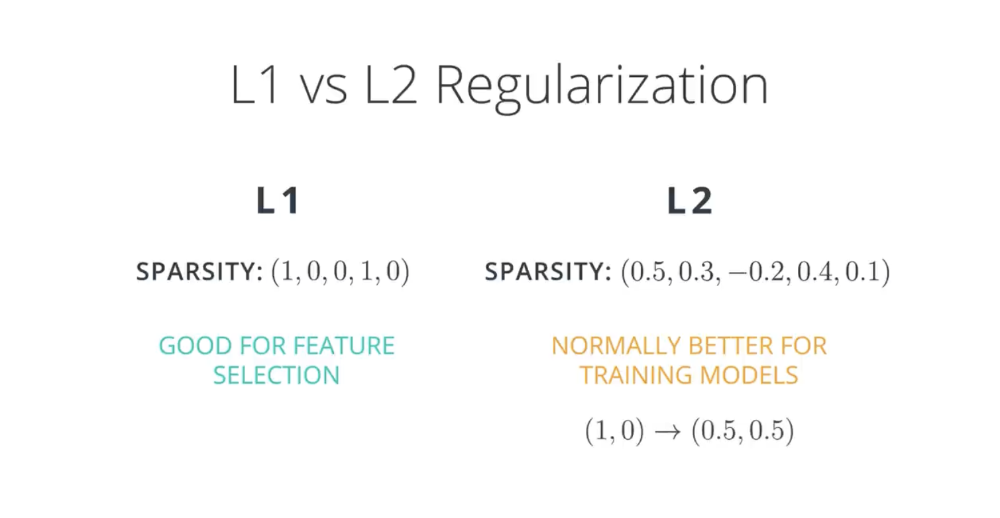

# C-2: Training Methodologies and Optimization

1. Activation and Output Functions
    - Types of Activation Functions
    - Sigmoid, ReLU, and Tanh Comparisons
    - Softmax for Multi-class Classification
    - Matching Activations to Problem Types
2. Training Neural Networks
    - Dataset Division Strategies
    - Overfitting vs Underfitting
    - Early Stopping Techniques
    - Evaluating Model Performance
3. Regularization and Optimization Techniques
    - L1 vs L2 Regularization
    - Dropout Implementation
    - Vanishing and Exploding Gradients
    - Learning Rate Decay and Momentum
4. Advanced Training Approaches
    - Batch vs Stochastic Gradient Descent
    - Mini-batch Processing
    - Optimizer Comparison (SGD, Adam, RMSprop)
    - Random Restart and Local Minima Solutions

#### Activation and Output Functions

Activation functions transform the output of neural network layers, introducing non-linearity that enables networks to
learn complex patterns. Without these non-linear elements, even a deep neural network would behave like a simple linear
model, greatly limiting its capabilities.


##### Types of Activation Functions

Activation functions serve several crucial purposes in neural networks:

1. **Introducing non-linearity**: They allow networks to learn complex, non-linear relationships in data. Without
   activation functions, multiple layers would collapse mathematically into a single linear transformation.
2. **Output transformation**: They map neuron outputs to specific ranges, often normalizing values to make training more
   stable.
3. **Gradient flow**: They affect how gradients propagate through the network during backpropagation, influencing the
   network's ability to learn.
4. **Decision making**: They determine when and how strongly neurons "activate" based on their inputs.

The ideal activation function generally has several properties:

1. **Non-linearity**: Essential for learning complex patterns
2. **Differentiability**: Required for gradient-based optimization, at least almost everywhere
3. **Monotonicity**: Preserves the order relationships in the data
4. **Approximating identity near origin**: Helps with initial training by allowing small inputs to pass through
   relatively unchanged

<div align="center">
   
   <p>Figure: Activation Functions</p>
</div>


Some common activation functions include:

- **Step Function**: The original activation used in the perceptron
    - Returns 1 if input is positive, 0 otherwise
    - Not differentiable, making it unsuitable for gradient-based learning
- **Sigmoid (Logistic)**: One of the earliest widely used activations
    - Formula: $\sigma(x) = \frac{1}{1 + e^{-x}}$
    - Output range: (0, 1)
    - Historically important but rarely used in hidden layers now
- **Hyperbolic Tangent (tanh)**: A scaled and shifted version of the sigmoid
    - Formula: $\tanh(x) = \frac{e^x - e^{-x}}{e^x + e^{-x}}$
    - Output range: (-1, 1)
    - Zero-centered, which can help with training dynamics
- **Rectified Linear Unit (ReLU)**: Currently the most popular activation function
    - Formula: $f(x) = \max(0, x)$
    - Simple and computationally efficient
    - Helps mitigate the vanishing gradient problem
- **Leaky ReLU**: A variant of ReLU that allows small negative values
    - Formula: $f(x) = \max(\alpha x, x)$, where $\alpha$ is a small constant like 0.01
    - Addresses the "dying ReLU" problem where neurons can become permanently inactive
- **GELU (Gaussian Error Linear Unit)**: A smooth approximation of ReLU weighted by the Gaussian cumulative distribution
    - Used in recent transformer architectures
    - Provides smooth transitions around zero

Each activation function has unique properties that make it more or less suitable for specific tasks and network
architectures.

##### Sigmoid, ReLU, and Tanh Comparisons

Understanding the differences between common activation functions helps in making informed choices when designing neural
networks:

**Sigmoid Function**:

- Formula: $\sigma(x) = \frac{1}{1 + e^{-x}}$
- Outputs range between 0 and 1, making it interpretable as a probability
- Advantages:
    - Smooth gradient
    - Output bounded between 0 and 1
    - Clear predictions (near 0 or 1 for large negative or positive inputs)
- Disadvantages:
    - Suffers from vanishing gradient problem for extreme inputs
    - Not zero-centered (outputs always positive)
    - Computationally expensive as involves exponential calculation
    - Saturates and kills gradients when inputs are far from zero

**Hyperbolic Tangent (tanh)**:

- Formula: $\tanh(x) = \frac{e^x - e^{-x}}{e^x + e^{-x}}$
- Outputs range between -1 and 1
- Advantages:
    - Zero-centered, which helps with the training dynamics
    - Generally performs better than sigmoid in hidden layers
    - Strong gradient around zero
- Disadvantages:
    - Still suffers from vanishing gradient problem for large inputs
    - Computationally expensive (involves exponential calculations)

**Rectified Linear Unit (ReLU)**:

- Formula: $f(x) = \max(0, x)$
- Outputs range from 0 to infinity
- Advantages:
    - Computationally efficient (simple max operation)
    - Generally faster convergence than sigmoid/tanh
    - No vanishing gradient for positive inputs
    - Biological plausibility (resembles real neuron activation)
- Disadvantages:
    - "Dying ReLU" problem - neurons can permanently die during training if they consistently receive negative inputs
    - Not zero-centered
    - Unbounded activation can lead to exploding gradients

Comparative analysis:

1. **Gradient Flow**: ReLU generally allows for better gradient flow, especially in deep networks where sigmoid and tanh
   can cause vanishing gradients. For positive inputs, ReLU maintains a constant gradient of 1, allowing for faster
   learning.
2. **Computational Efficiency**: ReLU is significantly more efficient to compute than sigmoid or tanh since it doesn't
   involve expensive exponential operations.
3. **Biological Analogy**: ReLU more closely resembles the actual firing pattern of biological neurons (which either
   fire or don't) compared to the smooth transitions of sigmoid and tanh.
4. **Training Dynamics**: Tanh often trains better than sigmoid in hidden layers due to its zero-centered output, while
   ReLU frequently outperforms both in terms of training speed and final performance.
5. **Use Cases**: Sigmoid is now primarily used in output layers for binary classification, tanh sometimes in recurrent
   networks, and ReLU (or its variants) dominates in hidden layers of feedforward networks.

In practice, ReLU has become the default choice for most hidden layers due to its simplicity and effectiveness, though
many modern architectures use variations like Leaky ReLU or GELU to address some of its limitations.

##### Comparing the Two Sigmoid Activation Functions

The left function appears to be a standard sigmoid: $\sigma(x_1 + x_2)$ or $\sigma(x_1 + x_2 + b)$, which has a gradual, S-shaped curve. The.      right function is $\sigma(10x_1 + 10x_2)$, which is much steeper on its transitions from 0 to 1 much more abruptly which made it                 too certain. 

<div align="center">
   
   <p>Figure: Activation Functions</p>
</div>

###### Why the Steeper Function Can Be Problematic

The steeper sigmoid (right side) makes very confident predictions - it quickly approaches either 0 or 1 with even small changes in input. This creates several issues:

1. **Vanishing Gradient Problem**: The flatter regions (where the function approaches 0 or 1) have derivatives very close to zero. In the steeper function, inputs quickly reach these "saturation zones" where learning effectively stops.
2. **Lack of Nuance**: The steep function essentially acts almost like a step function, losing the smooth, gradual transitions that make sigmoid useful for expressing probability or uncertainty.
3. **Reduced Training Stability**: The steep transitions can cause dramatic changes in output with small input modifications, potentially making training unstable.
4. **Poor Generalization**: A model using such steep activations tends to be overconfident and might not generalize well to new data.

The standard sigmoid (left) is generally better for:

- Early training stages when you want gradual learning
- Problems requiring nuanced probability estimates
- Deeper networks where gradient flow is important
- Tasks where uncertainty representation matters

The steeper sigmoid (right) might only be useful in:

- Final decision-making layers where binary outcomes are needed
- Scenarios where you specifically want high confidence decisions
- Situations where you need to amplify small differences in input

Between these two options, the standard sigmoid (left) is generally better for most neural network applications because it provides smoother gradients, better training dynamics, and more nuanced outputs. The "TOO CERTAIN" label on the steeper function suggests that excessive confidence can be problematic in machine learning - we typically want models that can express uncertainty appropriately rather than making overly confident predictions based on minor input differences.

##### Softmax for Multi-class Classification

The Softmax function is a specialized activation function designed specifically for the output layer in multi-class
classification problems. It converts a vector of raw scores into a probability distribution across multiple classes.

The Softmax function is defined as:

$$\text{softmax}(x)*i = \frac{e^{x_i}}{\sum*{j=1}^{k} e^{x_j}}$$

Where:

- $x$ is the input vector
- $i$ represents the $i$-th element of the input vector
- $k$ is the number of classes

This formula ensures that:

1. All outputs are between 0 and 1
2. The sum of all outputs equals 1, forming a valid probability distribution

The Softmax function has several important properties:

1. **Probabilistic interpretation**: Outputs can be interpreted directly as probabilities of class membership.
2. **Emphasis on largest values**: The exponential in the formula accentuates differences between inputs, pushing the
   largest values toward 1 and suppressing smaller values toward 0.
3. **Differentiability**: Softmax is differentiable, allowing for gradient-based optimization.
4. **Preservation of order**: The function maintains the relative ordering of inputs (monotonic).

A concrete example helps illustrate how Softmax works. Given raw scores [2.0, 1.0, 0.1] for three classes:

1. Calculate exponentials: [7.39, 2.72, 1.11]
2. Sum of exponentials: 11.22
3. Divide each exponential by the sum: [0.66, 0.24, 0.10]

The result is a probability distribution showing the model predicts a 66% chance for class 1, 24% for class 2, and 10%
for class 3.

Softmax is typically used with cross-entropy loss for training, forming a natural pairing that produces well-calibrated
probabilities. The combination allows the network to learn to distinguish between classes effectively, with larger
penalties for confident but incorrect predictions.

While Softmax works well for standard multi-class problems where each input belongs to exactly one class, it's not
suitable for multi-label classification (where an input can belong to multiple classes simultaneously).

##### Matching Activations to Problem Types

Choosing the right activation function, especially for the output layer, depends significantly on the type of problem
being solved. Here's a guide to matching activations to common problem types:

| Problem Type               | Target Data           | Output Needed            | Recommended Activation     | Typical Loss Function       |
| -------------------------- | --------------------- | ------------------------ | -------------------------- | --------------------------- |
| Binary Classification      | 0 or 1 labels         | Probability (0-1)        | Sigmoid                    | Binary Cross-Entropy        |
| Multi-class Classification | One-hot vectors       | Probability distribution | Softmax                    | Categorical Cross-Entropy   |
| Regression                 | Continuous values     | Unbounded values         | Linear/Identity            | Mean Squared Error          |
| Positive-only Regression   | Positive values       | Positive numbers         | ReLU or Exponential        | Mean Squared/Absolute Error |
| Bounded Regression         | Values in range [a,b] | Numbers in range [a,b]   | Sigmoid (scaled & shifted) | Mean Squared Error          |

For the hidden layers, the choice is less dependent on the problem type and more on the network architecture and
training dynamics:

1. **Deep Networks**: ReLU and its variants (Leaky ReLU, ELU) generally perform better in deep networks due to their
   resistance to the vanishing gradient problem.
2. **Recurrent Networks**: Tanh or specialized gating functions (like in LSTM or GRU cells) often work better due to
   their bounded, zero-centered outputs which help with the recurrent dynamics.
3. **Convolutional Networks**: ReLU is the standard choice, though some advanced architectures experiment with variants
   like Swish or GELU.
4. **Transformer Architectures**: GELU has become popular in transformer-based models like BERT and GPT.

The synergy between activation functions and loss functions is also important:

- Sigmoid outputs pair naturally with binary cross-entropy loss
- Softmax outputs pair with categorical cross-entropy loss
- Linear outputs pair with mean squared error loss

This matching ensures that the gradients during backpropagation have advantageous mathematical properties, making
training more stable and effective.

In practice, a common approach is to use ReLU (or a variant) for all hidden layers, and then select the output
activation based on the problem type. This combination works well for a wide range of tasks and has become a standard
starting point when designing new neural networks.

#### Training Neural Networks

The training process is where a neural network learns to recognize patterns in data by iteratively adjusting its
parameters. This section explores the critical aspects of effectively training neural networks, from how to properly
divide your dataset to techniques for determining when to stop training.

##### Dataset Division Strategies

Before training begins, we need to properly allocate our data to ensure the model generalizes well to unseen examples. A
thoughtful division strategy is foundational to developing robust neural networks.

The standard approach is to split data into three distinct sets:

1. **Training Set**: This is the largest portion, typically around 80% of the data. The model learns directly from this
   data, adjusting its weights based on the patterns it discovers. This is where the actual learning happens through
   iterative weight updates.

2. **Validation Set**: Usually around 10% of the data, this set serves as an independent check during training. While
   the model doesn't learn from this data directly, we use it to:

    - Monitor for overfitting
    - Tune hyperparameters
    - Make decisions about early stopping

    The validation set acts as a simulated test environment that helps us make decisions about model configuration
    without contaminating our final evaluation.

3. **Test Set**: The remaining 10% is held back entirely until the model is fully trained. This pristine dataset
   provides an unbiased evaluation of the final model's performance, simulating how it would perform on truly unseen
   data in the real world.

Beyond this standard 80/10/10 split, more sophisticated approaches exist:

**K-fold Cross-validation** addresses the limitation of having a single validation split by:

- Dividing the data into k equal portions (typically 5 or 10)
- Using k-1 portions for training and the remaining portion for validation
- Rotating through all possible train/validation combinations
- Averaging the performance across all k runs

This technique is particularly valuable when working with smaller datasets, as it provides a more robust estimate of
model performance and reduces the impact of how the data happens to be divided.

**Stratified Sampling** ensures that the class distribution in the original dataset is preserved in each subset. This is
crucial for imbalanced datasets where some classes appear much less frequently than others. Without stratification, you
might end up with validation or test sets that don't contain examples from minority classes.

**Time-based Splitting** is essential for time-series data, where we typically want to train on past data and
validate/test on future data to maintain the temporal relationship. Randomly splitting time-series data can lead to
"data leakage" where future information inadvertently influences predictions of past events.

The right division strategy ultimately depends on your specific dataset and problem context. The goal is always the
same: to create a training environment that accurately reflects how the model will perform in production without
introducing biases or unrealistic assumptions.

##### Overfitting vs Underfitting

The concepts of overfitting and underfitting represent two fundamental challenges in machine learning that sit at
opposite ends of the model complexity spectrum.

**Underfitting** occurs when a model is too simplistic to capture the underlying patterns in the data:

- The model has high bias, making oversimplified assumptions about the data
- Performance is poor on both training and validation data
- The model fails to capture important relationships between features and targets
- Example: Using a linear model to fit data with clearly non-linear relationships

Underfitting is often characterized by high training error, indicating that the model isn't complex enough to represent
even the training data properly. If an image classifier trained to recognize dogs learns only "if it has four legs, it's
a dog," it would underfit the data, misclassifying many other four-legged animals as dogs.

<div align="center">
   
   <p>Figure: Model Complexity Graph</p>
</div>

**Overfitting** occurs when a model becomes too specialized to the training data:

- The model memorizes the training data rather than learning generalizable patterns
- It performs exceptionally well on training data but poorly on validation data
- It captures noise and random fluctuations in the training data as if they were meaningful patterns
- Example: A model with so many parameters that it can essentially "memorize" every training example

Overfitting is characterized by a significant gap between training and validation performance. If our dog classifier
learns highly specific and irrelevant patterns like "dogs that are yellow, orange, or grey" instead of more general
features like body shape or facial structure, it would fail to recognize dogs of other colors in new images.

The relationship between model complexity, training error, and testing error follows a characteristic U-shaped curve:

1. As model complexity increases from very simple models, both training and testing errors initially decrease
2. At some optimal point, the testing error begins to increase while training error continues to decrease
3. This divergence marks the onset of overfitting, where the model starts learning patterns specific to the training
   data that don't generalize

Finding the sweet spot between underfitting and overfitting is a central challenge in machine learning. For neural
networks, architecture choices significantly impact this balance:

- Networks that are too small (few layers or neurons) tend to underfit
- Networks that are too large tend to overfit, especially with limited training data

The bias-variance tradeoff formalizes this relationship:

- High bias leads to underfitting (the model makes strong assumptions that may be incorrect)
- High variance leads to overfitting (the model is highly sensitive to fluctuations in the training data)

In practice, we often prefer to start with a slightly larger model and then apply regularization techniques to prevent
overfitting, rather than using a model that's too simple and risks underfitting.

##### Early Stopping Techniques

Early stopping is one of the most effective and widely used techniques to prevent overfitting in neural networks.
Instead of training for a fixed number of epochs, we monitor the model's performance on validation data and stop
training when performance begins to degrade.

The core principle is straightforward: we want to find the point where the model has learned the true patterns in the
data but hasn't yet started memorizing the noise. This optimal stopping point represents the best trade-off between
underfitting and overfitting.

Here's how early stopping typically works:

1. **Monitor validation metrics**: During training, track performance metrics (like loss or accuracy) on the validation
   set after each epoch or at regular intervals.
2. **Define patience**: Set a "patience" parameter that determines how many epochs to continue training without
   improvement before stopping.
3. **Track best performance**: Keep a record of the best validation performance seen so far and the corresponding model
   weights.
4. **Stop condition**: If validation performance doesn't improve for a number of epochs equal to the patience parameter,
   stop training.
5. **Restore best weights**: Return to the model weights that achieved the best validation performance, not necessarily
   the final weights.

```python
best_val_loss = float('inf')
patience = 10
patience_counter = 0
best_weights = None

for epoch in range(max_epochs):
    # Train for one epoch
    train_model(...)

    # Evaluate on validation set
    val_loss = evaluate_model(...)

    # Check if this is the best model so far
    if val_loss < best_val_loss:
        best_val_loss = val_loss
        patience_counter = 0
        best_weights = model.get_weights()
    else:
        patience_counter += 1

    # Check early stopping condition
    if patience_counter >= patience:
        print(f"Early stopping at epoch {epoch}")
        break

# Restore the best weights
model.set_weights(best_weights)
```

Several variations of early stopping exist:

1. **Smooth metrics**: Rather than using raw validation metrics, which can be noisy, some implementations use moving
   averages or other smoothing techniques to reduce the impact of random fluctuations.
2. **Relative improvement**: Instead of stopping when no improvement occurs, stop when the improvement falls below a
   certain threshold (e.g., less than 0.1% improvement).
3. **Multiple metrics**: Monitor multiple performance metrics simultaneously and only stop when all of them stop
   improving.

Early stopping offers several benefits:

- It's simple to implement and requires no modification of the training algorithm
- It automatically determines an appropriate amount of training
- It serves as a form of regularization without adding extra terms to the loss function
- It saves computation time by avoiding unnecessary training epochs

However, it does have some limitations:

- It requires a validation set, which reduces the amount of data available for training
- It can be sensitive to the initial random state, potentially leading to different stopping points
- It may stop training prematurely if validation metrics fluctuate substantially

In practice, early stopping is often combined with other regularization techniques to achieve optimal performance. By
carefully monitoring validation performance, we can catch the moment when the model reaches its best generalization
ability and prevent wasted computation or degraded performance from excessive training.

##### Evaluating Model Performance

Properly evaluating a neural network's performance is essential for understanding its strengths, weaknesses, and overall
effectiveness. Different metrics provide different insights, and choosing the right evaluation approach depends on your
specific problem and goals.

**Basic Performance Metrics**:

For classification tasks:

- **Accuracy**: The proportion of correct predictions among all predictions. Simple but potentially misleading for
  imbalanced datasets.
  $$\text{Accuracy} = \frac{\text{Number of correct predictions}}{\text{Total number of predictions}}$$
- **Precision**: The proportion of true positive predictions among all positive predictions. Measures how many of the
  items identified as positive are actually positive.
  $$\text{Precision} = \frac{\text{True Positives}}{\text{True Positives + False Positives}}$$
- **Recall (Sensitivity)**: The proportion of true positive predictions among all actual positives. Measures how many of
  the actual positive items were correctly identified.
  $$\text{Recall} = \frac{\text{True Positives}}{\text{True Positives + False Negatives}}$$
- **F1 Score**: The harmonic mean of precision and recall, providing a balance between the two.
  $$\text{F1} = 2 \times \frac{\text{Precision} \times \text{Recall}}{\text{Precision} + \text{Recall}}$$
- **Confusion Matrix**: A table showing the counts of true positives, false positives, true negatives, and false
  negatives, providing a comprehensive view of classification performance.

For regression tasks:

- **Mean Squared Error (MSE)**: The average of squared differences between predictions and actual values.
  $$\text{MSE} = \frac{1}{n} \sum_{i=1}^{n} (y_i - \hat{y}_i)^2$$
- **Mean Absolute Error (MAE)**: The average of absolute differences between predictions and actual values.
  $$\text{MAE} = \frac{1}{n} \sum_{i=1}^{n} |y_i - \hat{y}_i|$$
- **R² Score**: The proportion of variance in the dependent variable that is predictable from the independent variables.
  $$\text{R}^2 = 1 - \frac{\sum_{i=1}^{n} (y_i - \hat{y}*i)^2}{\sum*{i=1}^{n} (y_i - \bar{y})^2}$$

**Visualization Techniques**:

Beyond numerical metrics, visualizations provide intuitive understanding of model performance:

- **Learning Curves**: Plotting training and validation metrics against epochs shows how the model learns over time and
  helps identify overfitting/underfitting.
- **ROC Curves**: For binary classification, these plot the true positive rate against the false positive rate at
  various threshold settings, with the Area Under the Curve (AUC) providing a single metric of performance.
- **Precision-Recall Curves**: Similar to ROC curves but better for imbalanced datasets, they plot precision against
  recall at different thresholds.
- **Residual Plots**: For regression models, plotting the differences between predicted and actual values can reveal
  patterns and biases in the model's predictions.

**Cross-Validation Strategies**:

To get more robust performance estimates:

- **K-fold Cross-validation**: Train and evaluate the model K times on different splits of the data, then average the
  results.
- **Stratified Cross-validation**: Ensures that each fold maintains the same class distribution as the original dataset.
- **Leave-One-Out Cross-validation**: An extreme form where each sample serves as a validation set once, with all other
  samples used for training.

**Comparing Models**:

When deciding between different model architectures or hyperparameter settings:

- **Statistical Significance Tests**: Determine if performance differences between models are statistically significant
  or might be due to random chance.
- **Ensemble Methods**: Combine multiple models to potentially achieve better performance than any individual model.
- **Model Complexity Analysis**: Compare models not just on performance but also on complexity, training time, and
  resource requirements.

**Production Considerations**:

Beyond academic metrics, practical considerations become important:

- **Inference Time**: How quickly can the model make predictions?
- **Model Size**: Does the model fit within memory constraints of deployment platforms?
- **Robustness to Drift**: How well does the model maintain performance as data distributions shift over time?

A comprehensive evaluation approach combines multiple metrics and visualization techniques to provide a nuanced
understanding of model performance. This multi-faceted evaluation helps identify specific areas for improvement and
ensures that the model meets the practical requirements of its intended application.

#### Regularization and Optimization Techniques

Training effective neural networks requires more than just defining an architecture and running gradient descent.
Advanced regularization and optimization techniques help models generalize better, train faster, and overcome common
challenges. These methods have transformed neural networks from academic curiosities into practical tools for solving
complex problems.

##### L1 vs L2 Regularization

Regularization addresses overfitting by adding penalty terms to the model's error function that discourage unnecessarily
complex solutions. These penalties constrain the magnitude of the weights, effectively limiting the model's flexibility
and encouraging it to find simpler solutions that are more likely to generalize.

The equation represents the binary cross-entropy loss function, which is the standard error function used for binary classification problems:

$$E(W, b) = -\frac{1}{m} \sum_{i=1}^{m} [(1 - y_i) \ln(1 - \hat{y}_i) + y_i \ln(\hat{y}_i)]$$

- **$E(W, b)$**: This represents the error (or loss) as a function of the model parameters - weights ($W$) and biases ($b$). We're trying to minimize this value during training.
- **$-\frac{1}{m}$**: The negative sign is there because we want to maximize the log-likelihood, which is equivalent to minimizing the negative log-likelihood. The $\frac{1}{m}$ represents averaging over all $m$ training examples, making the loss independent of dataset size.
- **$\sum_{i=1}^{m}$**: This is the summation over all $m$ training examples in our dataset.
- **$(1 - y_i) \ln(1 - \hat{y}_i)$**: This part handles the case when the true label $y_i = 0$. When $y_i = 0$, this term becomes $\ln(1 - \hat{y}_i)$, which is maximized when $\hat{y}_i$ is close to 0 (a correct prediction). When $y_i = 1$, this term becomes 0 and doesn't contribute to the sum.
- **$y_i \ln(\hat{y}_i)$**: This part handles the case when the true label $y_i = 1$. When $y_i = 1$, this term becomes $\ln(\hat{y}_i)$, which is maximized when $\hat{y}_i$ is close to 1 (a correct prediction). When $y_i = 0$, this term becomes 0 and doesn't contribute to the sum.
- **$y_i$**: The true label for the ith training example (either 0 or 1 in binary classification).
- **$\hat{y}_i$**: The model's predicted probability that the ith example belongs to class 1. This is typically the output of a sigmoid function.

This error function is elegantly designed to handle both possible values of $y_i$ in a single formula. When the true label is 1, we want to maximize $\ln(\hat{y}_i)$, which happens when $\hat{y}_i$ approaches 1. When the true label is 0, we want to maximize $\ln(1-\hat{y}_i)$, which happens when $\hat{y}_i$ approaches 0.

The formula penalizes the model heavily when it makes confident but wrong predictions. For example, if $y_i = 1$ but $\hat{y}_i = 0.01$ (model is confident it's class 0), then $\ln(0.01) \approx -4.6$, creating a large error. Similarly, if $y_i = 0$ but $\hat{y}_i = 0.99$, then $\ln(1-0.99) = \ln(0.01) \approx -4.6$.

This function is derived from the principles of maximum likelihood estimation and information theory, making it theoretically well-grounded for binary classification problems.

Regularization modifies this by adding terms that grow larger as the weights increase. The two primary forms of
regularization are L1 and L2, each with unique characteristics and effects on the model.

<div align="center">
   
   <p>Figure: Regularization Penalty Visualization</p>
</div>


**L1 Regularization (Lasso)**

L1 regularization adds the sum of the absolute values of the weights to the error function:

$$E_{L1}(W, b) = -\frac{1}{m} \sum_{i=1}^{m}[(1 - y_i) \ln(1 - \hat{y}_i) + y_i \ln(\hat{y}_i)] + \lambda \sum_{j=1}^{n}|w_j|$$

The term $\lambda \sum_{j=1}^{n}|w_j|$ is the L1 regularization penalty, often called the "Lasso" penalty. Breaking it down:

- $\lambda$ (lambda) is the regularization parameter that controls how strongly we penalize large weights. It's a hyperparameter that you set before training. Larger values of $\lambda$ result in stronger regularization.
- $\sum_{j=1}^{n}$ indicates that we're summing over all weights in the network, where $n$ is the total number of weights.
- $|w_j|$ is the absolute value of each weight. This absolute value is what makes this L1 regularization rather than L2. It penalizes the sum of absolute weight values rather than the sum of squared weights.

This penalty has a special property: it tends to push some weights exactly to zero, effectively eliminating those connections from the network. This creates sparse networks where many weights become precisely zero, which is effectively a form of feature selection.

This happens because the gradient of the absolute value function is constant (either +1 or -1 depending on whether the weight is positive or negative). This means that regardless of how small a weight becomes, the regularization continues to apply the same pressure toward zero. Only when the gradient from the loss function exactly counterbalances this constant pressure does a weight stabilize at a non-zero value.

In contrast, L2 regularization applies pressure proportional to the weight's magnitude, so small weights experience very little regularization pressure. This is why L1 can drive weights exactly to zero while L2 typically just makes weights very small but non-zero.

This sparsity-inducing property makes L1 regularization particularly useful when you suspect many input features might be irrelevant, as it can automatically identify and eliminate those connections, resulting in simpler models.

Where $\lambda$ (lambda) is the regularization parameter that controls the strength of the penalty.

L1 regularization has several distinctive properties:

1. **Sparse Solutions**: It tends to drive some weights exactly to zero, effectively performing feature selection by
   eliminating less important inputs.
2. **Mathematical Interpretation**: The L1 penalty creates a constraint region shaped like a diamond (in 2D) or
   diamond-like polytope (in higher dimensions), which tends to intersect with the error contours at corners where some
   weights are zero.
3. **Use Cases**: Particularly valuable when dealing with high-dimensional data where many features might be irrelevant
   or redundant.

To illustrate how L1 regularization works, consider a weight that's relatively unimportant for prediction accuracy.
During training, the gradient from the error term might push this weight slightly away from zero, but the L1 penalty
consistently pushes it back toward zero with constant force (regardless of how small the weight becomes). Eventually,
this constant pressure drives the weight exactly to zero, effectively removing that feature from the model.

**L2 Regularization (Ridge)**

L2 regularization adds the sum of the squares of the weights to the error function:

$$E_{L2}(W, b) = -\frac{1}{m} \sum_{i=1}^{m} [(1 - y_i) \ln(1 - \hat{y}_i) + y_i \ln(\hat{y}_i)] + \lambda \sum_{j=1}^{n} w_j^2$$

The last term, $\lambda \sum_{j=1}^{n} w_j^2$, is the L2 regularization penalty (also known as Ridge regularization or weight decay). Let me explain how this works and why it's important:

This term adds a cost proportional to the squared magnitude of all weights in the network. Breaking it down:

- $\lambda$ is the regularization parameter that controls the strength of the penalty. Higher values of $\lambda$ result in stronger regularization effects, pushing weights closer to zero.
- $\sum_{j=1}^{n}$ indicates that we're summing across all weights in the network, where $n$ is the total number of weights.
- $w_j^2$ is the square of each weight. This squaring operation is what distinguishes L2 from L1 regularization.

The squaring has important consequences for how L2 regularization works. Unlike L1 regularization (which uses absolute values), L2 regularization:

1. Penalizes larger weights much more heavily than smaller weights. A weight of 2 contributes 4 units to the penalty, while a weight of 0.5 contributes only 0.25 units.
2. Creates a gradient that's proportional to the weight value ($\frac{d(w_j^2)}{dw_j} = 2w_j$). This means that large weights receive stronger pressure to shrink, while tiny weights receive very little pressure.
3. Rarely pushes weights exactly to zero. Instead, it makes all weights uniformly small but non-zero, creating a more distributed pattern of small weights rather than a sparse solution.

This behavior is particularly useful when we suspect that most input features contribute at least somewhat to the prediction. L2 regularization helps prevent any single feature from dominating the model, leading to more stable and generalizable solutions.

Geometrically, L2 regularization creates a circular (in 2D) or spherical (in higher dimensions) constraint region, which tends to produce solutions where all weights are small but non-zero. This differs from L1's diamond-shaped constraint region that often intersects with optima at corners where some weights are exactly zero.

In practice, L2 regularization is more commonly used for neural networks than L1, particularly for hidden layers, as it typically produces more stable models with better generalization.

L2 regularization has different characteristics:

1. **Weight Shrinkage**: It tends to shrink all weights toward zero proportionally, without typically reaching exact
   zeros.
2. **Mathematical Interpretation**: The L2 penalty creates a circular (in 2D) or spherical (in higher dimensions)
   constraint region, which tends to produce solutions where all weights are small but non-zero.
3. **Analytical Advantages**: L2 regularization is differentiable everywhere, making it mathematically more convenient
   for optimization.

The proportional shrinking occurs because the gradient of the L2 penalty term for each weight depends on the magnitude
of that weight. For large weights, the penalty gradient is strong; for weights already close to zero, the penalty
gradient becomes very small, allowing these weights to remain non-zero.

**Comparing L1 and L2 Regularization**

When deciding which form of regularization to use, consider these trade-offs:

1. **Feature Selection**: If automatically identifying important features is valuable, L1 regularization provides this
   through its sparsity-inducing property.
2. **Model Simplicity**: L2 generally produces more stable models with smaller overall weight values, while L1 creates
   sparse models where some weights are exactly zero.
3. **Computational Efficiency**: L2 regularization is computationally simpler due to its differentiability everywhere,
   while L1 requires special handling at zero points.
4. **Noisy Features**: L1 is particularly effective when you suspect many input features are irrelevant or noisy, as it
   can eliminate them completely.

In practice, L2 regularization is more commonly used for neural networks, particularly for hidden layers, while L1 is
sometimes applied to the input layer when feature selection is desirable. Some practitioners even use a combination
called "Elastic Net" regularization, which incorporates both L1 and L2 penalties to get the benefits of both approaches.

##### Dropout Implementation

Dropout is a powerful regularization technique that helps prevent overfitting by randomly deactivating a portion of
neurons during each training iteration. It addresses a fundamental issue in neural networks: co-adaptation, where
neurons become overly dependent on each other, leading to brittle, overspecialized networks.

**The Problem Dropout Solves**

In standard neural networks, training can lead to situations where:

- Some parts of the network develop very large weights and dominate the training process
- Other parts become relatively inactive or redundant
- Neurons form complex co-dependencies, essentially memorizing training examples rather than learning generalizable
  patterns

Dropout disrupts these co-adaptations by introducing randomness into the training process, forcing the network to
develop more robust, distributed representations.

**How Dropout Works**

During each training iteration (or batch), dropout randomly turns off a percentage of neurons in specified layers:

1. Before the forward pass, each neuron has a probability $p$ (the dropout rate) of being temporarily removed from the
   network
2. The forward pass and backward pass proceed with this "thinned" network
3. For the next iteration, a new random subset of neurons is dropped
4. This process continues throughout training

The effect is profound: every training iteration essentially uses a different subnetwork, so neurons cannot rely on the
presence of specific other neurons. This encourages:

- Redundant representations (multiple neurons learning similar features)
- Independent feature extraction (neurons learning useful patterns on their own)
- Better generalization to new data

**Implementation Example**

Here's a simplified implementation of dropout in PyTorch for a single layer:

```python
def dropout_layer(x, dropout_rate=0.5, is_training=True):
    if not is_training:
        return x

    # Create a binary mask with probability (1-dropout_rate)
    mask = torch.rand(x.shape) > dropout_rate
    # Convert to same device and dtype as input
    mask = mask.to(device=x.device, dtype=x.dtype)
    # Scale the remaining activations by 1/(1-dropout_rate)
    scale = 1.0 / (1.0 - dropout_rate)

    return x * mask * scale
```

The scaling factor (dividing by 1-dropout_rate) is crucial. It ensures that the expected sum of the inputs to the next
layer remains the same during training and inference, addressing what would otherwise be a shift in activation
distributions.

**Inference with Dropout Networks**

During testing or inference, dropout behaves differently:

- All neurons are active (no dropping)
- No explicit scaling is applied, as the expected value of activations should match what the next layer expects

Some implementations achieve this by scaling activations during training and using unscaled values during inference.
Others scale weights after training is complete, which has the same mathematical effect.

**Practical Considerations**

When implementing dropout, consider:

1. **Dropout Rate**: Typically between 0.2 (dropping 20% of neurons) and 0.5 (dropping 50%). Larger networks often
   benefit from higher dropout rates.
2. **Layer Application**: Dropout is usually more effective in higher layers of the network. The first hidden layer
   often uses lower dropout rates or no dropout at all.
3. **Input Dropout**: Applying dropout to input features (sometimes called "input corruption") can also be effective,
   especially for inputs with redundancy.
4. **Computational Impact**: Dropout essentially trains an ensemble of networks sharing weights, which can require more
   training iterations to converge.

Modern deep learning frameworks like PyTorch and TensorFlow include built-in dropout layers that handle the
implementation details automatically:

```python
# PyTorch example
model = nn.Sequential(
    nn.Linear(784, 256),
    nn.ReLU(),
    nn.Dropout(p=0.5),  # Apply dropout after activation
    nn.Linear(256, 10)
)
```

Dropout has become a standard component in many neural network architectures, dramatically improving their ability to
generalize from training data to real-world applications, especially when training data is limited relative to model
complexity.

##### Vanishing and Exploding Gradients

As neural networks grow deeper with many layers, they often encounter gradient problems during training that can
severely impair learning. These issues - vanishing and exploding gradients - represent opposite extremes of the same
fundamental challenge: maintaining stable gradient flow through a deep network.

**Understanding the Problem**

During backpropagation, gradients are propagated backward through the network, layer by layer. For a deep network with
many layers, this involves multiplying many terms together through the chain rule of calculus. When these terms are
consistently less than 1, their product approaches zero (vanishing); when they're greater than 1, their product can grow
exponentially (exploding).

**Vanishing Gradients**

Vanishing gradients occur when the gradient becomes extremely small as it propagates backward through the network. This
means:

- Earlier layers learn very slowly or not at all
- The network effectively becomes shallower, as only later layers get meaningful updates
- Training stalls or progresses extremely slowly

The primary causes include:

1. **Saturating Activation Functions**: Functions like sigmoid and tanh saturate (have very small derivatives) for
   inputs far from zero. The sigmoid function's maximum derivative is 0.25, meaning gradients diminish by at least 75%
   passing through each layer with saturated neurons.
2. **Deep Networks**: The multiplication of many small gradients compounds exponentially with network depth.
3. **Small Weights**: If weight initialization results in many small weights, these further reduce the gradient
   magnitude during backpropagation.

Using our earlier example, we saw that in a simple network with sigmoid activations, the gradient diminished from 0.122
in the output layer to just 0.003 in the hidden layer - a reduction of 97.5%. In deeper networks, this effect compounds
across many layers, potentially reducing gradients to negligible values.

**Exploding Gradients**

Exploding gradients represent the opposite problem, where gradients become extremely large during backpropagation,
causing:

- Unstable training with dramatic weight updates
- Overshooting minima in the error surface
- Numerical overflow (NaN values)
- Model divergence (weights growing to infinity)

The main causes include:

1. **Large Weights**: Weights greater than 1 amplify gradients during backpropagation.
2. **Deep Networks**: The multiplication of many terms greater than 1 leads to exponential growth.
3. **Unbounded Activation Functions**: Functions like ReLU have no upper limit on their output or gradient for positive
   inputs.

**Detection and Diagnosis**

Recognizing gradient problems early can save considerable debugging time:

1. **Vanishing Gradients** often manifest as:
    - Weights in early layers barely changing during training
    - Training loss decreasing very slowly or plateauing early
    - Later layers learning while earlier layers remain essentially random
2. **Exploding Gradients** typically show as:
    - Training loss becoming NaN (Not a Number)
    - Wildly oscillating loss values
    - Extremely large weight values appearing suddenly

To monitor for these issues, you can implement gradient norm tracking:

```python
# PyTorch example of tracking gradient norms
for name, param in model.named_parameters():
    if param.grad is not None:
        grad_norm = param.grad.norm().item()
        print(f"Layer: {name}, Gradient Norm: {grad_norm}")
```

**Solutions and Mitigation Strategies**

For both gradient problems, several effective solutions have emerged:

**For Vanishing Gradients:**

1. **Alternative Activation Functions**: Replace sigmoid/tanh with ReLU or its variants in hidden layers. ReLU maintains
   a gradient of 1 for all positive inputs, preventing vanishing.
2. **Careful Weight Initialization**: Techniques like Xavier/Glorot or He initialization scale initial weights based on
   layer dimensions to stabilize gradient flow.
3. **Residual Connections**: Skip connections (as in ResNets) provide alternative paths for gradient flow, bypassing
   layers that might cause vanishing gradients.
4. **Batch Normalization**: Normalizing layer inputs keeps values in the non-saturating range of activation functions.
5. **Long Short-Term Memory (LSTM) or Gated Recurrent Units (GRU)**: For recurrent networks, these architectures include
   gating mechanisms specifically designed to maintain gradient flow over many time steps.

**For Exploding Gradients:**

1. **Gradient Clipping**: Directly limit gradient magnitude by scaling gradients when their norm exceeds a threshold:

```python
# PyTorch gradient clipping example
torch.nn.utils.clip_grad_norm_(model.parameters(), max_norm=1.0)
```

1. **Weight Regularization**: L2 regularization discourages large weights that might contribute to gradient explosion.
2. **Smaller Learning Rates**: Reducing the learning rate can prevent large updates from causing instability.
3. **Gradient Monitoring**: Implementing early stopping based on gradient norms can catch explosion before it causes
   numerical instability.

Modern neural network architectures incorporate many of these solutions by default. For instance, most image
classification networks use ReLU activations, residual connections, and batch normalization, while most language models
use specialized architectures like transformers with careful normalization techniques to maintain stable gradient flow.

Understanding these gradient challenges and their solutions is essential for designing and debugging deep neural
networks, especially when working with custom architectures or adapting existing models to new domains.

##### Learning Rate Decay and Momentum

Learning rate and momentum are two critical hyperparameters that significantly influence the optimization process in
neural networks. Properly managing these values throughout training can dramatically improve both the speed of
convergence and the quality of the final model.

**Learning Rate Fundamentals**

The learning rate determines how large of a step to take in the direction of the negative gradient during optimization.
This seemingly simple parameter has profound implications:

- **Large Learning Rate**:
    - Advantages: Faster initial progress, better chance of escaping weak local minima
    - Disadvantages: May overshoot minima, cause oscillation, or diverge entirely
- **Small Learning Rate**:
    - Advantages: More precise convergence, more stable training
    - Disadvantages: Very slow progress, higher risk of getting stuck in local minima

Ideally, we want the benefits of both: rapid initial progress followed by fine-tuned precision as we approach a
solution. Learning rate decay strategies achieve exactly this.

**Learning Rate Decay**

Learning rate decay (or learning rate scheduling) systematically reduces the learning rate during training. Common
approaches include:

1. **Step Decay**: Reduce the learning rate by a factor at predetermined intervals

    ```python
    # Example: Reduce learning rate by half every 10 epochs
    learning_rate = initial_lr * (0.5 ** (epoch // 10))
    ```

2. **Exponential Decay**: Continuously reduce the learning rate exponentially

    ```python
    # Example: Exponential decay
    learning_rate = initial_lr * exp(-decay_rate * epoch)
    ```

3. **1/t Decay**: Reduce learning rate proportionally to the inverse of the iteration number

    ```python
    # Example: 1/t decay
    learning_rate = initial_lr / (1 + decay_rate * epoch)
    ```

4. **Performance-Based Decay**: Reduce learning rate when validation performance plateaus

    ```python
    # Pseudocode for performance-based decay
    if validation_loss_not_improved_for_n_epochs:
        learning_rate = learning_rate * 0.1
    ```

Modern deep learning frameworks provide built-in schedulers that implement these strategies:

```python
# PyTorch example of step decay
scheduler = torch.optim.lr_scheduler.StepLR(optimizer, step_size=10, gamma=0.5)

# Use in training loop
for epoch in range(num_epochs):
    train_one_epoch()
    scheduler.step()
```

The benefits of learning rate decay include:

- Faster overall convergence compared to using a single learning rate
- Better final model performance by allowing fine-grained weight adjustments
- Reduced oscillation around the minimum as training progresses

**Momentum: Pushing Past Local Minima**

While learning rate controls step size, momentum determines how much previous gradient steps influence the current
update. It acts like a ball rolling down a hill, building up velocity in consistent directions and dampening
oscillations.

Momentum is implemented by keeping a running average of past gradients:

$$v_t = \beta v_{t-1} + (1 - \beta) \nabla J(\theta_t)$$ $$\theta_{t+1} = \theta_t - \alpha v_t$$

Where:

- $v_t$ is the velocity at time $t$
- $\beta$ is the momentum coefficient (typically between 0.9 and 0.99)
- $\nabla J(\theta_t)$ is the current gradient
- $\alpha$ is the learning rate

This formulation can be rewritten as a weighted average of past gradients:

$$v_t = (1-\beta) \sum_{i=0}^{t} \beta^{t-i} \nabla J(\theta_i)$$

Because $\beta$ is between 0 and 1, raising it to higher powers results in smaller values, meaning gradients from the
distant past have less influence than recent ones.

**Benefits of Momentum**:

1. **Smoothing Effect**: Reduces oscillations in directions where the gradient changes sign frequently, creating a
   smoother optimization path.
2. **Acceleration**: Builds up velocity in directions with consistent gradients, speeding progress along long, flat
   regions of the error surface.
3. **Escape Local Minima**: The accumulated velocity can carry optimization over small bumps and shallow local minima in
   the error surface.
4. **Dampening Effect**: Reduces the impact of noisy, inconsistent gradients that might otherwise cause erratic updates.

A practical implementation of momentum in PyTorch:

```python
# PyTorch SGD with momentum
optimizer = torch.optim.SGD(model.parameters(), lr=0.01, momentum=0.9)
```

**Advanced Variations: Nesterov Momentum**

An important variation is Nesterov Accelerated Gradient (NAG), which modifies the momentum algorithm to look ahead in
the direction of the accumulated velocity:

1. First, take a step in the direction of accumulated velocity: $\theta_{lookahead} = \theta_t - \beta v_{t-1}$
2. Calculate the gradient at this lookahead position: $\nabla J(\theta_{lookahead})$
3. Update velocity and parameters using this lookahead gradient

This "look before you leap" approach improves convergence by making more informed updates. PyTorch implements this with
a simple flag:

```python
optimizer = torch.optim.SGD(model.parameters(), lr=0.01, momentum=0.9, nesterov=True)
```

**Combining Learning Rate Decay and Momentum**

The most effective optimization strategies often combine both techniques:

- Momentum helps navigate the error surface more efficiently
- Learning rate decay ensures precision as we approach the minimum

Together, they complement each other's strengths:

- Momentum helps escape local minima that might otherwise trap optimization when the learning rate becomes small
- Learning rate decay prevents the accumulated momentum from causing overshooting as we near the optimum

Modern optimizers like Adam (Adaptive Moment Estimation) incorporate these ideas automatically, adapting learning rates
per-parameter while maintaining a momentum-like effect through exponentially weighted moving averages of past gradients
and squared gradients.

Understanding these fundamental optimization techniques provides insight into both the classic approaches and the more
sophisticated algorithms that have built upon them. These concepts remain relevant even when using advanced optimizers,
as they help explain the underlying dynamics that make neural network training effective.

#### Advanced Training Approaches

Neural network training combines art and science, requiring strategic choices that balance computational efficiency,
learning dynamics, and optimization quality. This section explores advanced approaches that have made training deep
neural networks both feasible and effective.

##### Batch vs Stochastic Gradient Descent

The classic gradient descent algorithm updates model parameters based on the gradient of the error function calculated
across all training examples. However, this approach becomes impractical for large datasets. Two alternative strategies
address this challenge: batch gradient descent and stochastic gradient descent.

**Batch Gradient Descent (BGD)**

Batch gradient descent uses the entire dataset to compute the gradient for each parameter update:

1. Calculate predictions for all training examples using current parameters
2. Compute the error across all examples
3. Calculate the gradient of this error with respect to all parameters
4. Update all parameters using this gradient
5. Repeat for multiple epochs

Mathematically, the parameter update rule is:

$$\theta = \theta - \alpha \nabla_\theta J(\theta)$$

Where $J(\theta)$ is calculated using all training examples.

The advantages of batch gradient descent include:

- Stable, consistent gradient estimates
- Guaranteed convergence to at least a local minimum for convex error surfaces
- Efficient matrix operations when calculations can be vectorized

However, significant drawbacks exist:

- Computationally expensive for large datasets, requiring the entire dataset to be processed before each update
- Memory intensive, as all training data must be loaded simultaneously
- Slow convergence, since parameters are updated only once per epoch
- Greater risk of getting trapped in local minima due to fewer parameter updates

**Stochastic Gradient Descent (SGD)**

Stochastic gradient descent takes the opposite approach, using a single randomly selected training example to calculate
each gradient and update parameters:

1. Randomly select one training example
2. Calculate the prediction and error for this single example
3. Compute the gradient based solely on this example
4. Update parameters using this gradient
5. Repeat for all examples (completing one epoch)
6. Shuffle the data and repeat for multiple epochs

The parameter update becomes:

$$\theta = \theta - \alpha \nabla_\theta J(\theta; x^{(i)}, y^{(i)})$$

Where $(x^{(i)}, y^{(i)})$ is a single training example.

The advantages of SGD include:

- Much faster updates, with parameters changing after each example
- Less memory required as only one example is processed at a time
- Introduction of noise in the gradient, which can help escape local minima
- Often faster convergence in practice, especially early in training
- Ability to process extremely large datasets that won't fit in memory

The disadvantages include:

- High variance in parameter updates due to the noise in gradient estimates
- Less efficient use of vectorized operations compared to batch methods
- May never converge exactly, often oscillating around the minimum
- Requires careful tuning of the learning rate

**Practical Comparison**

Consider a training set with 1 million examples. With batch gradient descent, we would process all million examples
before making a single parameter update. With stochastic gradient descent, we would make 1 million parameter updates per
epoch, dramatically increasing the frequency of updates.

To visualize the difference, imagine descending a hill:

- Batch gradient descent is like carefully surveying the entire landscape, calculating the exact steepest path, and
  taking a single precise step downhill
- Stochastic gradient descent is like taking many quick steps, each in a roughly downhill direction but with some random
  variation, reacting to the local terrain under each footstep

The latter approach may seem less precise, but its frequency of updates and ability to escape local minima often make it
more effective in practice, especially for complex, non-convex error landscapes typical of neural networks.

##### Mini-batch Processing

Mini-batch gradient descent represents a "Goldilocks" solution between batch and stochastic approaches, offering many of
the benefits of both while mitigating their respective drawbacks.

**Mini-batch Gradient Descent**

This approach divides the training data into small batches (typically 32 to 256 examples) and updates parameters after
processing each batch:

1. Divide the training data into mini-batches of size m (where m is much smaller than the full dataset)
2. For each mini-batch:
    - Calculate predictions for all examples in the mini-batch
    - Compute the error across these examples
    - Calculate the gradient of this error with respect to parameters
    - Update parameters using this gradient
3. Complete one epoch when all mini-batches have been processed
4. Shuffle data and create new mini-batches for the next epoch

The parameter update rule becomes:

$$\theta = \theta - \alpha \nabla_\theta J(\theta; X^{(i:i+m)}, Y^{(i:i+m)})$$

Where $(X^{(i:i+m)}, Y^{(i:i+m)})$ represents a mini-batch of m examples.

**Advantages of Mini-batch Processing**

Mini-batch gradient descent combines key benefits from both extremes:

1. **Computational Efficiency**:
    - Enables efficient use of matrix operations and vectorization
    - Makes better use of CPU/GPU parallelization compared to processing single examples
    - Requires less memory than full-batch approaches
2. **Training Dynamics**:
    - Provides more frequent parameter updates than batch gradient descent
    - Offers less noisy gradient estimates than pure stochastic gradient descent
    - Creates a good balance between update frequency and update quality
3. **Optimization Benefits**:
    - Introduces enough noise to help escape local minima
    - Provides more stable convergence than SGD
    - Allows for higher throughput and faster training overall

**Implementation Considerations**

Several practical aspects need consideration when implementing mini-batch processing:

1. **Batch Size Selection**:
    - Smaller batches (16-64) provide more updates and potentially better regularization
    - Larger batches (128-512) provide more stable gradient estimates and better utilize GPU parallelism
    - Very large batches may require special optimization techniques like LARS (Layer-wise Adaptive Rate Scaling)
2. **Batch Normalization**:
    - Normalizes activations within each mini-batch, stabilizing and accelerating training
    - Depends on having a reasonable batch size (too small and statistics become unreliable)
3. **Shuffling**:
    - Randomizing the order of training examples before creating mini-batches prevents the model from learning arbitrary
      patterns based on data order
    - Complete shuffling at the start of each epoch is standard practice
4. **Handling Incomplete Batches**:
    - The final batch in an epoch may have fewer examples than the standard batch size
    - Options include dropping the incomplete batch, padding it with examples from the next epoch, or processing it
      as-is with appropriate normalization

Here's a simplified implementation of mini-batch gradient descent in PyTorch:

```python
def train_epoch(model, dataloader, criterion, optimizer):
    model.train()
    running_loss = 0.0

    for batch_idx, (inputs, targets) in enumerate(dataloader):
        # Move data to appropriate device (CPU/GPU)
        inputs, targets = inputs.to(device), targets.to(device)

        # Zero the parameter gradients
        optimizer.zero_grad()

        # Forward pass
        outputs = model(inputs)
        loss = criterion(outputs, targets)

        # Backward pass and optimize
        loss.backward()
        optimizer.step()

        # Accumulate loss statistics
        running_loss += loss.item()

    return running_loss / len(dataloader)
```

The `dataloader` in this example automatically handles the creation of mini-batches and can be configured with
parameters like `batch_size` and `shuffle=True`.

Mini-batch processing has become the standard approach for training neural networks, providing an excellent compromise
between computational efficiency and optimization quality. Nearly all modern deep learning systems use this approach by
default, with batch size remaining an important hyperparameter that practitioners tune based on their specific hardware
constraints and model requirements.

##### Optimizer Comparison (SGD, Adam, RMSprop)

While gradient descent forms the foundation of neural network optimization, several advanced algorithms have been
developed to address its limitations. These optimizers modify the basic gradient descent update rule in various ways to
improve convergence speed, stability, and final performance.

**Standard Stochastic Gradient Descent (SGD)**

The standard SGD update rule is:

$$\theta_{t+1} = \theta_t - \alpha \nabla_\theta J(\theta_t)$$

Where:

- $\theta_t$ represents the parameters at step t
- $\alpha$ is the learning rate
- $\nabla_\theta J(\theta_t)$ is the gradient of the loss function

SGD with momentum adds velocity to the update:

$$v_{t+1} = \beta v_t + \nabla_\theta J(\theta_t)$$ $$\theta_{t+1} = \theta_t - \alpha v_{t+1}$$

Where $\beta$ is the momentum coefficient (typically 0.9).

**Characteristics of SGD**:

- Simple and well-understood
- Requires careful learning rate tuning
- Often slow convergence in regions with high curvature
- May oscillate in ravines (areas where the surface curves much more steeply in one dimension than in others)
- With momentum, performs better but still requires manual learning rate scheduling

**RMSprop (Root Mean Square Propagation)**

RMSprop, developed by Geoffrey Hinton, addresses SGD's sensitivity to different feature scales by adapting the learning
rate for each parameter based on the history of gradients:

$$v_t = \beta v_{t-1} + (1 - \beta)(\nabla_\theta J(\theta_t))^2$$
$$\theta_{t+1} = \theta_t - \frac{\alpha}{\sqrt{v_t + \epsilon}} \nabla_\theta J(\theta_t)$$

Where:

- $v_t$ tracks the exponentially weighted moving average of squared gradients
- $\beta$ is typically set to 0.9
- $\epsilon$ is a small constant to prevent division by zero (typically 1e-8)

**Characteristics of RMSprop**:

- Automatically adjusts learning rates for each parameter
- Divides the learning rate by the square root of the running average of squared gradients
- Parameters with large gradients get smaller updates, while parameters with small gradients get larger relative updates
- Effectively addresses the "bouncing" problem in steep ravines
- Works well with non-stationary objectives and online learning

**Adam (Adaptive Moment Estimation)**

Adam combines the ideas from momentum and RMSprop, tracking both the first moment (mean) and second moment (uncentered
variance) of the gradients:

$$m_t = \beta_1 m_{t-1} + (1 - \beta_1) \nabla_\theta J(\theta_t)$$
$$v_t = \beta_2 v_{t-1} + (1 - \beta_2)(\nabla_\theta J(\theta_t))^2$$

These estimates are biased toward zero, especially during the initial steps, so Adam includes a bias correction:

$$\hat{m}_t = \frac{m_t}{1 - \beta_1^t}$$ $$\hat{v}_t = \frac{v_t}{1 - \beta_2^t}$$

The parameter update then becomes:

$$\theta_{t+1} = \theta_t - \frac{\alpha \hat{m}_t}{\sqrt{\hat{v}_t} + \epsilon}$$

Where:

- $\beta_1$ is typically 0.9 (momentum coefficient)
- $\beta_2$ is typically 0.999 (RMSprop factor)
- $\epsilon$ is typically 1e-8

**Characteristics of Adam**:

- Combines the benefits of both momentum and adaptive learning rates
- Typically requires less manual tuning of the learning rate
- Works well across a wide range of problems and architectures
- Includes bias correction for more accurate moment estimates, especially early in training
- Often converges more quickly than either SGD with momentum or RMSprop alone

**Performance Comparison**

Each optimizer has different strengths and weaknesses that make them suitable for different scenarios:

1. **Convergence Speed**:
    - Adam typically converges faster in terms of iterations or epochs
    - SGD with momentum generally takes more iterations but may reach better final performance
    - RMSprop usually falls between the two
2. **Final Performance**:
    - SGD with momentum often reaches slightly better final performance, especially with proper learning rate scheduling
    - Adam may converge to slightly worse solutions in some cases
    - Adam's adaptive learning rates can sometimes lead to premature convergence
3. **Sensitivity to Hyperparameters**:
    - SGD is highly sensitive to the initial learning rate and schedule
    - Adam is more robust to poor initial learning rate settings
    - All benefit from proper hyperparameter tuning, but Adam typically requires less tuning
4. **Memory Requirements**:
    - SGD with momentum stores one additional variable (velocity) per parameter
    - RMSprop also stores one additional variable (squared gradient running average)
    - Adam stores two additional variables (first and second moments) per parameter

**Practical Recommendations**

Based on extensive empirical research and practical experience:

1. **For New Projects**:
    - Start with Adam as a default choice
    - Use a learning rate between 0.0001 and 0.001
    - If training time permits, also try SGD with momentum and learning rate scheduling
2. **For State-of-the-Art Performance**:
    - Many competition-winning models use SGD with momentum and a well-tuned learning rate schedule
    - Consider starting with Adam for rapid initial convergence, then switching to SGD with momentum for fine-tuning
3. **For Specific Domains**:
    - Computer Vision: SGD with momentum is often preferred
    - Natural Language Processing: Adam is widely used
    - Reinforcement Learning: Adam or specialized variants like RMSprop
4. **Implementation Example**:

```python
# PyTorch implementations of different optimizers

# SGD with momentum
optimizer = torch.optim.SGD(model.parameters(), lr=0.01, momentum=0.9)

# RMSprop
optimizer = torch.optim.RMSprop(model.parameters(), lr=0.001, alpha=0.99, eps=1e-08)

# Adam
optimizer = torch.optim.Adam(model.parameters(), lr=0.001, betas=(0.9, 0.999), eps=1e-08)
```

The field of optimization algorithms continues to evolve, with new variants like AdamW (Adam with decoupled weight
decay) showing improved performance for certain applications. However, these three optimizers—SGD with momentum,
RMSprop, and Adam—form the core foundations upon which most modern approaches are built.

Understanding the trade-offs between these optimizers helps practitioners make informed choices and troubleshoot
training issues more effectively. While there is no universal "best" optimizer, having this knowledge allows you to
select the most appropriate tool for each specific deep learning task.

##### Random Restart and Local Minima Solutions

Neural network training involves navigating complex error landscapes with numerous local minima, saddle points, and
plateaus. Random restart and related techniques help overcome these optimization challenges by exploring different
regions of the parameter space.

**The Challenge of Local Minima**

The error function of a neural network typically forms a high-dimensional, non-convex surface with many critical points:

1. **Local Minima**: Points where the error is lower than all nearby points but potentially higher than the global
   minimum
2. **Global Minimum**: The point with the lowest possible error value
3. **Saddle Points**: Points where the gradient is zero but are neither maxima nor minima (common in high dimensions)
4. **Plateaus**: Flat regions where the gradient is very close to zero

When using gradient-based optimization, the training process can get stuck in these suboptimal critical points,
particularly:

- Local minima, where every direction leads uphill
- Saddle points, which can significantly slow progress
- Plateaus, where gradients are too small to make meaningful progress

**Random Restart Strategy**

Random restart is a simple but effective approach to mitigate local minima problems:

1. Initialize the neural network with random weights
2. Train the network until convergence or for a fixed number of epochs
3. Save the resulting model and its performance
4. Reinitialize with a different random seed
5. Repeat steps 2-4 multiple times
6. Select the best-performing model from all runs

This strategy leverages the fact that different initializations lead to different trajectories through the parameter
space, potentially reaching different (and hopefully better) local minima.

```python
# Pseudocode for random restart
best_loss = float('inf')
best_model = None

for restart in range(num_restarts):
    # Initialize with different random seed
    model = NeuralNetwork(random_seed=restart)

    # Train the model
    trained_model, validation_loss = train_model(model, train_data, validation_data)

    # Keep track of the best model
    if validation_loss < best_loss:
        best_loss = validation_loss
        best_model = copy.deepcopy(trained_model)
```

**Benefits of Random Restart**:

- Simple to implement and understand
- Embarrassingly parallel (each restart can run independently)
- Provides multiple models that can be ensembled for improved performance
- Can find significantly better solutions with relatively little extra conceptual complexity

**Limitations of Random Restart**:

- Computationally expensive, multiplying training time by the number of restarts
- No guarantee of finding the global minimum
- May be redundant with other techniques like learning rate scheduling

**Beyond Simple Random Restart**

Modern approaches extend the basic random restart concept with more sophisticated strategies:

1. **Hyperparameter Search with Restarts**:
    - Combine random restarts with different hyperparameter configurations
    - Use methods like random search or Bayesian optimization to explore the configuration space
    - Each run tests both a different initialization and different hyperparameters
2. **Cyclical Learning Rates**:
    - Instead of restarting from scratch, cycle the learning rate between small and large values
    - Large learning rates help escape local minima, while small rates enable fine-tuning
    - Effectively performs "soft restarts" within a single training run
3. **Snapshot Ensembles**:
    - Save model snapshots at different points in a cyclical learning rate schedule
    - Ensemble these diverse models for better performance
    - Gets the benefit of multiple local minima without full retraining
4. **Stochastic Weight Averaging (SWA)**:
    - Average weights from different points along the optimization trajectory
    - Often produces solutions that generalize better than any individual model
    - Particularly effective when combined with cyclical learning rates

**Handling Saddle Points**

In high-dimensional spaces like neural networks, saddle points are actually more prevalent than local minima. At a
saddle point, some directions lead uphill while others lead downhill, but the gradient is zero or very small.

Techniques that specifically address saddle points include:

1. **Momentum**: Helps maintain velocity through flat regions and escape saddle points
2. **Curvature Information**: Second-order methods like Newton's method use the Hessian matrix to identify downhill
   directions at saddle points, but these are computationally expensive
3. **Noise Injection**: Adding noise to gradients can help bump the optimization out of saddle points:

```python
# Adding gradient noise example
for param in model.parameters():
    if param.grad is not None:
        param.grad += torch.randn_like(param.grad) * noise_scale
```

**Practical Implementation**

In practice, a comprehensive approach might combine several techniques:

```python
# Pseudocode for advanced training with multiple strategies
best_model = None
best_loss = float('inf')

for restart in range(num_restarts):
    # Initialize model with different seed
    model = create_model(random_seed=restart)

    # Setup cyclical learning rate
    scheduler = CyclicalLR(optimizer, base_lr=0.001, max_lr=0.1,
                          step_size_up=2000, mode='triangular')

    # Track models for SWA
    swa_model = AveragedModel(model)
    snapshots = []

    for epoch in range(num_epochs):
        train_one_epoch(model, train_loader, optimizer)

        # Update learning rate
        scheduler.step()

        # Save snapshot at the end of each cycle
        if scheduler.is_at_cycle_end():
            snapshots.append(copy.deepcopy(model))

        # Update SWA model after initial epochs
        if epoch > swa_start:
            swa_model.update_parameters(model)

        # Evaluate current model
        val_loss = evaluate(model, val_loader)

        if val_loss < best_loss:
            best_loss = val_loss
            best_model = copy.deepcopy(model)

    # Evaluate SWA model
    swa_loss = evaluate(swa_model, val_loader)
    if swa_loss < best_loss:
        best_loss = swa_loss
        best_model = copy.deepcopy(swa_model)

    # Create and evaluate ensemble of snapshots
    ensemble_loss = evaluate_ensemble(snapshots, val_loader)
    if ensemble_loss < best_loss:
        best_model = snapshots  # Store the ensemble
        best_loss = ensemble_loss
```

This comprehensive approach combines random restart with cyclical learning rates, snapshot ensembles, and stochastic
weight averaging to explore the error landscape more effectively.

**When to Use These Techniques**

These approaches are particularly valuable when:

- You're working on a critical application where performance gains justify additional computation
- You observe signs that your model is getting stuck in suboptimal solutions
- Your validation loss plateaus while training loss continues to decrease
- You want to build a stronger ensemble model

In the age of deep learning, pure random restart has somewhat fallen out of favor compared to more efficient techniques
like cyclical learning rates and stochastic weight averaging. However, the core principle—exploring different regions of
the parameter space to find better solutions—remains fundamental to successful neural network training.
