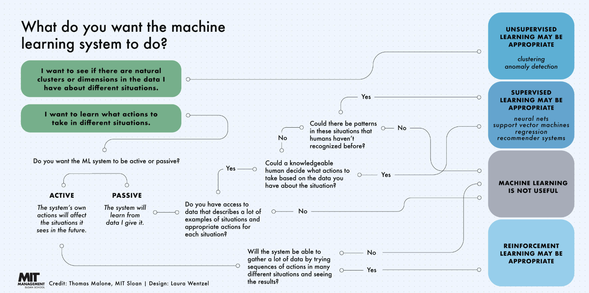

# Introduction to Deep Learning

<br>
<br>

# C-2: Deep Learning

<br>
<br>


<br>



<br>

The relationship between AI, ML, and DL can be understood as nested fields:

- AI (Artificial Intelligence): The broadest field that includes various algorithmic approaches like local search and logic programming
- ML (Machine Learning): A subset of AI focusing on specific modeling techniques like logistic regression and decision trees
- DL (Deep Learning): A specialized subset of ML specifically focused on neural network models


### Deep Learning Lifecycle

We begin with a problem statement, then move to development (where code gets written). Next, we begin training, where our model learns our data. After training, we deploy, which is when our model goes out into the world for use. A lot of other people do front-end work at this stage. Then we go to monitoring. For our purposes, we'll focus on the development and training of models.


### Training Tools


1. Experiment management like TensorBoard or Weights and Biases
   - Observe accuracy and loss at training time
   
2. Model versioning like DVC, Neptune, and Pachyderm
   - Remedy issues within the model across different versions of the model
   - DVC is very similar to Git


## Deciding When to Use Deep Learning

Deep Learning is a powerful tool in machine learning, but it's not always the optimal choice. Here's a guide to help you make informed decisions:

## Task Types

### Classification
- **Binary Classification**
  - Deep Learning: Complex decision boundaries
  - Alternatives: Logistic Regression, Decision Trees, SVMs

- **Multi-class Classification**
  - Deep Learning: Complex patterns, many classes
  - Alternatives: Decision Trees, SVMs

### Regression
- Deep Learning: Non-linear relationships
- Alternatives: Linear Regression, Decision Trees

## Data Considerations

### By Data Type
- **Images**: Deep Learning (CNNs) excels
- **Text**: Deep Learning (Transformers, RNNs) preferred
- **Tabular**: Traditional ML often better

### By Dataset Size
- **Large**: Deep Learning thrives
- **Small**: Traditional ML methods preferred

## When to Use Deep Learning
- Complex, non-linear patterns
- Large amounts of data available
- Unstructured data (images/text)
- Automatic feature extraction needed
- State-of-the-art performance required

## When to Avoid Deep Learning
- Small datasets
- Need for model interpretability
- Simple, linear relationships
- Limited computational resources
- Quick iteration requirements

Remember that we need to start with the simplest solution. Consider Deep Learning only after simpler approaches prove inadequate.


<br>
<br>

# C-3: Minimizing Error Function with Gradient Descent

<br>


Doing Deep Learning means training our models. These models are made up of parameters that are randomly initialized and gradually get closer to mapping our inputs to our outputs. This is done by minimizing our error function, and one of the key algorithms for minimizing error is the gradient descent algorithm. Once we are dealing with multilayer models, we need to find a way to backpropagate the changes, which we use the backpropagation algorithm for.

Improving our Machine Learning model means computing how far off our predictions are from their true values and minimizing the distance between those values. To do that, we'll need to understand how we can do that optimization programmatically. In this lesson, we will learn how to:


1. Create and manipulate PyTorch tensors.
2. Preprocess data using PyTorch.
3. Define and use loss functions to measure model performance.
4. Implement the foundational algorithms of deep learning: gradient descent and backpropagation.


## Introduction to Gradient Descent

Gradient descent is a fundamental optimization algorithm used in machine learning and deep learning to minimize the error 
(or loss) of a model. It's the backbone of how neural networks learn from data.

### What is Gradient Descent?

1. Definition: An iterative optimization algorithm for finding the minimum of a function.
2. In deep learning: Used to minimize the error function (also called loss function or cost function).
3. Goal: Adjust model parameters to find the lowest point (global minimum) of the error function.

### Key Concepts

1. Gradient: The vector of partial derivatives of the function with respect to each parameter.
2. Descent: Moving in the opposite direction of the gradient to reduce the function's value.

## The Error Function

### Purpose of the Error Function

1. Measures the difference between the model's predictions and the actual target values.
2. Provides a quantitative way to assess model performance.

### Common Error Functions

1. Mean Squared Error (MSE): For regression problems
   - Formula: MSE = (1/n) * Σ(y_true - y_pred)^2
2. Cross-Entropy Loss: For classification problems
   - Formula: -Σ(y_true * log(y_pred))

## Gradient Descent Algorithm

### Basic Steps

1. Initialize model parameters randomly.
2. Calculate the error using the current parameters.
3. Compute the gradient of the error with respect to each parameter.
4. Update parameters in the opposite direction of the gradient.
5. Repeat steps 2-4 until convergence or for a set number of iterations.

### Update Rule

Parameters are updated using the following formula:
θ_new = θ_old - η * ∇J(θ)

Where:
- θ: Model parameter
- η: Learning rate (step size)
- ∇J(θ): Gradient of the error function with respect to θ

### Learning Rate (η)

1. Controls the size of steps taken during optimization.
2. Too large: May overshoot the minimum.
3. Too small: Slow convergence and risk of getting stuck in local minima.

## Types of Gradient Descent

### Batch Gradient Descent

1. Uses entire dataset to compute gradient in each iteration.
2. Pros: Stable convergence, good for small datasets.
3. Cons: Slow for large datasets, requires all data to fit in memory.

### Stochastic Gradient Descent (SGD)

1. Uses a single randomly selected data point to compute gradient in each iteration.
2. Pros: Faster, can handle large datasets, can escape local minima.
3. Cons: High variance in parameter updates, may not converge to exact minimum.

### Mini-Batch Gradient Descent

1. Uses a small random subset of data (mini-batch) to compute gradient in each iteration.
2. Pros: Balance between batch and stochastic GD, widely used in practice.
3. Cons: Requires tuning of batch size hyperparameter.

## Challenges and Improvements

### A. Challenges

1. Choosing the right learning rate.
2. Avoiding local minima and saddle points.
3. Slow convergence for ill-conditioned problems.

### B. Improvements and Variants

1. Momentum: Adds a fraction of the previous update to the current one.
2. AdaGrad: Adapts learning rates for each parameter.
3. RMSprop: Addresses AdaGrad's radically diminishing learning rates.
4. Adam: Combines ideas from momentum and RMSprop.

## Gradient Descent in Deep Neural Networks

### Backpropagation

1. Efficient algorithm for computing gradients in neural networks.
2. Uses the chain rule to propagate error gradients from output to input layers.

### Challenges in Deep Networks

1. Vanishing gradients: Gradients become very small in early layers.
2. Exploding gradients: Gradients become very large, causing unstable updates.

### Solutions

1. Careful weight initialization (e.g., Xavier/Glorot initialization).
2. Using activation functions like ReLU to mitigate vanishing gradients.
3. Gradient clipping to prevent exploding gradients.


## Conclusion

Gradient descent is a powerful and versatile optimization algorithm that forms the foundation of learning in deep neural networks. 
By iteratively adjusting model parameters to minimize error, it enables these networks to learn complex patterns and relationships 
in data. Understanding its principles, variations, and challenges is crucial for effectively training and optimizing deep learning 
models.


## Data Preprocessing with PyTorch

Data preprocessing is a crucial step in preparing your data for machine learning models. PyTorch provides various tools and techniques 
to preprocess your data efficiently. Let's explore the key preprocessing steps mentioned in the image and how to implement them 
using PyTorch.

## Normalization

Normalization involves mapping numerical values to a standard range, typically [0, 1]. This helps in faster convergence 
during model training and ensures that all features contribute equally to the learning process.

## Data Augmentation

Data augmentation involves creating modified versions of existing data to increase the diversity of your training set. This 
helps in reducing overfitting and improving model generalization.


## IV. Label Encoding

Label encoding is the process of converting categorical labels into numerical format, which is necessary for many machine 
learning algorithms.


## Conclusion

Proper data preprocessing is essential for building effective machine learning models. PyTorch provides powerful tools for 
normalization, data augmentation, and creating efficient data pipelines. By leveraging these techniques, you can improve your 
model's performance and generalization capabilities.


## Data Representation

Rarely can we use "out of the box" input. We need our input to be tensors, but often our raw data consists of images, text, or tabular data, and we can't easily input those directly into our model.

1. For image data, we need the data to be turned into tensors with entries of the tensors as bit values in color channels (usually red, green, and blue).
2. Text data needs to be tokenized, meaning, individual words or groups of letters need to be mapped to a token value.
3. For tabular data, we have categorical values (high, medium, low, colors, demographic information, etc...) that we need to 
transform into numbers for processing.


### Transforming Data for Neural Networks

Often, we are faced with data that is not in a format conducive to use in neural networks in its raw form. Preprocessing is the act of turning data from that raw form into tensors that can be used as input to a neural network. This includes:


1. Encoding non-numerical features
2. Converting images to tensors of bit values in color channels
3. Tokenizing words


## One-Hot Encoding

1. Definition:
   One-Hot Encoding is a process of converting categorical variables into a form that could be provided to machine learning algorithms to do a better job in prediction. It creates binary columns for each category and uses 0 or 1 to indicate the presence of that category.

2. Purpose:
   - To represent categorical variables without assuming any ordinal relationship between categories.
   - To avoid the potential pitfall of machine learning algorithms assuming a natural ordering between categories when using simple integer encoding.

3. How it works:
   - For each category in a feature, a new binary column is created.
   - Each column represents one possible value of the categorical feature.
   - The column for the present category gets a value of 1, while all others get 0.

4. Example:
   Let's say we have a "Color" feature with categories: Red, Blue, Green
   
   One-Hot Encoding would create:
   
   | Color_Red | Color_Blue | Color_Green |
   |-----------|------------|-------------|
   |     1     |     0      |      0      |  (for Red)
   |     0     |     1      |      0      |  (for Blue)
   |     0     |     0      |      1      |  (for Green)

5. Advantages:
   - No arbitrary numerical relationships between categories.
   - Works well with many machine learning algorithms, especially tree-based models and neural networks.

6. Disadvantages:
   - Can significantly increase the number of features, leading to the "curse of dimensionality" for datasets with many categorical variables or categories.

7. PyTorch Implementation:
   While PyTorch doesn't have a built-in one-hot encoder, you can easily implement it:

8. When to use One-Hot Encoding vs Label Encoding:
   - Use One-Hot Encoding for nominal categorical variables (no inherent order).
   - Use Label Encoding for ordinal categorical variables (have a natural order).


One-Hot Encoding is particularly useful when working with neural networks or any algorithm that doesn't assume ordinal 
relationships between categories. It ensures that the machine learning model treats each category independently.


## Error Function 

An error function is simply a function that measures how far the current state is from the solution. We can calculate the error and then make a change in an attempt to reduce the error—and then repeat this process until we have reduced the error to an acceptable level.


## Log-Loss Error Function

Discrete and Continuous Errors One approach to reducing errors might be to simply count the number of errors and then make changes until the number of errors is reduced. But taking a discrete approach like this can be problematic—for example, we could change our line in a way that gets closer to the solution, but this change might not (by itself) improve the number of misclassified points.

Instead, we need to construct an error function that is continuous. That way, we can always tell if a small change in the line gets us closer to the solution. We'll do that in this lesson using the log-loss error function. Generally speaking, the log-loss function will assign a large penalty to incorrectly classified points and small penalties to correctly classified points. For a point that is misclassified, the penalty is roughly the distance from the boundary to the point. For a point that is correctly classified, the penalty is almost zero.

We can then calculate a total error by adding all the errors from the corresponding points. Then we can use gradient descent to solve the problem, making very tiny changes to the parameters of the line in order to decrease the total error until we have reached an acceptable minimum.

We need to cover some other concepts before we get into the specifics of how to calculate our log-loss function, but we'll come back to it when we dive into gradient descent later in the lesson.


## Log-Loss Error Function and Its Use in Gradient Descent


### Introduction to Log-Loss Error Function

The Log-Loss Error Function, also known as Cross-Entropy Loss, is a widely used loss function in machine learning, particularly for binary and multi-class classification problems.

### Definition

For binary classification, the Log-Loss function is defined as:

L(y, ŷ) = -1/N ∑(i=1 to N) [yi log(ŷi) + (1-yi) log(1-ŷi)]

Where:
- N is the number of samples
- yi is the true label (0 or 1)
- ŷi is the predicted probability of the positive class

### Characteristics

1. Always positive: Log-Loss is always ≥ 0
2. Perfect prediction: Log-Loss = 0 when the model predicts the correct class with 100% confidence
3. Penalizes confident mistakes: Heavily penalizes predictions that are both confident and wrong

## Log-Loss in Multi-class Classification

For multi-class problems, the formula extends to:

L(y, ŷ) = -1/N ∑(i=1 to N) ∑(j=1 to M) yij log(ŷij)

Where:
- M is the number of classes
- yij is 1 if sample i belongs to class j, and 0 otherwise
- ŷij is the predicted probability that sample i belongs to class j


## Why Use Log-Loss?

1. Probabilistic interpretation: Directly models probability distributions
2. Differentiable: Suitable for optimization algorithms like gradient descent
3. Handles imbalanced datasets well
4. Provides smoother gradients compared to other loss functions (e.g., 0-1 loss)

## Log-Loss and Gradient Descent

Gradient Descent is an optimization algorithm used to minimize the loss function by iteratively adjusting the model parameters.

### Gradient Descent Process

1. Initialize model parameters randomly
2. Calculate the predicted probabilities using current parameters
3. Compute the Log-Loss
4. Calculate the gradient of Log-Loss with respect to each parameter
5. Update parameters in the opposite direction of the gradient
6. Repeat steps 2-5 until convergence

### Gradient Calculation

For logistic regression (binary classification), the gradient of Log-Loss with respect to weights w is:

∂L/∂w = 1/N Xᵀ(ŷ - y)

Where:
- X is the input feature matrix
- ŷ is the vector of predicted probabilities
- y is the vector of true labels

### Parameter Update Rule

w_new = w_old - α ∂L/∂w

Where α is the learning rate.

## Advantages and Considerations

### Advantages
1. Works well for probabilistic classification
2. Provides smooth gradients for optimization
3. Naturally handles multi-class problems

### Considerations

1. Sensitive to outliers
2. May lead to overfitting if not regularized
3. Assumes independence between features (in logistic regression)


### Gradient Descent Conditions 


1. We need to be able to take very small steps in the direction that minimizes the error, which is only possible if our error function is continuous. With a discrete error function (such as a simple count of the number of misclassified points), a single small change may not have any detectable effect on the error.

2. We also mentioned that the error function should be differentiable.

## Conclusion

The Log-Loss Error Function, combined with Gradient Descent, forms a powerful framework for training classification models. 
Its probabilistic nature and smooth gradients make it particularly suitable for a wide range of machine learning tasks, 
especially when implemented with modern deep learning frameworks like PyTorch.


## Maximum Likelihood


### Maximum Likelihood Estimation with Sigmoid Function

#### Introduction

Maximum Likelihood Estimation (MLE) is a fundamental method in statistics and machine learning for estimating the parameters of a probability distribution. When combined with the sigmoid function, it forms the basis of logistic regression, a powerful tool for binary classification.


#### The Sigmoid Function

The sigmoid function, also known as the logistic function, is defined as:

σ(z) = 1 / (1 + e^(-z))

### Properties of the Sigmoid Function

1. Output range: (0, 1)
2. S-shaped curve
3. Symmetric around 0.5
4. Differentiable

### Use in Classification

In binary classification, the sigmoid function is used to map any real-valued number to a probability between 0 and 1.

## Logistic Regression Model

In logistic regression, we model the probability of the positive class as:

P(Y=1|X) = σ(wᵀX + b)

Where:
- X is the input feature vector
- w is the weight vector
- b is the bias term


<br>
<br>

## Maximum Likelihood Estimation

### Likelihood Function


For a dataset with n independent samples, the likelihood function is:

L(w, b) = ∏(i=1 to n) P(Y=yi|Xi)
        = ∏(i=1 to n) [σ(wᵀXi + b)]^yi [1 - σ(wᵀXi + b)]^(1-yi)

Where yi is the true label (0 or 1) for the i-th sample.

### Log-Likelihood

We typically work with the log-likelihood for computational convenience:

ℓ(w, b) = ∑(i=1 to n) [yi log(σ(wᵀXi + b)) + (1-yi) log(1 - σ(wᵀXi + b))]

### Maximum Likelihood Estimator

The goal is to find w and b that maximize the log-likelihood:

(w*, b*) = argmax(w,b) ℓ(w, b)

## Optimization

### Gradient Ascent

We can use gradient ascent to find the maximum:

w := w + α ∂ℓ/∂w
b := b + α ∂ℓ/∂b

Where α is the learning rate.

### Gradients

The gradients of the log-likelihood with respect to w and b are:

∂ℓ/∂w = ∑(i=1 to n) (yi - σ(wᵀXi + b)) Xi

∂ℓ/∂b = ∑(i=1 to n) (yi - σ(wᵀXi + b))


<br>
<br>

## Connection to Cross-Entropy Loss

Maximizing the log-likelihood is equivalent to minimizing the cross-entropy loss:

Cross-Entropy = -1/n ℓ(w, b)

This is why the cross-entropy loss is commonly used as the objective function in logistic regression and neural networks with sigmoid output.


## Conclusion

Maximum Likelihood Estimation with the sigmoid function provides a powerful framework for binary classification. It forms the basis of logistic regression and is closely related to the cross-entropy loss used in many machine learning models. Understanding this connection helps in interpreting model outputs as probabilities and in choosing appropriate loss functions for classification tasks.


## Cross Entropy 


Cross-entropy is a fundamental concept in machine learning that measures how different two probability distributions are from each other. It's particularly important in classification tasks where we need to measure how far off our model's predictions are from the true labels.

There are two main formulations:

1. Binary Cross-Entropy:
Used when we have just two possible classes (binary classification). The formula is:

```
-Σ[yi log(pi) + (1-yi)log(1-pi)]
```

where yi represents the true labels and pi represents our predictions.

2. Multi-Class Cross-Entropy:
Used when we have multiple classes (M classes). The formula extends to:

```
-Σ Σ yij log(pij)
```

where we sum over both examples (i) and classes (j).

Cross-entropy is particularly useful as a loss function in neural networks and other machine learning models because:
- It effectively captures the distance between predicted and actual probability distributions
- It penalizes predictions that are very confident but wrong
- It provides good gradients for optimization
- It works well for both binary and multi-class classification problems

The negative sign in both formulas ensures that minimizing cross-entropy brings our predictions closer to the true labels, making it an ideal choice for training neural networks.

<br>

<br>


## Gradient Calculation


Gradient descent is a fundamental optimization algorithm used in machine learning, particularly for training models like 
logistic regression. Here's the basic idea:

1. We start with a model that makes predictions, but it's not very accurate at first.

2. We have a way to measure how wrong our predictions are, called an error function or loss function.

3. Our goal is to adjust the model's parameters (weights and bias) to make it more accurate - in other words, to reduce the error.

4. The gradient is like a compass that tells us which direction to move our parameters to reduce the error. It points in the direction of steepest increase, so we go in the opposite direction to decrease the error.

5. We calculate this gradient for each parameter of our model.

6. Then we take a small step in the direction opposite to the gradient for each parameter. How big this step is depends on our learning rate (α).

7. If the gradient is large, we'll take a bigger step. If it's small, we'll take a smaller step.

8. We repeat this process many times, each time slightly adjusting our model's parameters to make it a little bit better.

The formulas in the image show exactly how we update our weights and bias:
- For weights: we add α(y - ŷ)xi to each weight
- For bias: we add α(y - ŷ)

Here, (y - ŷ) is the difference between the true value and our prediction. If our prediction is too low, this will be positive, 
and we'll increase our weights and bias. If our prediction is too high, this will be negative, and we'll decrease them.

The xi term for weights means we adjust weights more for features that have larger values, as they have more impact on the prediction.

By repeatedly applying these updates across our entire dataset, we gradually improve our model's accuracy.

In the last few videos, we learned that in order to minimize the error function, we need to take some derivatives. So let's 
get our hands dirty and actually compute the derivative of the error function. The first thing to notice is that the sigmoid 
function has a really nice derivative. Namely,


σ'(x) = σ(x)(1 - σ(x))

The reason for this is the following, we can calculate it using the quotient formula:

σ'(x) = ∂/∂x [1 / (1 + e^(-x))]
      = e^(-x) / (1 + e^(-x))^2
      = [1 / (1 + e^(-x))] · [e^(-x) / (1 + e^(-x))]
      = σ(x)(1 - σ(x)).

And now, let's recall that if we have m points labelled x^(1), x^(2), ..., x^(m), the error formula is:

E = -1/m ∑(i=1 to m) [yi ln(ŷi) + (1 - yi) ln(1 - ŷi)]

where the prediction is given by ŷi = σ(Wx^(i) + b).

Our goal is to calculate the gradient of E, at a point x = (x1, ..., xn), given by the partial derivatives

∇E = (∂E/∂w1, ..., ∂E/∂wn, ∂E/∂b)

To simplify our calculations, we'll actually think of the error that each point produces, and calculate the derivative of this error. The total error, then, is the average of the errors at all the points. The error produced by each point is, simply,

E = -y ln(ŷ) - (1 - y) ln(1 - ŷ)

In order to calculate the derivative of this error with respect to the weights, we'll first calculate ∂ŷ/∂wj. Recall that ŷ = σ(Wx + b), so:

∂ŷ/∂wj = ∂/∂wj σ(Wx + b)
        = σ(Wx + b)(1 - σ(Wx + b)) · ∂/∂wj (Wx + b)
        = ŷ(1 - ŷ) · ∂/∂wj (w1x1 + ... + wjxj + ... + wnxn + b)
        = ŷ(1 - ŷ) · xj.

Now, we can go ahead and calculate the derivative of the error E at a point x, with respect to the weight wj.

∂E/∂wj = ∂/∂wj [-y log(ŷ) - (1 - y) log(1 - ŷ)]
        = -y ∂/∂wj log(ŷ) - (1 - y) ∂/∂wj log(1 - ŷ)
        = -y · 1/ŷ · ∂ŷ/∂wj - (1 - y) · 1/(1 - ŷ) · ∂/∂wj (1 - ŷ)
        = -y(1 - ŷ)xj + (1 - y)ŷxj
        = -(y - ŷ)xj.

A similar calculation will show us that

∂E/∂b = -(y - ŷ).

This actually tells us something very important. For a point with coordinates (x1, ..., xn), label y, and prediction ŷ, 
the gradient of the error function at that point is (-(y - ŷ)x1, ..., -(y - ŷ)xn, -(y - ŷ)). In summary, the gradient is

∇E = -(y - ŷ)(x1, ..., xn, 1).


So, a small gradient means we'll change our coordinates by a little bit, and a large gradient means we'll change our coordinates by a lot.

# Gradient Descent Step

Therefore, since the gradient descent step simply consists in subtracting a multiple of the gradient of the error function 
at every point, then this updates the weights in the following way:

w'i ← wi - α[-(y - ŷ)xi],

which is equivalent to

w'i ← wi + α(y - ŷ)xi.

Similarly, it updates the bias in the following way:

b' ← b + α(y - ŷ),


Note: Since we've taken the average of the errors, the term we are adding should be 1/m · α instead of α, but as α is a 
constant, then in order to simplify calculations, we'll just take 1/m · α to be our learning rate, and abuse the notation 
by just calling it α.


## Gradient Calculation for Logistic Regression

In logistic regression, we need to calculate derivatives to minimize the error function. This lecture note focuses on computing the gradient of the error function.

## Sigmoid Function Derivative

The sigmoid function has a convenient derivative:

σ'(x) = σ(x)(1 - σ(x))

Proof:

σ'(x) = ∂/∂x [1 / (1 + e^(-x))]
       = e^(-x) / (1 + e^(-x))^2
       = [1 / (1 + e^(-x))] · [e^(-x) / (1 + e^(-x))]
       = σ(x)(1 - σ(x))

## Error Function

For m points labeled x^(1), x^(2), ..., x^(m), the error formula is:

E = -1/m ∑(i=1 to m) [yi ln(ŷi) + (1 - yi) ln(1 - ŷi)]

Where the prediction is given by ŷi = σ(Wx^(i) + b).

## Gradient Calculation

Our goal is to calculate the gradient of E at a point x = (x1, ..., xn):

∇E = (∂E/∂w1, ..., ∂E/∂wn, ∂E/∂b)

### Derivative with respect to weights

First, we calculate ∂ŷ/∂wj:

∂ŷ/∂wj = ŷ(1 - ŷ) · xj

Then, we calculate ∂E/∂wj:

∂E/∂wj = -y · (1/ŷ) · ∂ŷ/∂wj - (1-y) · (1/(1-ŷ)) · ∂(1-ŷ)/∂wj
        = -y(1 - ŷ)xj + (1 - y)ŷxj
        = -(y - ŷ)xj

### Derivative with respect to bias

Similarly, we can show that:

∂E/∂b = -(y - ŷ)

## Final Gradient Formula

For a point with coordinates (x1, ..., xn), label y, and prediction ŷ, the gradient of the error function at that point is:

∇E = -(y - ŷ)(x1, ..., xn, 1)


## Significance

The gradient is a scalar (y - ŷ) multiplied by the coordinates of the point (with an additional 1 for the bias term). This 
scalar represents the difference between the true label and the prediction, highlighting the error's direct influence on the gradient's magnitude and direction.


### Logistic Regression


1. Take your data.
2. Pick a random model.
3. Calculate the error.
4. Minimize the error and obtain a better model


Logistic regression is a fundamental machine learning algorithm used for binary classification problems. Despite its name, it's a classification algorithm, not a regression algorithm.

## The Logistic Function
At the core of logistic regression is the logistic function (also called sigmoid function):

σ(z) = 1 / (1 + e^(-z))

This function maps any real-valued number to a value between 0 and 1, which can be interpreted as a probability.

## Model Representation
In logistic regression, we model the probability that an input X belongs to the positive class:

P(Y=1|X) = σ(WᵀX + b)

Where:
- W is the weight vector
- X is the input feature vector
- b is the bias term

## Decision Boundary
The decision boundary is the point where the model predicts a 0.5 probability. This occurs when WᵀX + b = 0.

## Cost Function
We use the log loss (also called cross-entropy loss) as our cost function:

J(W,b) = -1/m ∑[y·log(ŷ) + (1-y)·log(1-ŷ)]

Where:
- m is the number of training examples
- y is the true label (0 or 1)
- ŷ is the predicted probability

## Gradient Descent
To minimize the cost function, we use gradient descent:

1. Initialize W and b
2. Repeat until convergence:
   W := W - α · ∂J/∂W
   b := b - α · ∂J/∂b

Where α is the learning rate.


## Advantages and Limitations

Advantages:
- Simple and interpretable
- Performs well on linearly separable classes
- Outputs have a nice probabilistic interpretation

Limitations:
- Assumes a linear decision boundary
- May underperform on complex datasets

## Applications
- Medical diagnosis
- Email spam detection
- Credit risk assessment
- Marketing campaign response prediction


## Calculating the Error Function

For reference, here is the formula for the error function (for binary classification problems):

Error function = -1/m ∑(i=1 to m) [(1 - yi) ln(1 - ŷi) + yi ln(ŷi)]

And the total formula for the error is then:

E(W, b) = -1/m ∑(i=1 to m) [(1 - yi) ln(1 - σ(Wx^(i) + b)) + yi ln(σ(Wx^(i) + b))]

For multiclass problems, the error function is:

Error function = -1/m ∑(i=1 to m) ∑(j=1 to n) yij ln(ŷij)

Now that we know how to calculate the error, our goal will be to minimize it.


## Minimizing the Error Function in Logistic Regression

## Introduction

Minimizing the error function is a crucial step in training a logistic regression model. The goal is to find the optimal 
parameters (weights and bias) that result in the lowest possible error on the training data.

## The Error Function

Recall the error function for binary logistic regression:

E(W, b) = -1/m ∑(i=1 to m) [(1 - yi) ln(1 - ŷi) + yi ln(ŷi)]

Where:
- m is the number of training examples
- yi is the true label (0 or 1)
- ŷi is the predicted probability

## Gradient Descent

The primary method for minimizing the error function is gradient descent. This iterative optimization algorithm takes steps 
proportional to the negative of the gradient of the function at the current point.

### Steps of Gradient Descent:

1. Initialize parameters W and b randomly
2. Calculate the gradient of E with respect to W and b
3. Update parameters:
   W := W - α ∂E/∂W
   b := b - α ∂E/∂b
4. Repeat steps 2-3 until convergence

Where α is the learning rate.

## Calculating the Gradient

The gradient for each weight wj is:

∂E/∂wj = 1/m ∑(i=1 to m) (ŷi - yi) xij

And for the bias b:

∂E/∂b = 1/m ∑(i=1 to m) (ŷi - yi)


## Learning Rate

The learning rate α determines the step size at each iteration. 
- If α is too small, convergence will be slow.
- If α is too large, the algorithm might overshoot the minimum and fail to converge.

Choosing an appropriate learning rate is crucial for effective minimization.

## Convergence

The algorithm converges when:
- The change in error between iterations becomes very small
- A maximum number of iterations is reached

## Variants of Gradient Descent

1. Batch Gradient Descent: Uses the entire dataset for each update
2. Stochastic Gradient Descent (SGD): Uses a single example for each update
3. Mini-Batch Gradient Descent: Uses a small random subset of data for each update

## Optimization Techniques

Several techniques can improve the basic gradient descent algorithm:

1. Momentum: Adds a fraction of the previous update to the current one
2. AdaGrad: Adapts the learning rate for each parameter
3. RMSprop: Addresses AdaGrad's radically diminishing learning rates
4. Adam: Combines ideas from momentum and RMSprop

## Avoiding Local Minima

The error function in logistic regression is convex, meaning it has only one global minimum. This ensures that gradient 
descent will converge to the optimal solution, regardless of the initial parameter values.

## Regularization

To prevent overfitting, we often add a regularization term to the error function:

E(W, b) = -1/m ∑(i=1 to m) [(1 - yi) ln(1 - ŷi) + yi ln(ŷi)] + λ||W||^2

Where λ is the regularization parameter. This discourages the model from relying too heavily on any single feature.

## Conclusion

Minimizing the error function is a critical step in training an effective logistic regression model. By using gradient 
descent and its variants, we can find the optimal parameters that best fit our training data while avoiding overfitting.


## Implementing Gradient Descent

## Introduction

Gradient descent is a fundamental optimization algorithm used to minimize the error function in machine learning models, including neural networks. This lecture focuses on implementing gradient descent for a simple neural network using the graduate school admissions dataset.

## Data Preprocessing

Before implementing gradient descent, it's crucial to preprocess the data:

1. Convert categorical variables (like rank) into dummy variables.
2. Standardize continuous variables (GRE and GPA) to have zero mean and unit standard deviation.

## Error Function

We use the Mean Squared Error (MSE) instead of Sum of Squared Errors (SSE):

E = 1/(2m) ∑μ(yμ - ŷμ)^2

Where:
- m is the number of records
- y is the true label
- ŷ is the predicted output

## Gradient Descent Algorithm

1. Initialize weights
2. For each epoch:
   a. Set weight step Δwi = 0
   b. For each record in the training data:
      - Forward pass: ŷ = f(∑i wi xi)
      - Calculate error term: δ = (y - ŷ) * f'(∑i wi xi)
      - Update weight step: Δwi = Δwi + δxi
   c. Update weights: wi = wi + η Δwi / m

Where η is the learning rate.

## Sigmoid Function and Its Derivative

Sigmoid function: f(h) = 1 / (1 + e^(-h))
Derivative: f'(h) = f(h)(1 - f(h))


## Key Points

1. Initialize weights randomly from a normal distribution with scale 1/sqrt(n_features).
2. Use np.dot() for efficient computation of the dot product.
3. The error term calculation simplifies due to the properties of the sigmoid function.
4. Adjust the learning rate to balance between convergence speed and accuracy.


Implementing gradient descent involves careful data preprocessing, understanding of the error function and its derivatives, 
and efficient computation using libraries like NumPy. This implementation forms the basis for training more complex neural 
networks and can be extended to other optimization problems in machine learning.


<br>
<br>


## Mean Square Error

We're going to make a small change to how we calculate the error here. Instead of the SSE, we're going to use the mean of the square errors (MSE). Now that we're using a lot of data, summing up all the weight steps can lead to really large updates that make the gradient descent diverge. To compensate for this, you'd need to use a quite small learning rate. Instead, we can just divide by the number of records in our data, m to take the average. This way, no matter how much data we use, our learning rates will typically be in the range of 0.01 to 0.001. Then, we can use the MSE (shown below) to calculate the gradient and the result is the same as before, just averaged instead of summed.

E = 1/(2m) ∑(y^μ - ŷ^μ)²

Here's the general algorithm for updating the weights with gradient descent:

* Set the weight step to zero: Δw_i = 0
* For each record in the training data:
  * Make a forward pass through the network, calculating the output ŷ = f(∑_i w_ix_i)
  * Calculate the error term for the output unit, δ = (y - ŷ) * f'(∑_i w_ix_i)
  * Update the weight step Δw_i = Δw_i + δx_i
* Update the weights w_i = w_i + ηΔw_i/m where η is the learning rate and m is the number of records. Here we're averaging the weight steps to help reduce any large variations in the training data.
* Repeat for e epochs.

You can also update the weights on each record instead of averaging the weight steps after going through all the records.

Remember that we're using the sigmoid for the activation function,

f(h) = 1/(1 + e^(-h))

And the gradient of the sigmoid is

f'(h) = f(h)(1 - f(h))

where h is the input to the output unit,

h = ∑_i w_ix_i


<br>
<br>


## Perceptrons


A Perceptron is a fundamental building block of neural networks, representing the simplest form of an artificial neuron. It takes multiple inputs, processes them, and produces a binary output.

<br>

<br>


## Structure of a Perceptron

1. Inputs: The Perceptron receives n inputs, denoted as x₁, x₂, ..., xₙ.
2. Weights: Each input is associated with a weight (W₁, W₂, ..., Wₙ).
3. Bias: An additional input with a constant value of 1 and its associated weight b.

## Computation in a Perceptron

The Perceptron performs two main steps:

1. Linear Combination:
   It calculates a weighted sum of inputs plus the bias:

   Wx + b = ∑(i=1 to n) WᵢXᵢ + b

2. Activation:

The result is then passed through an activation function. In the simplest case, this is a step function:
   - If Wx + b ≥ 0, the output is "Yes" (or 1)
   - If Wx + b < 0, the output is "No" (or 0)

## Decision Making

- The Perceptron essentially defines a decision boundary in the input space.
- This boundary is a hyperplane defined by the equation Wx + b = 0.
- Inputs on one side of this hyperplane are classified as "Yes", and on the other side as "No".


<br>

<br>


## Learning Process

- The weights and bias of a Perceptron can be adjusted through a learning process.
- This typically involves presenting the Perceptron with labeled training data and adjusting the weights based on the errors it makes.

## Limitations

- Perceptrons can only learn linearly separable functions.
- For more complex problems, multiple Perceptrons need to be combined into multi-layer networks.


## Historical Significance

- Introduced by Frank Rosenblatt in 1958, Perceptrons were among the first machine learning algorithms.
- They laid the groundwork for more complex neural network architectures.

## Applications

- Binary classification tasks
- As building blocks in more complex neural networks
- Simple decision-making systems

Understanding Perceptrons is crucial as they form the basis for understanding more complex neural network architectures 
and deep learning models.


<br>
<br>


## Multilayer Perceptrons (MLPs)


Multilayer Perceptrons (MLPs) are neural networks with one or more hidden layers between the input and output layers. They can solve linearly inseparable problems, unlike single-layer perceptrons.

## Structure of an MLP
- Input layer
- One or more hidden layers
- Output layer

Example: A network with three input units, two hidden units, and one output unit.


<br>

<br>

## Calculation Process

1. Input to hidden layer: Weighted sum of inputs plus bias
2. Hidden layer activation: Apply activation function (e.g., sigmoid)
3. Output layer input: Weighted sum of hidden layer activations
4. Output layer activation: Apply activation function to get final output


## Weight Notation

For multiple layers, weights require two indices: wᵢⱼ
- i: input unit index
- j: hidden unit index

## Weight Matrix
For a network with 3 input units and 2 hidden units:

[w₁₁ w₁₂]
[w₂₁ w₂₂]
[w₃₁ w₃₂]


<br>

<br>

## Hidden Layer Calculation
For each hidden unit hⱼ:

hⱼ = ∑ᵢ wᵢⱼxᵢ

Using matrix multiplication:

hidden_inputs = np.dot(inputs, weights_input_to_hidden)


## Forward Pass Implementation

The forward pass in a perceptron, or more generally in a neural network, is the process of propagating input data through 
the network to generate an output. Let me explain this process step-by-step for a multilayer perceptron:

Input Layer:

The process starts with the input data being fed into the input layer. 

Hidden Layer(s):

For each neuron in the hidden layer:
a. Calculate the weighted sum of inputs:
h_j = ∑(i=1 to n) w_ij * x_i + b_j
Where:

h_j is the input to the j-th hidden neuron
w_ij is the weight from the i-th input to the j-th hidden neuron
x_i is the i-th input
b_j is the bias for the j-th hidden neuron

b. Apply the activation function:
a_j = f(h_j)
Where f is typically a non-linear function like sigmoid or ReLU


Output Layer:

Similar to the hidden layer, but using the outputs from the hidden layer as inputs:
a. Calculate the weighted sum:
y_k = ∑(j=1 to m) w_jk * a_j + b_k
b. Apply the activation function:
output_k = f(y_k)


## Key Points
- MLPs can learn more complex patterns with deep stacks of hidden layers.
- Matrix multiplication is crucial for efficient computation in MLPs.
- The dimensions of weight matrices must match the number of units in connected layers.
- Activation functions (e.g., sigmoid) introduce non-linearity, allowing MLPs to solve complex problems.


<br>
<br>

## Backpropagation 

<br>

The backpropagation algorithm is just an extension of that, using the chain rule to find the error with the respect to the weights connecting the input layer to the hidden layer (for a two layer network).

To update the weights to hidden layers using gradient descent, you need to know how much error each of the hidden units contributed to the final output. Since the output of a layer is determined by the weights between layers, the error resulting from units is scaled by the weights going forward through the network. Since we know the error at the output, we can use the weights to work backwards to hidden layers.

For example, in the output layer, you have errors δₖᵒ attributed to each output unit k. Then, the error attributed to hidden unit j is the output errors, scaled by the weights between the output and hidden layers (and the gradient):

δⱼʰ = ∑Wⱼₖδₖᵒf'(hⱼ).

Then, the gradient descent step is the same as before, just with the new errors:

Δwᵢⱼ = ηδⱼʰxᵢ

where wᵢⱼ are the weights between the inputs and hidden layer and xᵢ are input unit values. This form holds for however many layers there are. The weight steps are equal to the step size times the output error of the layer times the values of the inputs to that layer

Δwₚᵩ = ηδₒᵤₜₚᵤₜVᵢₙ.

Here, you get the output error, δₒᵤₜₚᵤₜ, by propagating the errors backwards from higher layers. And the input values, Vᵢₙ are the inputs to the layer, the hidden layer activations to the output unit for example.


Backpropagation is a fundamental algorithm used to train artificial neural networks, especially those with multiple layers. 
Here's a brief explanation:

1. Purpose: It's used to calculate gradients efficiently, which are needed to update the network's weights during training.

2. Process: 
   - First, the network makes a forward pass to generate predictions.
   - Then, it calculates the error between predictions and actual targets.
   - Finally, it propagates this error backwards through the network layers.

3. Key Idea: It uses the chain rule of calculus to compute how each weight contributes to the overall error.

4. Weight Updates: Based on these calculated gradients, the weights are adjusted to minimize the error.

5. Efficiency: Backpropagation allows for efficient computation of gradients for all weights simultaneously, making it 
feasible to train large networks.

6. Iterative: This process is repeated many times over the training data to gradually improve the network's performance.

In essence, backpropagation is the "learning" mechanism that allows neural networks to adjust their internal parameters 
to better fit the training data.


Backpropagation is a fundamental algorithm for training multilayer neural networks. It extends the concept of gradient descent to hidden layers, allowing the network to learn complex patterns.In a multilayer network, we need to calculate the error for hidden layer units to update their weights. Backpropagation 
solves this by propagating the error backwards through the network.

The error in a hidden unit is proportional to the sum of the errors in the output units to which it is connected, weighted by the strength of those connections. This aligns with the intuition that units more strongly connected to the output contribute more to the final error.

## Mathematical Formulation

For a hidden unit j, the error term δⱼʰ is calculated as:

δⱼʰ = ∑ Wⱼₖ δᵏₒ f'(hⱼ)

Where:
- Wⱼₖ is the weight between hidden unit j and output unit k
- δᵏₒ is the error term of output unit k
- f'(hⱼ) is the derivative of the activation function at the input to unit j

The weight update rule remains similar to single-layer networks:

Δwᵢⱼ = η δⱼʰ xᵢ

Where:
- η is the learning rate
- xᵢ is the input to the layer

## Detailed Example


Let's walk through the steps of calculating the weight updates for a simple two layer network. Suppose there are two input values, one hidden unit, and one output unit, with sigmoid activations on the hidden and output units. The following image depicts this network. (Note: the input values are shown as nodes at the bottom of the image, while the network's output value is shown as y^ at the top. The inputs themselves do not count as a layer, which is why this is considered a two layer network.)

<br>

<br>

Assume we're trying to fit some binary data and the target is y = 1. We'll start with the forward pass, first calculating the input to the hidden unit

h = ∑ᵢwᵢxᵢ = 0.1 × 0.4 - 0.2 × 0.3 = -0.02

and the output of the hidden unit

a = f(h) = sigmoid(-0.02) = 0.495.

Using this as the input to the output unit, the output of the network is

ŷ = f(W · a) = sigmoid(0.1 × 0.495) = 0.512.

With the network output, we can start the backwards pass to calculate the weight updates for both layers. Using the fact that for the sigmoid function
f'(W · a) = f(W · a)(1 - f(W · a)), the error term for the output unit is

δᵒ = (y - ŷ)f'(W · a) = (1 - 0.512) × 0.512 × (1 - 0.512) = 0.122.

Now we need to calculate the error term for the hidden unit with backpropagation. Here we'll scale the error term from the output unit by the weight W connecting it to the hidden unit. For the hidden unit error term, δⱼʰ = ∑ₖWⱼₖδₖᵒf'(hⱼ), but since we have one hidden unit and one output unit, this is much simpler.

δʰ = Wδᵒf'(h) = 0.1 × 0.122 × 0.495 × (1 - 0.495) = 0.003

Now that we have the errors, we can calculate the gradient descent steps. The hidden to output weight step is the learning rate, times the output unit error, times the hidden unit activation value.

ΔW = ηδᵒa = 0.5 × 0.122 × 0.495 = 0.0302

Then, for the input to hidden weights wᵢ, it's the learning rate times the hidden unit error, times the input values.

Δwᵢ = ηδʰxᵢ = (0.5 × 0.003 × 0.1, 0.5 × 0.003 × 0.3) = (0.00015, 0.00045)

From this example, you can see one of the effects of using the sigmoid function for the activations. The maximum derivative of the sigmoid function is 0.25, so the errors in the output layer get reduced by at least 75%, and errors in the hidden layer are scaled down by at least 93.75%! You can see that if you have a lot of layers, using a sigmoid activation function will quickly reduce the weight steps to tiny values in layers near the input. This is known as the vanishing gradient problem. Later in the course you'll learn about other activation functions that perform better in this regard and are more commonly used in modern network architectures.


Let's walk through a simple two-layer network with:
- Two input values
- One hidden unit
- One output unit
- Sigmoid activation functions

Network structure:

1. Forward Pass:

   h = ∑ᵢ wᵢxᵢ = 0.1 × 0.4 - 0.2 × 0.3 = -0.02
   a = f(h) = sigmoid(-0.02) = 0.495
   ŷ = f(W·a) = sigmoid(0.1 × 0.495) = 0.512

2. Backward Pass:

   Output error term:
   δₒ = (y - ŷ) f'(W·a) = (1 - 0.512) × 0.512 × (1 - 0.512) = 0.122

   Hidden unit error term:
   δʰʰ = δₒWⱼf'(hⱼ)
        = 0.1 × 0.122 × 0.495 × (1 - 0.495) = 0.003

3. Weight Updates:

   Hidden to output weight:
   ΔW = ηδₒa = 0.5 × 0.122 × 0.495 = 0.0302

   Input to hidden weights:
   Δwᵢ = ηδʰʰaᵢ = (0.5 × 0.003 × 0.1, 0.5 × 0.003 × 0.3) = (0.00015, 0.00045)

## Key Considerations

1. Vanishing Gradient Problem: The sigmoid function's maximum derivative is 0.25, which can lead to very small weight updates 
in deep networks.

2. NumPy Broadcasting: Utilize NumPy's broadcasting capabilities for efficient matrix operations.

3. Error Propagation: The error is scaled by the weights as it propagates backwards, reflecting each unit's contribution to the final output.


## Conclusion

Backpropagation is a powerful algorithm that enables the training of multilayer neural networks. By efficiently computing 
gradients for all layers, it allows networks to learn complex, non-linear mappings from inputs to outputs. Understanding 
backpropagation is crucial for implementing, optimizing, and debugging neural networks.


## Implementing Backpropagation

Now we've seen that the error term for the output layer is:

δₖ = (yₖ - ŷₖ) f'(aₖ)

and the error term for the hidden layer is:

δⱼ = ∑[wⱼₖδₖ] f'(hⱼ)

For now we'll only consider a simple network with one hidden layer and one output unit. Here's the general algorithm for updating the weights with backpropagation:

1. Set the weight steps for each layer to zero
   - The input to hidden weights Δwᵢⱼ = 0
   - The hidden to output weights ΔWⱼ = 0

2. For each record in the training data:
   - Make a forward pass through the network, calculating the output ŷ
   - Calculate the error gradient in the output unit, δₒ = (y - ŷ) f'(z) where z = ∑ⱼWⱼaⱼ, the input to the output unit.
   - Propagate the errors to the hidden layer δⱼʰ = δₒWⱼf'(hⱼ)
   - Update the weight steps, where η is the learning rate:
     - ΔWⱼ = ηδₒaⱼ
     - Δwᵢⱼ = ηδⱼʰaᵢ

3. Update the weights, where m is the number of records:
   - Wⱼ = Wⱼ + ΔWⱼ/m
   - wᵢⱼ = wᵢⱼ + Δwᵢⱼ/m

4. Repeat for e epochs.

This algorithm outlines the process of implementing backpropagation for a simple neural network with one hidden layer and one output unit.


<br>
<br>

# C-5: Training Neural Networks

<br>
<br>

# C-4: Intro to Neural Networks

<br>

Neural Network Architecture

Combining Models

We will combine two linear models to get our non-linear model. Essentially the steps to do this are:

1. Calculate the probability for each model
2. Apply weights to the probabilities
3. Add the weighted probabilities
4. Apply the sigmoid function to the result


Neural networks have a certain special architecture with layers:


1. The first layer is called the input layer, which contains the inputs.
2. The next layer is called the hidden layer, which is the set of linear models created with the input layer.
3. The final layer is called the output layer, which is where the linear models get combined to obtain a nonlinear model.

Neural networks can have different architectures, with varying numbers of nodes and layers:

   1. Input nodes. In general, if we have n n nodes in the input layer, then we are modeling data in n-dimensional space (e.g., 
   3 nodes in the input layer means we are modeling data in 3-dimensional space).

   2. Output nodes. If there are more nodes in the output layer, this simply means we have more outputs—for example, we may 
   have a multiclass classification model.

   3. Layers. If there are more layers then we have a deep neural network. Our linear models combine to create nonlinear models, 
   which then combine to create even more nonlinear models!


      
The softmax mentioned in the video is the activation function used by multiclass classification, which we will cover shortly 
in this lesson.

When we have three or more classes, we could construct three separate neural networks—one for predicting each class. However, 
this is not necessary. Instrad, we can add more nodes in the output layer. Each of these nodes will give us the probability that 
the item belongs to the given class.


Training a neural network essentially means determining what parameters they should have on the edges in order to model 
our data well. So in order to learn how to train them, we need to look carefully at how they process the input to obtain an output.


# Feedforward in Neural Networks


## Introduction


Feedforward is the fundamental process by which neural networks transform input data into output predictions. It's called 
"feedforward" because information flows through the network in one direction, from input to output, without any loops or 
feedback.

## General Process
The feedforward process can be broken down into these steps:

1. Take the input vector
2. Apply a sequence of linear models (weighted sums)
3. Apply activation functions (like sigmoid) after each linear model
4. Combine these transformations to create a highly non-linear map

## Mathematical Representation
For a simple neural network with one hidden layer, the feedforward process can be represented as:

ŷ = σ ∘ W⁽²⁾ ∘ σ ∘ W⁽¹⁾(x)

Where:
- x is the input vector
- W⁽¹⁾ represents the weights of the first layer
- W⁽²⁾ represents the weights of the second layer
- σ is the activation function (e.g., sigmoid)
- ∘ denotes function composition

## Step-by-Step Breakdown
1. Input Layer: The input vector x is received.
2. First Hidden Layer: 
   - Compute W⁽¹⁾(x) (linear transformation)
   - Apply σ to the result (non-linear activation)
3. Output Layer:
   - Take the output from the hidden layer and apply W⁽²⁾
   - Apply σ again to get the final output ŷ

## Importance
The feedforward process allows neural networks to approximate complex functions. By stacking multiple layers of linear 
transformations and non-linear activations, the network can learn to represent intricate patterns in the data.


## Conclusion
Feedforward is the core operation in neural networks, transforming inputs into outputs. It's the process that allows 
trained networks to make predictions on new, unseen data.


## Activation Functions in Neural Networks


Activation functions are mathematical operations applied to the output of a neuron in a neural network. They serve several 
crucial purposes:

1. Non-linearity: They introduce non-linear properties to the network, allowing it to learn complex patterns and relationships in data.

2. Output transformation: They transform the neuron's output, often mapping it to a specific range (e.g., between 0 and 1, or -1 and 1).

3. Decision making: They help determine whether a neuron should "fire" (be activated) based on its input.

4. Gradient flow: They allow for the flow of gradients during backpropagation, enabling the network to learn.


Common activation functions include:

- Sigmoid: Maps output to (0, 1)
- ReLU (Rectified Linear Unit): Returns 0 for negative inputs, and the input itself for positive values
- Tanh: Similar to sigmoid, but maps to (-1, 1)


The choice of activation function can significantly impact a neural network's performance and training dynamics. Six activation 
functions plotted: ReLU, Leaky ReLU, Sigmoid, Tanh, Step, and GELU


<br>


<br>

Activation Function Properties

There are a wide variety of activation functions that we can use. Activation functions should be:

1. Nonlinear
2. Differentiable -- preferably everywhere
3. Monotonic
4. Close to the identity function at the origin

We can loosen these restrictions slightly. For example, ReLU is not differentiable at the origin. Others, like monotonicity, 
are very important and cannot be reasonably relaxed.

## I. Introduction

Activation functions are crucial components in neural networks, introducing non-linearity into the network's computations. 
They determine whether a neuron should be activated or not, based on the relevance of the input in the prediction process.

## II. Purpose of Activation Functions

1. Introduce non-linearity: Allow networks to learn complex patterns
2. Normalize the output: Often bound the output to a specific range
3. Enable backpropagation: Most are differentiable, allowing gradient-based optimization

## III. Common Activation Functions

### A. Sigmoid Function

σ(x) = 1 / (1 + e^(-x))

- Output range: (0, 1)
- Pros: Smooth gradient, clear predictions
- Cons: Vanishing gradient problem, not zero-centered

### B. Hyperbolic Tangent (tanh)

tanh(x) = (e^x - e^(-x)) / (e^x + e^(-x))

- Output range: (-1, 1)
- Pros: Zero-centered, stronger gradients than sigmoid
- Cons: Still suffers from vanishing gradient problem

### C. Rectified Linear Unit (ReLU)

f(x) = max(0, x)

- Output range: [0, ∞)
- Pros: Computationally efficient, mitigates vanishing gradient
- Cons: "Dying ReLU" problem (neurons can become inactive)

### D. Leaky ReLU

f(x) = max(αx, x), where α is a small constant

- Addresses the "dying ReLU" problem
- Allows small negative values when x < 0

### E. Softmax (for multi-class classification)

softmax(x_i) = e^(x_i) / Σ(e^(x_j))

- Outputs a probability distribution over classes

## IV. Choosing Activation Functions

- Hidden layers: ReLU is often a good default choice
- Output layer: Depends on the task (e.g., sigmoid for binary classification, softmax for multi-class)
- Consider the problem domain and network architecture

## V. Impact on Training

- Affects the speed of convergence
- Influences the occurrence of vanishing/exploding gradients
- Can impact the network's ability to approximate complex functions

## VI. Recent Developments

- Swish: f(x) = x * sigmoid(βx)
- GELU (Gaussian Error Linear Unit)
- Mish: f(x) = x * tanh(softplus(x))

These newer functions aim to combine the benefits of traditional activations while mitigating their drawbacks.

## VII. Practical Considerations

- Initialization: Different activation functions may require different weight initialization strategies
- Learning rate: The choice of activation function can influence the appropriate learning rate
- Regularization: Some activations (like ReLU) can have a regularizing effect


## VIII. Conclusion

Activation functions are essential for enabling neural networks to learn complex, non-linear relationships in data. Understanding 
their properties and impacts is crucial for designing effective neural network architectures and troubleshooting training issues.


# Output Functions in Neural Networks - Softmax

## I. Introduction to Output Functions


Output functions, also known as activation functions for the output layer, determine the final form of a neural network's 
output. They are crucial for mapping the network's computations to the desired output format, especially in classification 
tasks.

## II. The Softmax Function

### A. Definition

The Softmax function is defined as:

σ(x)ᵢ = e^xᵢ / (Σⱼ₌₁ᵏ e^xⱼ)

Where:
- x is the input vector
- i represents the i-th element of the input
- k is the number of classes

### B. Properties

1. Produces a probability distribution:
   - Outputs are between 0 and 1
   - Sum of all outputs equals 1

2. Emphasizes the largest values while suppressing lower ones

3. Preserves the order of inputs (monotonic)

## III. Applications of Softmax

1. Multi-class Classification: Primary use case
2. Neural Network Output Layer: Common for classification tasks
3. Probability Estimation: Provides probabilities for each class

## IV. Characteristics (as mentioned in the image)

1. Difficult to plot:
   - Returns a probability distribution across classes
   - Limited to 3 dimensions for visualization

2. Returns a vector of probabilities:
   - Each element corresponds to the probability of a class given the input

## V. Advantages of Softmax

1. Interpretable outputs as probabilities
2. Handles multi-class problems naturally
3. Differentiable, allowing for backpropagation

## VI. Considerations

1. Computationally expensive for large numbers of classes
2. Can be sensitive to large input values
3. Not suitable for multi-label classification (where an instance can belong to multiple classes)

## VII. Implementation

In practice, Softmax is often combined with cross-entropy loss for training classification models. Many deep learning frameworks 
provide built-in implementations of Softmax.


## VIII. Conclusion

The Softmax function is a powerful tool for multi-class classification problems, providing a way to convert arbitrary real-valued 
vectors into probability distributions. Its ability to handle multiple classes and provide interpretable outputs makes it a staple 
in many neural network architectures.


| Binary Classification | Multiclass Classification | Regression |
|:----------------------|:--------------------------|:-----------|
| Target is 0 or 1 | Vector of targets {0, 1} | Target is a numerical value |
| Output probability of label | Output probability vector | Output predicted value |
| Sigmoid activation | Softmax activation | Identity activation |
| Binary Cross Entropy | Multi-class Cross Entropy | Mean Squared Error |


This table outlines the characteristics of three common machine learning problem types: Binary Classification, Multiclass 
Classification, and Regression, including their target types, outputs, activation functions, and loss functions.


For regression problems, Mean Absolute Error (MAE) and Mean Squared Error (MSE) are appropriate error functions.

1. Mean Absolute Error (MAE):

   Formula: MAE = (1/n) * Σ|y_true - y_pred|

   Why it's appropriate:
   - Robust to outliers: MAE is less sensitive to extreme values compared to MSE.
   - Interprets directly in the unit of the target variable: The error is in the same scale as the prediction.
   - Provides a linear penalty: Each unit of error contributes equally to the total error.

2. Mean Squared Error (MSE):

   Formula: MSE = (1/n) * Σ(y_true - y_pred)²

   Why it's appropriate:
   - Penalizes larger errors more heavily: The squaring magnifies bigger mistakes.
   - Differentiable: This makes it suitable for optimization algorithms like gradient descent.
   - Provides a quadratic penalty: Larger errors have a disproportionately larger effect on the total error.

Both are appropriate because:

1. They measure the central tendency of the error, giving an overall sense of model performance.
2. They are always non-negative, with perfect predictions yielding a value of 0.
3. They are intuitive and easy to interpret in the context of regression problems.
4. They work well with continuous target variables, which is characteristic of regression problems.

The choice between MAE and MSE often depends on the specific requirements of your problem:
- Use MAE when you want to treat all errors equally.
- Use MSE when you want to penalize large errors more severely, or when you need a differentiable loss function for optimization.

Both provide valuable insights into your model's performance in regression tasks.


| Output activation | Loss function |
|-------------------|---------------|
| Sigmoid | Binary Cross Entropy |
| Softmax | Multiclass Cross Entropy |
| Identity | Mean Squared Error |

Explanation of the matches:

1. Sigmoid - Binary Cross Entropy:
   - Sigmoid activation outputs values between 0 and 1, making it suitable for binary classification.
   - Binary Cross Entropy is designed to measure the difference between two probability distributions, which aligns perfectly 
   with sigmoid's output.

2. Softmax - Multiclass Cross Entropy:
   - Softmax activation outputs a probability distribution across multiple classes, summing to 1.
   - Multiclass Cross Entropy is the natural extension of binary cross entropy for multiple classes, measuring the difference 
   between predicted and true probability distributions.

3. Identity - Mean Squared Error:
   - Identity activation (f(x) = x) is often used in regression problems where the output can be any real number.
   - Mean Squared Error is commonly used for regression tasks as it penalizes larger errors more heavily and works well 
   with continuous outputs.


These pairings are standard in machine learning because they match the nature of the output (binary, multiclass, or continuous) 
with an appropriate way to measure prediction error. The activation functions shape the output, while the loss functions provide 4
a way to quantify how far off the predictions are from the true values in a way that's mathematically compatible with the output format.


| Model | Activation Function |
|-------|---------------------|
| Speed prediction | ReLU |
| Road hazard detection | Sigmoid |
| Road sign classification | Softmax |


Based on the scenario and the question presented in the image, here are the appropriate output functions (activation functions) for each model:

1. Speed prediction: ReLU
   - Speed is a continuous, non-negative value, making ReLU suitable as it outputs positive values.

2. Road hazard detection: Sigmoid
   - This is likely a binary classification problem (hazard present or not), for which sigmoid is appropriate as it outputs values between 0 and 1, interpretable as probabilities.

3. Road sign classification: Softmax
   - This is a multi-class classification problem (multiple types of road signs), for which softmax is ideal as it outputs a probability distribution over multiple classes.

These choices align with the typical use cases for each activation function:
- ReLU for regression tasks with non-negative outputs
- Sigmoid for binary classification
- Softmax for multi-class classification


Here's the modified code for the road hazard detection system, incorporating the necessary changes:

```textmate
class Net(nn.Module):
    def __init__(self):
        super().__init__()
        self.conv1 = nn.Conv2d(3, 6, 5)
        self.pool = nn.MaxPool2d(2, 2)
        self.conv2 = nn.Conv2d(6, 16, 5)
        self.fc1 = nn.Linear(16 * 5 * 5, 120)
        self.fc2 = nn.Linear(120, 84)
        self.fc3 = nn.Linear(84, 1)  # Changed to output 1 value
        
    def forward(self, x):
        x = self.pool(F.relu(self.conv1(x)))
        x = self.pool(F.relu(self.conv2(x)))
        x = torch.flatten(x, 1)
        x = F.relu(self.fc1(x))
        x = F.relu(self.fc2(x))
        x = torch.sigmoid(self.fc3(x))  # Added sigmoid activation
        return x
```

Answers:
1. Change the size of the output layer
2. Add an activation function to the output layer

Explanation:

1. Change the size of the output layer:
   We modified the last fully connected layer (fc3) to output a single value instead of 10:

   ```textmate
   self.fc3 = nn.Linear(84, 1)
   ```
   
   This change is necessary because road hazard detection is a binary classification problem (hazard present or not), so we only need one output neuron.

2. Add an activation function to the output layer:
   We added a sigmoid activation function to the output of the last layer:

   ```textmate
   x = torch.sigmoid(self.fc3(x))
   ```
   

   The sigmoid function is appropriate for binary classification as it squashes the output to a range between 0 and 1, which 
   can be interpreted as the probability of a road hazard being present.

These modifications are necessary to adapt the LeNet-5 model, originally designed for multi-class classification, to a binary 
classification task (road hazard detection). The output size change ensures we get a single value, and the sigmoid activation 
ensures this value is between 0 and 1, suitable for binary classification and compatible with the Binary Cross Entropy Loss 
(nn.BCELoss) mentioned in the question.

We didn't need to add more hidden layers or change the Linear layers to Conv2d layers, as the existing architecture is already 
capable of learning features for binary classification tasks.


Question 3 of 4:
What major risk is associated with the "flow of traffic" speed prediction system?

Answer: The output is unbounded, so it may predict an extremely high speed

Question 4 of 4:
Consider the road sign classification system. Only a small number of signs are immediately actionable to an autonomous 
vehicle: speed limit, stop sign, yield sign, etc. Many others are purely informational, and some are extremely rare. 
Additionally, signs change from country to country, so each region will need its own model.

How should we deal with this problem?

Answer: Identify the most important road signs and have an "unknown" class.

Explanation:

Question 3:

The selected answer highlights a crucial risk in using unbounded output for speed prediction. Without proper constraints, 
the model could potentially predict unrealistically high speeds, which could be dangerous if acted upon by an autonomous 
vehicle. This underscores the importance of either constraining the model's output range or implementing post-processing 
steps to ensure predictions remain within reasonable limits.

Question 4:
The chosen solution addresses several key challenges in road sign classification:

1. Prioritization: By focusing on the most important signs (those actionable by an autonomous vehicle), the system concentrates 
on the most critical information for safe driving.

2. Handling Diversity: The "unknown" class allows the system to deal with rare, informational, or region-specific signs 
without needing to explicitly classify every possible sign.

3. Scalability: This approach makes it easier to adapt the system to different countries or regions, as only the most 
crucial signs need to be specifically identified for each area.

4. Safety: By clearly distinguishing between known, important signs and unknown signs, the system can make more informed 
decisions about when to rely on sign information and when to potentially seek additional input or take conservative action.

This solution balances the need for accurate classification of critical signs with the practical limitations of trying 
to classify every possible sign in every region.


For your reference, here are all the new terms we introduced in this lesson:

Neural Networks are defined by having one or more hidden layers and an output layer that emits a decision -- either a predicted value, a probability, or a vector of probabilities, depending on the task.

Neural Networks Layers:

1. The first layer is called the input layer, which contains the inputs.
2. The next layer is called the hidden layer, which is the set of linear models created with the input layer.
3. The final layer is called the output layer, which is where the linear models get combined to obtain a nonlinear model.

Neural Network Nodes:

   1. Input nodes. In general, if we have n nodes in the input layer, then we are modeling data in n-dimensional space (e.g., 
   3 nodes in the input layer means we are modeling data in 3-dimensional space).
   2. Output nodes. If there are more nodes in the output layer, this simply means we have more outputs—for example, we may 
   have a multiclass classification model.
   3. Layers. If there are more layers then we have a deep neural network. Our linear models combine to create nonlinear models, 
   which then combine to create even more nonlinear models!


Feedforward is the process neural networks use to turn the input into an output.


Introduction to Training Neural Networks
–––––––––––––––––––––––––––––––––––––––

In this lesson, we'll cover the details of how to train a neural network and define a training loop. We'll cover:

1. How to divide datasets
2. Distinguish between underfitting and overfitting
3. Techniques for optimizing training
4. Choosing loss functions and optimizers for neural networks
5. How to write training loops in PyTorch


Having a conceptual framework for neural networks is important, but so is actually training the models. 
In this lesson, we will learn how to:

1. Distinguish between underfitting and overfitting
2. Visualize our training with TensorBoard
3. Optimize the training process with early stopping, regularization, dropout, random restarts, learning rate decay, and momentum
4. Use PyTorch to build and train a neural network


Dividing Data


When presented with a dataset, if we use the whole thing to train our model, then we do not know how it performs on unseen 
data. We typically divide our data into three sets whose size can vary, but a good rule of thumb is the 80/10/10 rule:

1. Train (80%)
2. Validation (10%)
3. Test (10%)


Another powerful approach is k-fold cross-validation, where the data is split up into some number, which we call k, equal 
parts. One is used as the validation set, one is used as the test set, and the remaining parts are used as the training set. 
We then cycle through all combinations of the data until all parts have had a chance to be the test set.


When we train our models, it is entirely possible to get them to a point where they perform very well on our training data—but 
then perform very poorly on our testing data. Two common reasons for this are underfitting and overfitting

1. Underfitting
   - Underfitting means that our model is too simplistic. There is a poor fit between our model and the data because we 
     have oversimplified the problem.
   - Underfitting is sometimes referred to as error due to bias. Our training data may be biased and this bias may be incorporated 
     into the model in a way that oversimplifies it.

   
For example, suppose we train an image classifier to recognize dogs. And suppose that the only type of animal in the training 
set is a dog. Perhaps the model learns a biased and overly simple rule like, "if it has four legs it is a dog". When we then 
test our model on some data that has other animals, it may misclassify a cat as a dog—in other words, it will underfit the 
data because it has error due to bias.

2. Overfitting
   - Overfitting means that our model is too complicated. The fit between our model and the training data is too specific—the model 
     will perform very well on the training data but will fail to generalize to new data.
   - Overfitting is sometimes referred to as error due to variance. This means that there are random or irrelevant differences 
     among the data points in our training data and we have fit the model so closely to these irrelevant differences that it 
     performs poorly when we try to use it with our testing data.


For example, suppose we want our image classifier to recognize dogs, but instead we train it to recognize "dogs that are yellow, 
orange, or grey." If our testing set includes a dog that is brown, for example, our model will put it in a separate class, which 
was not what we wanted. Our model is too specific—we have fit the data to some unimportant differences in the training data and 
now it will fail to generalize.


Applying This to Neural Networks

Generally speaking, underfitting tends to happen with neural networks that have overly simple architecture, while overfitting 
tends to happen with models that are highly complex.

The bad news is, it's really hard to find the right architecture for a neural network. There is a tendency to create a network 
that either has overly simplistic architecture or overly complicated architecture. In general terms, the approach we will take 
is to err on the side of an overly complicated model, and then we'll apply certain techniques to reduce the risk of overfitting.


When training our neural network, we start with random weights in the first epoch and then change these weights as we go 
through additional epochs. Initially, we expect these changes to improve our model as the neural network fits the training 
data more closely. But after some time, further changes will start to result in overfitting.


We can monitor this by measuring both the training error and the testing error. As we train the network, the training error 
will go down—but at some point, the testing error will start to increase. This indicates overfitting and is a signal that 
we should stop training the network prior to that point. We can see this relationship in a model complexity graph like this one:


<br>


<br>


Have a look at the graph and make sure you can recognize the following:

1. On the Y-axis, we have a measure of the error and on the X-axis we have a measure of the complexity of the model (in 
   this case, it's the number of epochs).
2. On the left we have high testing and training error, so we're underfitting.
3. On the right, we have high testing error and low training error, so we're overfitting.
4. Somewhere in the middle, we have our happy Goldilocks point (the point that is "just right").


In summary, we do gradient descent until the testing error stops decreasing and starts to increase. At that moment, we stop. 
This algorithm is called early stopping and is widely used to train neural networks.


Considering the Activation Functions

A key point here is to consider the activation functions of these two equations:


<br>


<br>


1. When we apply sigmoid to small values such as x1+x2 , we get the function on the left, which has a nice slope for gradient 
  descent.
2. When we multiply the linear function by 10 and take sigmoid of 10x1+ 10x2 , our predictions are much better since they're 
  closer to zero and one. But the function becomes much steeper and it's much harder to do graident descent.

Conceptually, the model on the right is too certain and it gives little room for applying gradient descent. Also, the points 
that are classified incorrectly in the model on the right will generate large errors and it will be hard to tune the model 
to correct them.


# Regularization in Machine Learning


## I. Introduction to Regularization

Regularization is a technique used in machine learning to prevent overfitting by adding a penalty term to the error function. 
It helps to control the model's complexity and improve its generalization ability.

## II. The Problem of Overfitting

1. When applying sigmoid to small values (e.g., x₁ + x₂), we get a function with a nice slope for gradient descent.
2. However, when we multiply the linear function by a large number (e.g., 10x₁ + 10x₂), the predictions become closer to 0 and 1, 
   but the function becomes much steeper.
3. This steeper function is harder for gradient descent and can lead to overfitting.

## III. Regularization: The Solution

Regularization prevents overfitting by penalizing large weights in the model. It modifies the error function by adding a term 
that grows as weights increase.

### Original Error Function:
-1/m ∑(i=1 to m) [(1 - yᵢ)ln(1 - ŷᵢ) + yᵢln(ŷᵢ)]

Where:
- m is the number of training examples
- yᵢ is the true label
- ŷᵢ is the predicted probability

## IV. Types of Regularization

### A. L1 Regularization (Lasso)

Added term: +λ(|w₁| + ... + |wₙ|)

Characteristics:
1. Results in sparse vectors (small weights tend to become zero)
2. Useful for reducing the number of weights
3. Good for feature selection in problems with many features

### B. L2 Regularization (Ridge)

Added term: +λ(w₁² + ... + wₙ²)

Characteristics:
1. Maintains all weights homogeneously small
2. Often provides better results for training models
3. Does not lead to sparse solutions

Where:
- λ (lambda) is the regularization parameter
- wᵢ are the model weights

## V. Choosing Between L1 and L2 Regularization

1. Use L1 when:
   - You want to reduce the number of features
   - Feature selection is important
   - Sparse solutions are desirable

2. Use L2 when:
   - You want to keep all features but with smaller weights
   - You're primarily focused on improving model performance

## VI. Impact of Regularization

1. Helps prevent overfitting by discouraging complex models
2. Improves model generalization
3. Can lead to more interpretable models, especially with L1 regularization

## VII. Conclusion

Regularization is a powerful technique for improving machine learning models. By penalizing large weights, it helps strike 
a balance between fitting the training data and maintaining simplicity in the model. The choice between L1 and L2 regularization 
depends on the specific requirements of the problem at hand.

Now the question is, how do we prevent this type of overfitting from happening? The trouble is that large coefficients are 
leading to overfitting, so what we need to do is adjust our error function by, essentially, penalizing large weights.

If you recall, our original error function looks like this:

-1/m ∑(i=1 to m) [(1 - yᵢ)ln(1 - ŷᵢ) + yᵢln(ŷᵢ)]


We want to take this and add a term that is big when the weights are big. There are two ways to do this. One way is to 
add the sums of absolute values of the weights times a constant lambda:

+λ(|w₁| + ... + |wₙ|)

The other one is to add the sum of the squares of the weights times that same constant:

+λ(w₁² + ... + wₙ²)

In both cases, these terms are large if the weights are large.

L1 vs L2 Regularization

The first approach (using absolute values) is called L1 regularization, while the second (using squares) is called L2 
regularization. Here are some general guidelines for deciding between the two:

L1 Regularization

1. L1 tends to result in sparse vectors. That means small weights will tend to go to zero.
2. If we want to reduce the number of weights and end up with a small set, we can use L1.
3. L1 is also good for feature selection. Sometimes we have a problem with hundreds of features, and L1 regularization 
   will help us select which ones are important, turning the rest into zeroes.

L2 Regularization

1. L2 tends not to favor sparse vectors since it tries to maintain all the weights homogeneously small.
2. L2 gives better results for training models so it's the one we'll use the most.


Sure, here's the explanation of sparse vectors in Markdown format:

# Sparse Vectors in Machine Learning

## Definition
A sparse vector is a vector in which most of the elements are zero. In machine learning, sparse vectors often refer to model weights where many parameters are zero or very close to zero.

## Dense vs. Sparse Vectors

- **Dense vector**: Most or all elements are non-zero.
  Example: `[1.2, 0.5, 3.7, 2.1, 1.8]`
- **Sparse vector**: Most elements are zero.
  Example: `[0, 1.5, 0, 0, 3.2, 0, 0, 0.7]`

## Significance in Machine Learning

1. **Feature Importance**: Sparse weights indicate that many features have little to no influence on the model's predictions.
2. **Feature Selection**: The model effectively "selects" only the most important features.

## L1 Regularization and Sparsity

- L1 regularization tends to produce sparse solutions.
- It can push less important weights to exactly zero.
- This is due to the L1 penalty based on the absolute value of weights.

## Benefits of Sparse Solutions

1. **Feature Selection**: Automatically identifies important features.
2. **Model Simplification**: Results in simpler, more interpretable models.
3. **Computational Efficiency**: Models with many zero weights can be more efficient, especially with large datasets.

## Example

Original weights: `[0.1, 2.3, 0.02, 1.5, 0.003]`
After L1 regularization: `[0, 2.1, 0, 1.3, 0]`

Here, small weights have been pushed to zero, creating a sparse vector.

## Contrast with L2 Regularization

- L2 regularization typically produces non-sparse solutions.
- It shrinks all weights but rarely sets them exactly to zero.

## Importance

Understanding sparse vectors is crucial when:
- Dealing with high-dimensional data
- Model interpretability is important
- Feature selection is a key consideration in your machine learning task


# Dropout in Neural Networks

## Introduction to Dropout

Dropout is a regularization technique used in neural networks to prevent overfitting and improve generalization. It addresses 
the problem of uneven training across different parts of the network.

## The Problem

- Some parts of the network may develop very large weights, dominating the training process.
- Other parts may become underutilized, not contributing significantly to learning.

## How Dropout Works

1. **Random Deactivation**: During training, randomly turn off (or "drop out") some nodes in the network.
2. **Forcing Adaptation**: This process forces the remaining active nodes to compensate and take on more responsibility in the learning process.

## Implementation Details

- **Dropout Rate**: A parameter that determines the probability of each node being dropped during an epoch.
  - Example: A dropout rate of 0.2 means each node has a 20% chance of being turned off in each epoch.

- **Randomness**: 
  - Some nodes may be dropped more frequently than others.
  - Some nodes might never be dropped.
  - This variability is acceptable due to the law of large numbers - over many epochs, each node will receive approximately equal treatment.

## Benefits of Dropout

1. **Prevents Overfitting**: By forcing the network to learn with different subsets of nodes, it reduces reliance on specific features.
2. **Improves Generalization**: The network becomes more robust and better at handling unseen data.
3. **Ensemble Effect**: Dropout can be seen as training many different neural networks and then averaging their results.

## Considerations

- **Training Time**: Dropout may increase the time required for training, as the network needs to learn multiple configurations.
- **Inference**: During testing or deployment, all nodes are typically used, but their outputs are often scaled by the dropout rate.


## Conclusion

Dropout is a powerful technique that helps in creating more balanced and robust neural networks. By randomly deactivating 
nodes during training, it encourages the network to develop redundant representations and avoid over-reliance on specific 
features or nodes.


<br>


<br>


Based on the images provided, I'll explain the questions, answers, and the reasoning behind them:

Question 1: Based on the screenshot, what is happening to your model?

Correct answers:
1. It is overfitting to the training set
2. It is stuck in a local minimum

Explanation:
The graphs show the accuracy and loss for both training and validation sets over multiple epochs. We can observe:

1. Overfitting: The training accuracy (top-left graph) continues to improve, while the validation accuracy (top-right graph) 
   plateaus and becomes unstable. This indicates that the model is learning the training data too well but not generalizing 
   to new data.

2. Local minimum: The validation loss (bottom-right graph) shows fluctuations and doesn't decrease consistently after a 
   certain point. This suggests the model might be stuck in a local minimum, unable to find a better global solution.


Question 2: Which two of the following techniques would be most helpful for this scenario?

Correct answers:
1. Early stopping
2. Random restart


Explanation

1. Early stopping: This technique would help prevent overfitting by stopping the training process when the validation 
   performance starts to degrade. It's useful when the model shows signs of learning the training data too well at the expense 
   of generalization.

2. Random restart: This can help escape local minima by reinitializing the model parameters and training again from a 
   different starting point. It increases the chances of finding a better global minimum.


These techniques address the two main issues identified in the model's performance: overfitting and being stuck in a local 
minimum. Early stopping helps with overfitting, while random restart addresses the local minimum problem. Training for more 
epochs or using dropout might not be as effective in this specific scenario, given the observed behavior of the model.

<br>


<br>


The question and answer for this scenario are as follows:

Question 3 of 3: Which of the following is occurring?

Answer: The model is not sufficiently trained

Explanation:

1. Both training and validation accuracy are steadily increasing over the epochs, with no signs of plateauing or diverging.
2. The loss for both training and validation sets is consistently decreasing, again with no signs of leveling off.
3. The validation accuracy closely follows the training accuracy, indicating good generalization so far.
4. There's no evidence of overfitting, as the validation performance doesn't deteriorate compared to the training performance.
5. The model doesn't appear to be stuck in a local minimum, as both accuracy and loss are still improving.
6. The curves suggest that if training continued for more epochs, both accuracy and loss could potentially improve further.


These observations indicate that the model is learning well and generalizing appropriately, but it hasn't reached its full 
potential yet. The training process could benefit from continuing for more epochs to potentially achieve better performance. 
This is why "The model is not sufficiently trained" is the correct answer. The model shows promise and room for improvement 
with additional training time.


# Vanishing and Exploding Gradients in Deep Neural Networks

Vanishing and exploding gradients are common challenges in training deep neural networks. Vanishing gradients occur when 
gradients become extremely small as they propagate backwards through the network, leading to slow or stalled learning in 
earlier layers. Exploding gradients, conversely, involve gradients becoming excessively large, causing unstable updates 
and potential training failure. These issues are particularly prevalent in deep networks and can be caused by factors like 
network depth, choice of activation functions, and poor weight initialization. Solutions include using ReLU activations, 
proper weight initialization techniques, gradient clipping, and architectural innovations like skip connections in ResNets 
or gating mechanisms in LSTMs. Addressing these problems is crucial for effective training of deep neural networks and achieving 
optimal performance.


## I. Introduction

Vanishing and exploding gradients are common problems in training deep neural networks, particularly those with many layers. 
These issues can significantly impede the learning process and affect the network's performance.

## II. Gradient Flow in Neural Networks

- During backpropagation, gradients are computed from the output layer back to the input layer.
- These gradients are used to update the weights of the network.

## III. Vanishing Gradients

### A. Definition
Vanishing gradients occur when the gradients become extremely small as they are backpropagated through the network.

### B. Causes
1. Deep networks with many layers
2. Use of certain activation functions (e.g., sigmoid, tanh) in deep networks
3. Poor weight initialization

### C. Effects
1. Slow learning in early layers of the network
2. Difficulty in capturing long-range dependencies in sequence data
3. Model may fail to converge

## IV. Exploding Gradients

### A. Definition
Exploding gradients occur when the gradients become extremely large during backpropagation.

### B. Causes
1. Deep networks with many layers
2. Poor weight initialization
3. High learning rates

### C. Effects
1. Unstable training process
2. Model weights may become too large, leading to poor performance
3. Numerical overflow, causing training to fail

## V. Detection

- Vanishing Gradients: Weights barely changing during training
- Exploding Gradients: Model weights becoming very large or reaching NaN values

## VI. Solutions and Mitigation Strategies

### A. For Both Issues
1. Proper weight initialization (e.g., Xavier/Glorot initialization)
2. Using shorter network architectures when possible
3. Batch normalization

### B. For Vanishing Gradients
1. Using ReLU activation functions
2. Residual connections (as in ResNet architectures)
3. LSTM or GRU units for recurrent neural networks

### C. For Exploding Gradients
1. Gradient clipping
2. Reducing the learning rate
3. L1 or L2 regularization

## VII. Advanced Architectures Addressing These Issues

1. ResNet: Uses skip connections to allow gradients to flow more easily
2. LSTM/GRU: Designed to better handle long-term dependencies in sequence data
3. Transformer: Uses self-attention mechanisms, avoiding recurrent structures prone to gradient issues


## VIII. Conclusion

Understanding and addressing vanishing and exploding gradients is crucial for effectively training deep neural networks. 
By employing appropriate techniques and architectures, these issues can be mitigated, leading to more stable and efficient 
training of deep models.


Choosing Learning Rates
Here are some key ideas to keep in mind when choosing a learning rate:


Large Learning Rate

1. This means the algorithm is taking large steps, which can make it faster.
2. However, the large steps may cause it to miss (overshoot) the minimum.


Small Learning Rate

1. This means the algorithm is taking small steps, which can make it slower.
2. However, it will make steady progress and have a better chance of arriving at the local minimum.


If your model is not working, a good general rule of thumb is to try decreasing the learning rate. The best learning rates 
are those that decrease as the algorithm is getting closer to a solution.


# Momentum in Gradient Descent

Momentum is a technique used to improve the performance of gradient descent optimization, particularly in dealing with local 
minima. It introduces a constant β (beta) between 0 and 1 to create a weighted average of previous steps.

The momentum update is calculated as:

step(n) + βstep(n-1) + β²step(n-2) + β³step(n-3) + ...

In this formula:
- The current step gets full weight (multiplied by 1)
- The previous step is multiplied by β
- The step before that is multiplied by β²
- And so on...

As β is between 0 and 1, raising it to higher powers results in smaller values. This means steps from the distant past have 
less influence than recent ones.


The previous step gets multiplied by 1, the one before it gets multiplied by β, the one before that by β², the one before 
that by β³, and so on. Because β has a value between 0 and 1, raising it to increasingly large powers means that the value 
will get smaller and smaller. In this way, the steps that happened a long time ago will be multiplied by tiny values and 
thus matter less than the ones that happened recently.

This can get us over "humps" and help us discover better minima. Once we get to the global minimum, the momentum will still 
be pushing us away, but not as much.


Momentum helps in several ways:
1. It can push the optimization process over "humps" in the error surface.
2. It aids in discovering better minima by allowing the process to escape shallow local minima.
3. It can accelerate progress along consistent directions in the parameter space.

When the global minimum is reached, momentum will still push the optimization away, but with diminishing force. This allows 
the process to settle into the minimum more effectively than standard gradient descent.

The momentum technique is particularly useful in scenarios where the error surface has many local minima or long, narrow 
valleys. By accumulating a velocity vector in directions of persistent reduction in the objective function, momentum can 
help the optimization process navigate these challenging landscapes more efficiently.

Choosing an appropriate value for β is important: too small, and the benefits of momentum are limited; too large, and the 
optimization might overshoot minima or oscillate. Typical values for β range from 0.5 to 0.99, with 0.9 being a common 
choice in practice.


# Batch vs Stochastic Gradient Descent

Gradient descent is a fundamental optimization algorithm in machine learning, particularly for training neural networks. 
There are two main variants: Batch Gradient Descent and Stochastic Gradient Descent.

## Batch Gradient Descent

In batch gradient descent, we use the entire dataset for each iteration (epoch):

1. Input all data through the neural network.
2. Calculate predictions and compute the error.
3. Back-propagate the error to update weights.
4. Repeat for multiple epochs.

This method provides accurate gradient calculations but can be computationally expensive and memory-intensive for large 
datasets due to extensive matrix computations.

## Stochastic Gradient Descent (SGD)

SGD addresses the computational challenges of batch gradient descent by using subsets of data:

1. Split the data into smaller batches.
2. For each batch:
   a. Run it through the neural network.
   b. Calculate the error and its gradient.
   c. Back-propagate to update weights.
3. Repeat for all batches.

SGD takes multiple steps per epoch, each based on a subset of data. While individual steps may be less accurate, the overall 
approach is often more efficient:

- It requires less memory as it processes smaller batches.
- It can make faster progress by taking many steps in an epoch.
- It can help escape local minima due to the noise in gradient estimates.


The key principle is that well-distributed data subsets can provide sufficient information about the overall gradient direction, 
allowing for faster and more frequent updates to the model.

In practice, taking multiple slightly inaccurate steps (SGD) often yields better results than taking one highly accurate 
step (batch gradient descent) per epoch. This makes SGD particularly useful for large datasets and online learning scenarios 
where data arrives continuously.

## Batch Gradient Descent

First, let's review our batch gradient descent algorithm:

In order to decrease error, we take a bunch of steps following the negative of the gradient, which is the error function.
Each step is called an epoch.
In each epoch, we take our input (all of our data) and run it through the entire neural network.
Then we find our predictions and calculate the error (how far the predictions are from the actual labels).
Finally, we back-propagate this error in order to update the weights in the neural network. This will give us a better 
boundary for predicting our data.
If we have a large number of data points then this process will involve huge matrix computations, which would use a lot of memory.


## Stochastic Gradient Descent

To expedite this, we can use only some of our data at each step. If the data is well-distributed then a subset of the data 
can give us enough information about the gradient.

This is the idea behind stochastic gradient descent. We take small subsets of the data and run them through the neural 
network, calculating the gradient of the error function based on these points and moving one step in that direction.

We still want to use all our data, so what we do is the following:

Split the data into several batches.
Take the points in the first batch and run them through the neural network.
Calculate the error and its gradient.
Back-propagate to update the weights (which will define a better boundary region).
Repeat the above steps for the rest of the batches.

Notice that with this approach we take multiple steps, whereas with batch gradient descent we take only one step with all 
the data. Each step may be less accurate, but, in practice, it's much better to take a bunch of slightly inaccurate steps 
than to take only one good one.


#### References

1. Training Data: Data actually used to fit the model
2. Validation Data: Data used during training to evaluate generalization
3. Test Data: Data used to evaluate the final model
4. Underfitting (also called error due to bias): Underfitting means that our model is too simplistic because of a poor fit 
   between our model, and the data because we have oversimplified the problem.
5. Overfitting (also called error due to variance): Overfitting means that our model is too complicated, and the fit between 
   our model and the training data is too specific—the model will perform very well on the training data but will fail to generalize 
   to new data.
6. Early Stopping: Implementing gradient descent until the testing error stops decreasing and starts to increase.
7. Dropout: The process of turning part of the network off and letting the rest of the network train
8. Local Minima: solutions where the error is at the lowest point in the local area, but not the lowest point overall.
9. Momentum: Momentum is a constant β between 0 and 1
10. Stochastic gradient descent: The process of taking small subsets of the data and running them through the neural network, 
   calculating the gradient of the error function based on these points, and moving one step in that direction.


```
# C-4: Intro to Neural Networks
# C-5: Training Neural Networks


# Introduction to Deep Learning

<br>
<br>

# C-2: Deep Learning

<br>
<br>


<br>


<br>


1. Artificial Intelligence is an overarching field that includes algorithms such as local search and logic programming.
2. Machine Learning is a part of Artificial Intelligence and includes models like logistic regression and decision trees.
3. Deep Learning is a subfield of Machine Learning that consists of various neural network models.


### Deep Learning Lifecycle

We begin with a problem statement, then move to development (where code gets written). Next, we begin training, where our model learns our data. After training, we deploy, which is when our model goes out into the world for use. A lot of other people do front-end work at this stage. Then we go to monitoring. For our purposes, we'll focus on the development and training of models.


### Training Tools


1. Experiment management like TensorBoard or Weights and Biases
   - Observe accuracy and loss at training time
   
2. Model versioning like DVC, Neptune, and Pachyderm
   - Remedy issues within the model across different versions of the model
   - DVC is very similar to Git


## Deciding When to Use Deep Learning

Deep Learning is a powerful tool in machine learning, but it's not always the optimal choice. Here's a guide to help you make informed decisions:

## Task Types

### Classification
- **Binary Classification**
  - Deep Learning: Complex decision boundaries
  - Alternatives: Logistic Regression, Decision Trees, SVMs

- **Multi-class Classification**
  - Deep Learning: Complex patterns, many classes
  - Alternatives: Decision Trees, SVMs

### Regression
- Deep Learning: Non-linear relationships
- Alternatives: Linear Regression, Decision Trees

## Data Considerations

### By Data Type
- **Images**: Deep Learning (CNNs) excels
- **Text**: Deep Learning (Transformers, RNNs) preferred
- **Tabular**: Traditional ML often better

### By Dataset Size
- **Large**: Deep Learning thrives
- **Small**: Traditional ML methods preferred

## When to Use Deep Learning
- Complex, non-linear patterns
- Large amounts of data available
- Unstructured data (images/text)
- Automatic feature extraction needed
- State-of-the-art performance required

## When to Avoid Deep Learning
- Small datasets
- Need for model interpretability
- Simple, linear relationships
- Limited computational resources
- Quick iteration requirements

Remember that we need to start with the simplest solution. Consider Deep Learning only after simpler approaches prove inadequate.

<br>
<br>

# C-3: Minimizing Error Function with Gradient Descent

<br>

Improving our Machine Learning model means computing how far off our predictions are from their true values and minimizing the distance between those values. To do that, we'll need to understand how we can do that optimization programmatically. In this lesson, we will learn how to:


1. Create and manipulate PyTorch tensors.
2. Preprocess data using PyTorch.
3. Define and use loss functions to measure model performance.
4. Implement the foundational algorithms of deep learning: gradient descent and backpropagation.


# Gradient Descent and Error Minimization in Deep Learning

## I. Introduction to Gradient Descent

Gradient descent is a fundamental optimization algorithm used in machine learning and deep learning to minimize the error 
(or loss) of a model. It's the backbone of how neural networks learn from data.

### A. What is Gradient Descent?

1. Definition: An iterative optimization algorithm for finding the minimum of a function.
2. In deep learning: Used to minimize the error function (also called loss function or cost function).
3. Goal: Adjust model parameters to find the lowest point (global minimum) of the error function.

### B. Key Concepts

1. Gradient: The vector of partial derivatives of the function with respect to each parameter.
2. Descent: Moving in the opposite direction of the gradient to reduce the function's value.

## II. The Error Function

### A. Purpose of the Error Function

1. Measures the difference between the model's predictions and the actual target values.
2. Provides a quantitative way to assess model performance.

### B. Common Error Functions

1. Mean Squared Error (MSE): For regression problems
   - Formula: MSE = (1/n) * Σ(y_true - y_pred)^2
2. Cross-Entropy Loss: For classification problems
   - Formula: -Σ(y_true * log(y_pred))

## III. Gradient Descent Algorithm

### A. Basic Steps

1. Initialize model parameters randomly.
2. Calculate the error using the current parameters.
3. Compute the gradient of the error with respect to each parameter.
4. Update parameters in the opposite direction of the gradient.
5. Repeat steps 2-4 until convergence or for a set number of iterations.

### B. Update Rule

Parameters are updated using the following formula:
θ_new = θ_old - η * ∇J(θ)

Where:
- θ: Model parameter
- η: Learning rate (step size)
- ∇J(θ): Gradient of the error function with respect to θ

### C. Learning Rate (η)

1. Controls the size of steps taken during optimization.
2. Too large: May overshoot the minimum.
3. Too small: Slow convergence and risk of getting stuck in local minima.

## IV. Types of Gradient Descent

### A. Batch Gradient Descent

1. Uses entire dataset to compute gradient in each iteration.
2. Pros: Stable convergence, good for small datasets.
3. Cons: Slow for large datasets, requires all data to fit in memory.

### B. Stochastic Gradient Descent (SGD)

1. Uses a single randomly selected data point to compute gradient in each iteration.
2. Pros: Faster, can handle large datasets, can escape local minima.
3. Cons: High variance in parameter updates, may not converge to exact minimum.

### C. Mini-Batch Gradient Descent

1. Uses a small random subset of data (mini-batch) to compute gradient in each iteration.
2. Pros: Balance between batch and stochastic GD, widely used in practice.
3. Cons: Requires tuning of batch size hyperparameter.

## V. Challenges and Improvements

### A. Challenges

1. Choosing the right learning rate.
2. Avoiding local minima and saddle points.
3. Slow convergence for ill-conditioned problems.

### B. Improvements and Variants

1. Momentum: Adds a fraction of the previous update to the current one.
2. AdaGrad: Adapts learning rates for each parameter.
3. RMSprop: Addresses AdaGrad's radically diminishing learning rates.
4. Adam: Combines ideas from momentum and RMSprop.

## VI. Gradient Descent in Deep Neural Networks

### A. Backpropagation

1. Efficient algorithm for computing gradients in neural networks.
2. Uses the chain rule to propagate error gradients from output to input layers.

### B. Challenges in Deep Networks

1. Vanishing gradients: Gradients become very small in early layers.
2. Exploding gradients: Gradients become very large, causing unstable updates.

### C. Solutions

1. Careful weight initialization (e.g., Xavier/Glorot initialization).
2. Using activation functions like ReLU to mitigate vanishing gradients.
3. Gradient clipping to prevent exploding gradients.


## VII. Conclusion

Gradient descent is a powerful and versatile optimization algorithm that forms the foundation of learning in deep neural networks. 
By iteratively adjusting model parameters to minimize error, it enables these networks to learn complex patterns and relationships 
in data. Understanding its principles, variations, and challenges is crucial for effectively training and optimizing deep learning 
models.


# Data Preprocessing with PyTorch

Data preprocessing is a crucial step in preparing your data for machine learning models. PyTorch provides various tools and techniques 
to preprocess your data efficiently. Let's explore the key preprocessing steps mentioned in the image and how to implement them 
using PyTorch.

## I. Normalization

Normalization involves mapping numerical values to a standard range, typically [0, 1]. This helps in faster convergence 
during model training and ensures that all features contribute equally to the learning process.


### PyTorch Implementation:

```textmate
import torch
from torchvision import transforms

# For image data
normalize = transforms.Normalize(mean=[0.485, 0.456, 0.406], 
                                 std=[0.229, 0.224, 0.225])

# For general numerical data
def min_max_normalize(tensor):
    min_val = torch.min(tensor)
    max_val = torch.max(tensor)
    return (tensor - min_val) / (max_val - min_val)
```

## II. Data Augmentation

Data augmentation involves creating modified versions of existing data to increase the diversity of your training set. This 
helps in reducing overfitting and improving model generalization.

### PyTorch Implementation:

```textmate
from torchvision import transforms

data_augmentation = transforms.Compose([
    transforms.RandomHorizontalFlip(p=0.5),
    transforms.RandomCrop(224),
    transforms.RandomResizedCrop(224, scale=(0.8, 1.0)),
])

# Apply augmentation to an image
augmented_image = data_augmentation(original_image)
```

### A. Flipping

Flipping involves mirroring the image horizontally or vertically.

```textmate
flip_transform = transforms.RandomHorizontalFlip(p=0.5)
```

### B. Cropping

Cropping involves selecting a portion of the image.

```textmate
crop_transform = transforms.RandomCrop(224)
```

### C. Zooming

Zooming can be achieved through resizing or cropping.

```textmate
zoom_transform = transforms.RandomResizedCrop(224, scale=(0.8, 1.0))
```

## III. Label Encoding

Label encoding is the process of converting categorical labels into numerical format, which is necessary for many machine 
learning algorithms.


### PyTorch Implementation:

PyTorch doesn't have built-in label encoding, but we can use Python's standard library or other libraries like scikit-learn 4
for this purpose.


```textmate
from sklearn.preprocessing import LabelEncoder
import torch

# Example labels
labels = ['cat', 'dog', 'bird', 'cat', 'dog']

# Create and fit the LabelEncoder
label_encoder = LabelEncoder()
encoded_labels = label_encoder.fit_transform(labels)

# Convert to PyTorch tensor
encoded_tensor = torch.tensor(encoded_labels)
```

## IV. Creating PyTorch Datasets and DataLoaders

After preprocessing, it's important to create efficient data pipelines using PyTorch's Dataset and DataLoader classes.

```textmate
from torch.utils.data import Dataset, DataLoader

class CustomDataset(Dataset):
    def __init__(self, data, labels, transform=None):
        self.data = data
        self.labels = labels
        self.transform = transform

    def __len__(self):
        return len(self.data)

    def __getitem__(self, idx):
        sample = self.data[idx]
        label = self.labels[idx]

        if self.transform:
            sample = self.transform(sample)

        return sample, label

# Create DataLoader
dataset = CustomDataset(data, labels, transform=data_augmentation)
dataloader = DataLoader(dataset, batch_size=32, shuffle=True)
```


## Conclusion

Proper data preprocessing is essential for building effective machine learning models. PyTorch provides powerful tools for 
normalization, data augmentation, and creating efficient data pipelines. By leveraging these techniques, you can improve your 
model's performance and generalization capabilities.


## Data Representation

Rarely can we use "out of the box" input. We need our input to be tensors, but often our raw data consists of images, text, 
or tabular data, and we can't easily input those directly into our model.

1. For image data, we need the data to be turned into tensors with entries of the tensors as bit values in color channels (usually red, green, and blue).
2. Text data needs to be tokenized, meaning, individual words or groups of letters need to be mapped to a token value.
3. For tabular data, we have categorical values (high, medium, low, colors, demographic information, etc...) that we need to 
transform into numbers for processing.


Transforming Data for Neural Networks
Often, we are faced with data that is not in a format conducive to use in neural networks in its raw form. Preprocessing is the act of turning data from that raw form into tensors that can be used as input to a neural network. This includes:


1. Encoding non-numerical features
2. Converting images to tensors of bit values in color channels
3. Tokenizing words


## One-Hot Encoding

1. Definition:
   One-Hot Encoding is a process of converting categorical variables into a form that could be provided to machine learning algorithms to do a better job in prediction. It creates binary columns for each category and uses 0 or 1 to indicate the presence of that category.

2. Purpose:
   - To represent categorical variables without assuming any ordinal relationship between categories.
   - To avoid the potential pitfall of machine learning algorithms assuming a natural ordering between categories when using simple integer encoding.

3. How it works:
   - For each category in a feature, a new binary column is created.
   - Each column represents one possible value of the categorical feature.
   - The column for the present category gets a value of 1, while all others get 0.

4. Example:
   Let's say we have a "Color" feature with categories: Red, Blue, Green
   
   One-Hot Encoding would create:
   
   | Color_Red | Color_Blue | Color_Green |
   |-----------|------------|-------------|
   |     1     |     0      |      0      |  (for Red)
   |     0     |     1      |      0      |  (for Blue)
   |     0     |     0      |      1      |  (for Green)

5. Advantages:
   - No arbitrary numerical relationships between categories.
   - Works well with many machine learning algorithms, especially tree-based models and neural networks.

6. Disadvantages:
   - Can significantly increase the number of features, leading to the "curse of dimensionality" for datasets with many categorical variables or categories.

7. When to use One-Hot Encoding vs Label Encoding:
   - Use One-Hot Encoding for nominal categorical variables (no inherent order).
   - Use Label Encoding for ordinal categorical variables (have a natural order).


One-Hot Encoding is particularly useful when working with neural networks or any algorithm that doesn't assume ordinal 
relationships between categories. It ensures that the machine learning model treats each category independently.


## Error Function 

An error function is simply a function that measures how far the current state is from the solution. We can calculate the error and then make a change in an attempt to reduce the error—and then repeat this process until we have reduced the error to an acceptable level.


## Log-Loss Error Function

### Discrete and Continuous Errors

One approach to reducing errors might be to simply count the number of errors and then make changes until the number of errors is reduced. But taking a discrete approach like this can be problematic—for example, we could change our line in a way that gets closer to the solution, but this change might not (by itself) improve the number of misclassified points.

Instead, we need to construct an error function that is continuous. That way, we can always tell if a small change in the line gets us closer to the solution. We'll do that in this lesson using the log-loss error function. Generally speaking, the log-loss function will assign a large penalty to incorrectly classified points and small penalties to correctly classified points. For a point that is misclassified, the penalty is roughly the distance from the boundary to the point. For a point that is correctly classified, the penalty is almost zero.

We can then calculate a total error by adding all the errors from the corresponding points. Then we can use gradient descent to solve the problem, making very tiny changes to the parameters of the line in order to decrease the total error until we have reached an acceptable minimum.

We need to cover some other concepts before we get into the specifics of how to calculate our log-loss function, but we'll come back to it when we dive into gradient descent later in the lesson.


# Log-Loss Error Function and Its Use in Gradient Descent


## Introduction to Log-Loss Error Function

The Log-Loss Error Function, also known as Cross-Entropy Loss, is a widely used loss function in machine learning, particularly for binary and multi-class classification problems.

### Definition

For binary classification, the Log-Loss function is defined as:

L(y, ŷ) = -1/N ∑(i=1 to N) [yi log(ŷi) + (1-yi) log(1-ŷi)]

Where:
- N is the number of samples
- yi is the true label (0 or 1)
- ŷi is the predicted probability of the positive class

### Characteristics

1. Always positive: Log-Loss is always ≥ 0
2. Perfect prediction: Log-Loss = 0 when the model predicts the correct class with 100% confidence
3. Penalizes confident mistakes: Heavily penalizes predictions that are both confident and wrong

## Log-Loss in Multi-class Classification

For multi-class problems, the formula extends to:

L(y, ŷ) = -1/N ∑(i=1 to N) ∑(j=1 to M) yij log(ŷij)

Where:
- M is the number of classes
- yij is 1 if sample i belongs to class j, and 0 otherwise
- ŷij is the predicted probability that sample i belongs to class j


## Why Use Log-Loss?

1. Probabilistic interpretation: Directly models probability distributions
2. Differentiable: Suitable for optimization algorithms like gradient descent
3. Handles imbalanced datasets well
4. Provides smoother gradients compared to other loss functions (e.g., 0-1 loss)

## Log-Loss and Gradient Descent

Gradient Descent is an optimization algorithm used to minimize the loss function by iteratively adjusting the model parameters.

### Gradient Descent Process

1. Initialize model parameters randomly
2. Calculate the predicted probabilities using current parameters
3. Compute the Log-Loss
4. Calculate the gradient of Log-Loss with respect to each parameter
5. Update parameters in the opposite direction of the gradient
6. Repeat steps 2-5 until convergence

### Gradient Calculation

For logistic regression (binary classification), the gradient of Log-Loss with respect to weights w is:

∂L/∂w = 1/N Xᵀ(ŷ - y)

Where:
- X is the input feature matrix
- ŷ is the vector of predicted probabilities
- y is the vector of true labels

### Parameter Update Rule

w_new = w_old - α ∂L/∂w

Where α is the learning rate.

## VI. Advantages and Considerations

### A. Advantages
1. Works well for probabilistic classification
2. Provides smooth gradients for optimization
3. Naturally handles multi-class problems

### B. Considerations
1. Sensitive to outliers
2. May lead to overfitting if not regularized
3. Assumes independence between features (in logistic regression)


### Gradient Descent Conditions 


1. We need to be able to take very small steps in the direction that minimizes the error, which is only possible if our error function is continuous. With a discrete error function (such as a simple count of the number of misclassified points), a single small change may not have any detectable effect on the error.

2. We also mentioned that the error function should be differentiable.

## Conclusion

The Log-Loss Error Function, combined with Gradient Descent, forms a powerful framework for training classification models. 
Its probabilistic nature and smooth gradients make it particularly suitable for a wide range of machine learning tasks, 
especially when implemented with modern deep learning frameworks like PyTorch.


## Python implementation of the Log-Loss function for binary classification based on the given formula


This Python code implements the Log-Loss function for binary classification as you specified. Here's a breakdown of the implementation:


```textmate
import numpy as np

def binary_log_loss(y_true, y_pred):
    """
    Calculate the Log-Loss (Binary Cross-Entropy) for binary classification.
    
    Parameters:
    y_true (array-like): True binary labels (0 or 1)
    y_pred (array-like): Predicted probabilities for the positive class
    
    Returns:
    float: The calculated Log-Loss
    """
    # Ensure inputs are numpy arrays
    y_true = np.array(y_true)
    y_pred = np.array(y_pred)
    
    # Clip predicted values to avoid log(0)
    eps = 1e-15
    y_pred = np.clip(y_pred, eps, 1 - eps)
    
    # Calculate log loss
    N = len(y_true)
    loss = -1/N * np.sum(y_true * np.log(y_pred) + (1 - y_true) * np.log(1 - y_pred))
    
    return loss

# Example usage
if __name__ == "__main__":
    y_true = np.array([1, 0, 1, 1, 0])
    y_pred = np.array([0.9, 0.1, 0.8, 0.7, 0.2])
    
    loss = binary_log_loss(y_true, y_pred)
    print(f"Log-Loss: {loss:.4f}")
```

1. We define a function binary_log_loss that takes two parameters: y_true (actual labels) and y_pred (predicted probabilities).
2. The function converts inputs to NumPy arrays for efficient computation.
3. We clip the predicted probabilities to avoid taking the log of 0, which would result in undefined behavior.
4. The Log-Loss is calculated using the formula you provided, leveraging NumPy's vectorized operations for efficiency.
5. An example usage is provided at the end, demonstrating how to use the function with sample data.


This implementation can be easily integrated into a larger machine learning pipeline or used standalone to evaluate binary 
classification models.


## Python implementation of the Log-Loss function for multi-class classification

This Python code implements the Log-Loss function for multi-class classification as per the formula you provided. Here's a breakdown of the implementation:


```textmate
import numpy as np

def multiclass_log_loss(y_true, y_pred):
    """
    Calculate the Log-Loss (Categorical Cross-Entropy) for multi-class classification.
    
    Parameters:
    y_true (array-like): True labels in one-hot encoded format (N x M)
    y_pred (array-like): Predicted probabilities for each class (N x M)
    
    Returns:
    float: The calculated Log-Loss
    """
    # Ensure inputs are numpy arrays
    y_true = np.array(y_true)
    y_pred = np.array(y_pred)
    
    # Clip predicted values to avoid log(0)
    eps = 1e-15
    y_pred = np.clip(y_pred, eps, 1 - eps)
    
    # Calculate log loss
    N = y_true.shape[0]  # Number of samples
    loss = -1/N * np.sum(y_true * np.log(y_pred))
    
    return loss

# Example usage
if __name__ == "__main__":
    # Example with 3 samples and 4 classes
    y_true = np.array([
        [1, 0, 0, 0],
        [0, 1, 0, 0],
        [0, 0, 1, 0]
    ])
    y_pred = np.array([
        [0.9, 0.05, 0.03, 0.02],
        [0.1, 0.7, 0.1, 0.1],
        [0.05, 0.05, 0.8, 0.1]
    ])
    
    loss = multiclass_log_loss(y_true, y_pred)
    print(f"Multi-class Log-Loss: {loss:.4f}")
```


1. We define a function multiclass_log_loss that takes two parameters: y_true (actual labels in one-hot encoded format) and y_pred (predicted probabilities for each class).
2. The function converts inputs to NumPy arrays for efficient computation.
3. We clip the predicted probabilities to avoid taking the log of 0, which would result in undefined behavior.
4. The Log-Loss is calculated using the formula you provided. Note that the summation over classes (M) is implicitly handled by NumPy's element-wise multiplication and sum operations.
5. An example usage is provided at the end, demonstrating how to use the function with sample data for a scenario with 3 samples and 4 classes.


Key points about this implementation:

1. It expects y_true to be in one-hot encoded format, where each row represents a sample and each column represents a class.
2. y_pred should contain predicted probabilities for each class, with each row summing to 1.
3. The implementation is vectorized, making it efficient for large datasets.


## Maximum Likelihood

# Maximum Likelihood Estimation with Sigmoid Function

## I. Introduction

Maximum Likelihood Estimation (MLE) is a fundamental method in statistics and machine learning for estimating the parameters of a probability distribution. When combined with the sigmoid function, it forms the basis of logistic regression, a powerful tool for binary classification.

## II. The Sigmoid Function

### A. Definition

The sigmoid function, also known as the logistic function, is defined as:

σ(z) = 1 / (1 + e^(-z))

### B. Properties

1. Output range: (0, 1)
2. S-shaped curve
3. Symmetric around 0.5
4. Differentiable

### C. Use in Classification

In binary classification, the sigmoid function is used to map any real-valued number to a probability between 0 and 1.

## III. Logistic Regression Model

In logistic regression, we model the probability of the positive class as:

P(Y=1|X) = σ(wᵀX + b)

Where:
- X is the input feature vector
- w is the weight vector
- b is the bias term

## IV. Maximum Likelihood Estimation


### A. Likelihood Function


For a dataset with n independent samples, the likelihood function is:

L(w, b) = ∏(i=1 to n) P(Y=yi|Xi)
        = ∏(i=1 to n) [σ(wᵀXi + b)]^yi [1 - σ(wᵀXi + b)]^(1-yi)

Where yi is the true label (0 or 1) for the i-th sample.

### B. Log-Likelihood

We typically work with the log-likelihood for computational convenience:

ℓ(w, b) = ∑(i=1 to n) [yi log(σ(wᵀXi + b)) + (1-yi) log(1 - σ(wᵀXi + b))]

### C. Maximum Likelihood Estimator

The goal is to find w and b that maximize the log-likelihood:

(w*, b*) = argmax(w,b) ℓ(w, b)

## V. Optimization

### A. Gradient Ascent

We can use gradient ascent to find the maximum:

w := w + α ∂ℓ/∂w
b := b + α ∂ℓ/∂b

Where α is the learning rate.

### B. Gradients

The gradients of the log-likelihood with respect to w and b are:

∂ℓ/∂w = ∑(i=1 to n) (yi - σ(wᵀXi + b)) Xi

∂ℓ/∂b = ∑(i=1 to n) (yi - σ(wᵀXi + b))

## VI. Connection to Cross-Entropy Loss

Maximizing the log-likelihood is equivalent to minimizing the cross-entropy loss:

Cross-Entropy = -1/n ℓ(w, b)

This is why the cross-entropy loss is commonly used as the objective function in logistic regression and neural networks with sigmoid output.

## VII. Implementation in Python

Here's a basic implementation of logistic regression using MLE with the sigmoid function:


```textmate
import numpy as np

def sigmoid(z):
    return 1 / (1 + np.exp(-z))

def log_likelihood(X, y, w, b):
    z = np.dot(X, w) + b
    ll = np.sum(y * np.log(sigmoid(z)) + (1 - y) * np.log(1 - sigmoid(z)))
    return ll

def gradient(X, y, w, b):
    z = np.dot(X, w) + b
    error = y - sigmoid(z)
    grad_w = np.dot(X.T, error)
    grad_b = np.sum(error)
    return grad_w, grad_b

def logistic_regression(X, y, learning_rate=0.1, num_iterations=1000):
    m, n = X.shape
    w = np.zeros(n)
    b = 0
    
    for _ in range(num_iterations):
        grad_w, grad_b = gradient(X, y, w, b)
        w += learning_rate * grad_w
        b += learning_rate * grad_b
    
    return w, b

# Example usage
X = np.array([[1, 2], [2, 3], [3, 4], [4, 5]])
y = np.array([0, 0, 1, 1])
w, b = logistic_regression(X, y)
print("Weights:", w)
print("Bias:", b)
```

## VIII. Conclusion


Maximum Likelihood Estimation with the sigmoid function provides a powerful framework for binary classification. It forms 
the basis of logistic regression and is closely related to the cross-entropy loss used in many machine learning models. 
Understanding this connection helps in interpreting model outputs as probabilities and in choosing appropriate loss functions 
for classification tasks.


# Gradient Calculation


Gradient descent is a fundamental optimization algorithm used in machine learning, particularly for training models like 
logistic regression. Here's the basic idea:

1. We start with a model that makes predictions, but it's not very accurate at first.

2. We have a way to measure how wrong our predictions are, called an error function or loss function.

3. Our goal is to adjust the model's parameters (weights and bias) to make it more accurate - in other words, to reduce the error.

4. The gradient is like a compass that tells us which direction to move our parameters to reduce the error. It points in the direction of steepest increase, so we go in the opposite direction to decrease the error.

5. We calculate this gradient for each parameter of our model.

6. Then we take a small step in the direction opposite to the gradient for each parameter. How big this step is depends on our learning rate (α).

7. If the gradient is large, we'll take a bigger step. If it's small, we'll take a smaller step.

8. We repeat this process many times, each time slightly adjusting our model's parameters to make it a little bit better.

The formulas in the image show exactly how we update our weights and bias:
- For weights: we add α(y - ŷ)xi to each weight
- For bias: we add α(y - ŷ)

Here, (y - ŷ) is the difference between the true value and our prediction. If our prediction is too low, this will be positive, 
and we'll increase our weights and bias. If our prediction is too high, this will be negative, and we'll decrease them.

The xi term for weights means we adjust weights more for features that have larger values, as they have more impact on the prediction.

By repeatedly applying these updates across our entire dataset, we gradually improve our model's accuracy.

In the last few videos, we learned that in order to minimize the error function, we need to take some derivatives. So let's 
get our hands dirty and actually compute the derivative of the error function. The first thing to notice is that the sigmoid 
function has a really nice derivative. Namely,


σ'(x) = σ(x)(1 - σ(x))

The reason for this is the following, we can calculate it using the quotient formula:

σ'(x) = ∂/∂x [1 / (1 + e^(-x))]
      = e^(-x) / (1 + e^(-x))^2
      = [1 / (1 + e^(-x))] · [e^(-x) / (1 + e^(-x))]
      = σ(x)(1 - σ(x)).

And now, let's recall that if we have m points labelled x^(1), x^(2), ..., x^(m), the error formula is:

E = -1/m ∑(i=1 to m) [yi ln(ŷi) + (1 - yi) ln(1 - ŷi)]

where the prediction is given by ŷi = σ(Wx^(i) + b).

Our goal is to calculate the gradient of E, at a point x = (x1, ..., xn), given by the partial derivatives

∇E = (∂E/∂w1, ..., ∂E/∂wn, ∂E/∂b)

To simplify our calculations, we'll actually think of the error that each point produces, and calculate the derivative of this error. The total error, then, is the average of the errors at all the points. The error produced by each point is, simply,

E = -y ln(ŷ) - (1 - y) ln(1 - ŷ)

In order to calculate the derivative of this error with respect to the weights, we'll first calculate ∂ŷ/∂wj. Recall that ŷ = σ(Wx + b), so:

∂ŷ/∂wj = ∂/∂wj σ(Wx + b)
        = σ(Wx + b)(1 - σ(Wx + b)) · ∂/∂wj (Wx + b)
        = ŷ(1 - ŷ) · ∂/∂wj (w1x1 + ... + wjxj + ... + wnxn + b)
        = ŷ(1 - ŷ) · xj.

Now, we can go ahead and calculate the derivative of the error E at a point x, with respect to the weight wj.

∂E/∂wj = ∂/∂wj [-y log(ŷ) - (1 - y) log(1 - ŷ)]
        = -y ∂/∂wj log(ŷ) - (1 - y) ∂/∂wj log(1 - ŷ)
        = -y · 1/ŷ · ∂ŷ/∂wj - (1 - y) · 1/(1 - ŷ) · ∂/∂wj (1 - ŷ)
        = -y(1 - ŷ)xj + (1 - y)ŷxj
        = -(y - ŷ)xj.

A similar calculation will show us that

∂E/∂b = -(y - ŷ).

This actually tells us something very important. For a point with coordinates (x1, ..., xn), label y, and prediction ŷ, 
the gradient of the error function at that point is (-(y - ŷ)x1, ..., -(y - ŷ)xn, -(y - ŷ)). In summary, the gradient is

∇E = -(y - ŷ)(x1, ..., xn, 1).


So, a small gradient means we'll change our coordinates by a little bit, and a large gradient means we'll change our coordinates by a lot.

# Gradient Descent Step

Therefore, since the gradient descent step simply consists in subtracting a multiple of the gradient of the error function 
at every point, then this updates the weights in the following way:

w'i ← wi - α[-(y - ŷ)xi],

which is equivalent to

w'i ← wi + α(y - ŷ)xi.

Similarly, it updates the bias in the following way:

b' ← b + α(y - ŷ),


Note: Since we've taken the average of the errors, the term we are adding should be 1/m · α instead of α, but as α is a 
constant, then in order to simplify calculations, we'll just take 1/m · α to be our learning rate, and abuse the notation 
by just calling it α.


# Gradient Calculation for Logistic Regression

## I. Introduction

In logistic regression, we need to calculate derivatives to minimize the error function. This lecture note focuses on computing the gradient of the error function.

## II. Sigmoid Function Derivative

The sigmoid function has a convenient derivative:

σ'(x) = σ(x)(1 - σ(x))

Proof:

σ'(x) = ∂/∂x [1 / (1 + e^(-x))]
       = e^(-x) / (1 + e^(-x))^2
       = [1 / (1 + e^(-x))] · [e^(-x) / (1 + e^(-x))]
       = σ(x)(1 - σ(x))

## III. Error Function

For m points labeled x^(1), x^(2), ..., x^(m), the error formula is:

E = -1/m ∑(i=1 to m) [yi ln(ŷi) + (1 - yi) ln(1 - ŷi)]

Where the prediction is given by ŷi = σ(Wx^(i) + b).

## IV. Gradient Calculation

Our goal is to calculate the gradient of E at a point x = (x1, ..., xn):

∇E = (∂E/∂w1, ..., ∂E/∂wn, ∂E/∂b)

### A. Derivative with respect to weights

First, we calculate ∂ŷ/∂wj:

∂ŷ/∂wj = ŷ(1 - ŷ) · xj

Then, we calculate ∂E/∂wj:

∂E/∂wj = -y · (1/ŷ) · ∂ŷ/∂wj - (1-y) · (1/(1-ŷ)) · ∂(1-ŷ)/∂wj
        = -y(1 - ŷ)xj + (1 - y)ŷxj
        = -(y - ŷ)xj

### B. Derivative with respect to bias

Similarly, we can show that:

∂E/∂b = -(y - ŷ)

## V. Final Gradient Formula

For a point with coordinates (x1, ..., xn), label y, and prediction ŷ, the gradient of the error function at that point is:

∇E = -(y - ŷ)(x1, ..., xn, 1)


## VI. Significance

The gradient is a scalar (y - ŷ) multiplied by the coordinates of the point (with an additional 1 for the bias term). This 
scalar represents the difference between the true label and the prediction, highlighting the error's direct influence on the gradient's magnitude and direction.


### Logistic Regression


1. Take your data.
2. Pick a random model.
3. Calculate the error.
4. Minimize the error and obtain a better model


## I. Introduction
Logistic regression is a fundamental machine learning algorithm used for binary classification problems. Despite its name, it's a classification algorithm, not a regression algorithm.

## II. The Logistic Function
At the core of logistic regression is the logistic function (also called sigmoid function):

σ(z) = 1 / (1 + e^(-z))

This function maps any real-valued number to a value between 0 and 1, which can be interpreted as a probability.

## III. Model Representation
In logistic regression, we model the probability that an input X belongs to the positive class:

P(Y=1|X) = σ(WᵀX + b)

Where:
- W is the weight vector
- X is the input feature vector
- b is the bias term

## IV. Decision Boundary
The decision boundary is the point where the model predicts a 0.5 probability. This occurs when WᵀX + b = 0.

## V. Cost Function
We use the log loss (also called cross-entropy loss) as our cost function:

J(W,b) = -1/m ∑[y·log(ŷ) + (1-y)·log(1-ŷ)]

Where:
- m is the number of training examples
- y is the true label (0 or 1)
- ŷ is the predicted probability

## VI. Gradient Descent
To minimize the cost function, we use gradient descent:

1. Initialize W and b
2. Repeat until convergence:
   W := W - α · ∂J/∂W
   b := b - α · ∂J/∂b

Where α is the learning rate.

## VII. Advantages and Limitations
Advantages:
- Simple and interpretable
- Performs well on linearly separable classes
- Outputs have a nice probabilistic interpretation

Limitations:
- Assumes a linear decision boundary
- May underperform on complex datasets

## VIII. Applications
- Medical diagnosis
- Email spam detection
- Credit risk assessment
- Marketing campaign response prediction


## Calculating the Error Function

For reference, here is the formula for the error function (for binary classification problems):

Error function = -1/m ∑(i=1 to m) [(1 - yi) ln(1 - ŷi) + yi ln(ŷi)]

And the total formula for the error is then:

E(W, b) = -1/m ∑(i=1 to m) [(1 - yi) ln(1 - σ(Wx^(i) + b)) + yi ln(σ(Wx^(i) + b))]

For multiclass problems, the error function is:

Error function = -1/m ∑(i=1 to m) ∑(j=1 to n) yij ln(ŷij)

Now that we know how to calculate the error, our goal will be to minimize it.


## Minimizing the Error Function in Logistic Regression

## I. Introduction

Minimizing the error function is a crucial step in training a logistic regression model. The goal is to find the optimal 
parameters (weights and bias) that result in the lowest possible error on the training data.

## II. The Error Function

Recall the error function for binary logistic regression:

E(W, b) = -1/m ∑(i=1 to m) [(1 - yi) ln(1 - ŷi) + yi ln(ŷi)]

Where:
- m is the number of training examples
- yi is the true label (0 or 1)
- ŷi is the predicted probability

## III. Gradient Descent

The primary method for minimizing the error function is gradient descent. This iterative optimization algorithm takes steps 
proportional to the negative of the gradient of the function at the current point.

### Steps of Gradient Descent:

1. Initialize parameters W and b randomly
2. Calculate the gradient of E with respect to W and b
3. Update parameters:
   W := W - α ∂E/∂W
   b := b - α ∂E/∂b
4. Repeat steps 2-3 until convergence

Where α is the learning rate.

## IV. Calculating the Gradient

The gradient for each weight wj is:

∂E/∂wj = 1/m ∑(i=1 to m) (ŷi - yi) xij

And for the bias b:

∂E/∂b = 1/m ∑(i=1 to m) (ŷi - yi)

## V. Learning Rate

The learning rate α determines the step size at each iteration. 
- If α is too small, convergence will be slow.
- If α is too large, the algorithm might overshoot the minimum and fail to converge.

Choosing an appropriate learning rate is crucial for effective minimization.

## VI. Convergence

The algorithm converges when:
- The change in error between iterations becomes very small
- A maximum number of iterations is reached

## VII. Variants of Gradient Descent

1. Batch Gradient Descent: Uses the entire dataset for each update
2. Stochastic Gradient Descent (SGD): Uses a single example for each update
3. Mini-Batch Gradient Descent: Uses a small random subset of data for each update

## VIII. Optimization Techniques

Several techniques can improve the basic gradient descent algorithm:

1. Momentum: Adds a fraction of the previous update to the current one
2. AdaGrad: Adapts the learning rate for each parameter
3. RMSprop: Addresses AdaGrad's radically diminishing learning rates
4. Adam: Combines ideas from momentum and RMSprop

## IX. Avoiding Local Minima

The error function in logistic regression is convex, meaning it has only one global minimum. This ensures that gradient 
descent will converge to the optimal solution, regardless of the initial parameter values.

## X. Regularization

To prevent overfitting, we often add a regularization term to the error function:

E(W, b) = -1/m ∑(i=1 to m) [(1 - yi) ln(1 - ŷi) + yi ln(ŷi)] + λ||W||^2

Where λ is the regularization parameter. This discourages the model from relying too heavily on any single feature.

## Conclusion

Minimizing the error function is a critical step in training an effective logistic regression model. By using gradient 
descent and its variants, we can find the optimal parameters that best fit our training data while avoiding overfitting.


# Implementing Gradient Descent

## I. Introduction

Gradient descent is a fundamental optimization algorithm used to minimize the error function in machine learning models, including neural networks. This lecture focuses on implementing gradient descent for a simple neural network using the graduate school admissions dataset.

## II. Data Preprocessing

Before implementing gradient descent, it's crucial to preprocess the data:

1. Convert categorical variables (like rank) into dummy variables.
2. Standardize continuous variables (GRE and GPA) to have zero mean and unit standard deviation.

## III. Error Function

We use the Mean Squared Error (MSE) instead of Sum of Squared Errors (SSE):

E = 1/(2m) ∑μ(yμ - ŷμ)^2

Where:
- m is the number of records
- y is the true label
- ŷ is the predicted output

## IV. Gradient Descent Algorithm

1. Initialize weights
2. For each epoch:
   a. Set weight step Δwi = 0
   b. For each record in the training data:
      - Forward pass: ŷ = f(∑i wi xi)
      - Calculate error term: δ = (y - ŷ) * f'(∑i wi xi)
      - Update weight step: Δwi = Δwi + δxi
   c. Update weights: wi = wi + η Δwi / m

Where η is the learning rate.

## V. Sigmoid Function and Its Derivative

Sigmoid function: f(h) = 1 / (1 + e^(-h))
Derivative: f'(h) = f(h)(1 - f(h))

## VI. Implementation in Python

Here's the Python implementation of the gradient descent algorithm:


```textmate
def update_weights(weights, features, targets, learnrate):
    del_w = np.zeros(weights.shape)
    for x, y in zip(features.values, targets):
        output = sigmoid(np.dot(x, weights))
        error = y - output
        error_term = error * output * (1 - output)
        del_w += error_term * x
    
    n_records = features.shape[0]
    weights += learnrate * del_w / n_records
    
    return weights
```

## VII. Key Points

1. Initialize weights randomly from a normal distribution with scale 1/sqrt(n_features).
2. Use np.dot() for efficient computation of the dot product.
3. The error term calculation simplifies due to the properties of the sigmoid function.
4. Adjust the learning rate to balance between convergence speed and accuracy.


## VIII. Conclusion

Implementing gradient descent involves careful data preprocessing, understanding of the error function and its derivatives, 
and efficient computation using libraries like NumPy. This implementation forms the basis for training more complex neural 
networks and can be extended to other optimization problems in machine learning.


# Perceptrons

<br>


<br>


## I. Definition of a Perceptron

A Perceptron is a fundamental building block of neural networks, representing the simplest form of an artificial neuron. 
It takes multiple inputs, processes them, and produces a binary output.

## II. Structure of a Perceptron

1. Inputs: The Perceptron receives n inputs, denoted as x₁, x₂, ..., xₙ.
2. Weights: Each input is associated with a weight (W₁, W₂, ..., Wₙ).
3. Bias: An additional input with a constant value of 1 and its associated weight b.

## III. Computation in a Perceptron

The Perceptron performs two main steps:

1. Linear Combination:
   It calculates a weighted sum of inputs plus the bias:

   Wx + b = ∑(i=1 to n) WᵢXᵢ + b

2. Activation:

The result is then passed through an activation function. In the simplest case, this is a step function:
   - If Wx + b ≥ 0, the output is "Yes" (or 1)
   - If Wx + b < 0, the output is "No" (or 0)

## IV. Decision Making

- The Perceptron essentially defines a decision boundary in the input space.
- This boundary is a hyperplane defined by the equation Wx + b = 0.
- Inputs on one side of this hyperplane are classified as "Yes", and on the other side as "No".

## V. Learning Process

- The weights and bias of a Perceptron can be adjusted through a learning process.
- This typically involves presenting the Perceptron with labeled training data and adjusting the weights based on the errors it makes.

## VI. Limitations

- Perceptrons can only learn linearly separable functions.
- For more complex problems, multiple Perceptrons need to be combined into multi-layer networks.

## VII. Historical Significance

- Introduced by Frank Rosenblatt in 1958, Perceptrons were among the first machine learning algorithms.
- They laid the groundwork for more complex neural network architectures.

## VIII. Applications

- Binary classification tasks
- As building blocks in more complex neural networks
- Simple decision-making systems

Understanding Perceptrons is crucial as they form the basis for understanding more complex neural network architectures 
and deep learning models.


# Multilayer Perceptrons (MLPs)


## I. Introduction

Multilayer Perceptrons (MLPs) are neural networks with one or more hidden layers between the input and output layers. They 
can solve linearly inseparable problems, unlike single-layer perceptrons.

## II. Structure of an MLP
- Input layer
- One or more hidden layers
- Output layer

Example: A network with three input units, two hidden units, and one output unit.


## III. Calculation Process

1. Input to hidden layer: Weighted sum of inputs plus bias
2. Hidden layer activation: Apply activation function (e.g., sigmoid)
3. Output layer input: Weighted sum of hidden layer activations
4. Output layer activation: Apply activation function to get final output


## IV. Weight Notation
For multiple layers, weights require two indices: wᵢⱼ
- i: input unit index
- j: hidden unit index

## V. Weight Matrix
For a network with 3 input units and 2 hidden units:

[w₁₁ w₁₂]
[w₂₁ w₂₂]
[w₃₁ w₃₂]

## VI. Hidden Layer Calculation
For each hidden unit hⱼ:

hⱼ = ∑ᵢ wᵢⱼxᵢ

Using matrix multiplication:

hidden_inputs = np.dot(inputs, weights_input_to_hidden)

## VII. Implementation in NumPy

```textmate
# Initialize weights
n_records, n_inputs = features.shape
n_hidden = 2
weights_input_to_hidden = np.random.normal(0, n_inputs**-0.5, size=(n_inputs, n_hidden))

# Calculate hidden layer inputs
hidden_inputs = np.dot(inputs, weights_input_to_hidden)
```

## VIII. Forward Pass Implementation

The forward pass in a perceptron, or more generally in a neural network, is the process of propagating input data through 
the network to generate an output. Let me explain this process step-by-step for a multilayer perceptron:

Input Layer:

The process starts with the input data being fed into the input layer.


Hidden Layer(s):

For each neuron in the hidden layer:
a. Calculate the weighted sum of inputs:
h_j = ∑(i=1 to n) w_ij * x_i + b_j
Where:

h_j is the input to the j-th hidden neuron
w_ij is the weight from the i-th input to the j-th hidden neuron
x_i is the i-th input
b_j is the bias for the j-th hidden neuron

b. Apply the activation function:
a_j = f(h_j)
Where f is typically a non-linear function like sigmoid or ReLU


Output Layer:

Similar to the hidden layer, but using the outputs from the hidden layer as inputs:
a. Calculate the weighted sum:
y_k = ∑(j=1 to m) w_jk * a_j + b_k
b. Apply the activation function:
output_k = f(y_k)


Final Output:

The activations of the output layer neurons are the final output of the network.

```textmate
def forward_pass(x, weights_input_to_hidden, weights_hidden_to_output):
    # Calculate input to hidden layer
    hidden_layer_in = np.dot(x, weights_input_to_hidden)
    
    # Calculate hidden layer output
    hidden_layer_out = sigmoid(hidden_layer_in)
    
    # Calculate input to output layer
    output_layer_in = np.dot(hidden_layer_out, weights_hidden_to_output)
    
    # Calculate network output
    output_layer_out = sigmoid(output_layer_in)
    
    return hidden_layer_out, output_layer_out
```

## IX. Key Points
- MLPs can learn more complex patterns with deep stacks of hidden layers.
- Matrix multiplication is crucial for efficient computation in MLPs.
- The dimensions of weight matrices must match the number of units in connected layers.
- Activation functions (e.g., sigmoid) introduce non-linearity, allowing MLPs to solve complex problems.


# Backpropagation in Neural Networks


Backpropagation is a fundamental algorithm used to train artificial neural networks, especially those with multiple layers. 
Here's a brief explanation:

1. Purpose: It's used to calculate gradients efficiently, which are needed to update the network's weights during training.

2. Process: 
   - First, the network makes a forward pass to generate predictions.
   - Then, it calculates the error between predictions and actual targets.
   - Finally, it propagates this error backwards through the network layers.

3. Key Idea: It uses the chain rule of calculus to compute how each weight contributes to the overall error.

4. Weight Updates: Based on these calculated gradients, the weights are adjusted to minimize the error.

5. Efficiency: Backpropagation allows for efficient computation of gradients for all weights simultaneously, making it 
feasible to train large networks.

6. Iterative: This process is repeated many times over the training data to gradually improve the network's performance.

In essence, backpropagation is the "learning" mechanism that allows neural networks to adjust their internal parameters 
to better fit the training data.


## I. Introduction

Backpropagation is a fundamental algorithm for training multilayer neural networks. It extends the concept of gradient 
descent to hidden layers, allowing the network to learn complex patterns.

## II. The Concept of Backpropagation

In a multilayer network, we need to calculate the error for hidden layer units to update their weights. Backpropagation 
solves this by propagating the error backwards through the network.

The error in a hidden unit is proportional to the sum of the errors in the output units to which it is connected, weighted 
by the strength of those connections. This aligns with the intuition that units more strongly connected to the output contribute 
more to the final error.

## III. Mathematical Formulation

For a hidden unit j, the error term δⱼʰ is calculated as:

δⱼʰ = ∑ Wⱼₖ δᵏₒ f'(hⱼ)

Where:
- Wⱼₖ is the weight between hidden unit j and output unit k
- δᵏₒ is the error term of output unit k
- f'(hⱼ) is the derivative of the activation function at the input to unit j

The weight update rule remains similar to single-layer networks:

Δwᵢⱼ = η δⱼʰ xᵢ

Where:
- η is the learning rate
- xᵢ is the input to the layer

## IV. Detailed Example

Let's walk through a simple two-layer network with:
- Two input values
- One hidden unit
- One output unit
- Sigmoid activation functions

Network structure:
[Image of the network structure would be here]

1. Forward Pass:

   h = ∑ᵢ wᵢxᵢ = 0.1 × 0.4 - 0.2 × 0.3 = -0.02
   a = f(h) = sigmoid(-0.02) = 0.495
   ŷ = f(W·a) = sigmoid(0.1 × 0.495) = 0.512

2. Backward Pass:

   Output error term:
   δₒ = (y - ŷ) f'(W·a) = (1 - 0.512) × 0.512 × (1 - 0.512) = 0.122

   Hidden unit error term:
   δʰʰ = δₒWⱼf'(hⱼ)
        = 0.1 × 0.122 × 0.495 × (1 - 0.495) = 0.003

3. Weight Updates:

   Hidden to output weight:
   ΔW = ηδₒa = 0.5 × 0.122 × 0.495 = 0.0302

   Input to hidden weights:
   Δwᵢ = ηδʰʰaᵢ = (0.5 × 0.003 × 0.1, 0.5 × 0.003 × 0.3) = (0.00015, 0.00045)

## V. Implementation in NumPy

When implementing backpropagation with NumPy, we need to handle matrix operations efficiently:

```textmate
def backward_pass(x, target, learnrate, hidden_layer_out, output_layer_out, weights_hidden_to_output):
    # Calculate output error
    error = target - output_layer_out

    # Calculate error term for output layer
    output_error_term = error * output_layer_out * (1 - output_layer_out)

    # Calculate error term for hidden layer
    hidden_error_term = output_error_term * weights_hidden_to_output * \
                        hidden_layer_out * (1 - hidden_layer_out)

    # Calculate change in weights for hidden layer to output layer
    delta_w_h_o = learnrate * output_error_term * hidden_layer_out

    # Calculate change in weights for input layer to hidden layer
    delta_w_i_h = learnrate * hidden_error_term * x[:, None]

    return delta_w_h_o, delta_w_i_h
```

## VI. Key Considerations

1. Vanishing Gradient Problem: The sigmoid function's maximum derivative is 0.25, which can lead to very small weight updates 
in deep networks.

2. NumPy Broadcasting: Utilize NumPy's broadcasting capabilities for efficient matrix operations.

3. Error Propagation: The error is scaled by the weights as it propagates backwards, reflecting each unit's contribution to the final output.

## VII. Conclusion

Backpropagation is a powerful algorithm that enables the training of multilayer neural networks. By efficiently computing 
gradients for all layers, it allows networks to learn complex, non-linear mappings from inputs to outputs. Understanding 
backpropagation is crucial for implementing, optimizing, and debugging neural networks.


# Implementing Backpropagation

Now we've seen that the error term for the output layer is:

δₖ = (yₖ - ŷₖ) f'(aₖ)

and the error term for the hidden layer is:

δⱼ = ∑[wⱼₖδₖ] f'(hⱼ)

For now we'll only consider a simple network with one hidden layer and one output unit. Here's the general algorithm for updating the weights with backpropagation:

1. Set the weight steps for each layer to zero
   - The input to hidden weights Δwᵢⱼ = 0
   - The hidden to output weights ΔWⱼ = 0

2. For each record in the training data:
   - Make a forward pass through the network, calculating the output ŷ
   - Calculate the error gradient in the output unit, δₒ = (y - ŷ) f'(z) where z = ∑ⱼWⱼaⱼ, the input to the output unit.
   - Propagate the errors to the hidden layer δⱼʰ = δₒWⱼf'(hⱼ)
   - Update the weight steps, where η is the learning rate:
     - ΔWⱼ = ηδₒaⱼ
     - Δwᵢⱼ = ηδⱼʰaᵢ

3. Update the weights, where m is the number of records:
   - Wⱼ = Wⱼ + ΔWⱼ/m
   - wᵢⱼ = wᵢⱼ + Δwᵢⱼ/m

4. Repeat for e epochs.

This algorithm outlines the process of implementing backpropagation for a simple neural network with one hidden layer and 
one output unit.


```textmate
def update_weights(weights_input_to_hidden, weights_hidden_to_output, 
                 features, targets, learnrate):
    """
    Complete a single epoch of gradient descent and return updated weights
    """
    delta_w_i_h = np.zeros(weights_input_to_hidden.shape)
    delta_w_h_o = np.zeros(weights_hidden_to_output.shape)

    # Loop through all records, x is the input, y is the target
    for x, y in zip(features.values, targets):
        ## Forward pass ##

        # Calculate the output using the forward_pass function.
        hidden_layer_out, output_layer_out = forward_pass(x,
            weights_input_to_hidden, weights_hidden_to_output)

        ## Backward pass ##

        # Calculate the change in weights using the backward_pass
        # function.
        delta_w_h_o_tmp, delta_w_i_h_tmp = backward_pass(x, y, learnrate,
            hidden_layer_out, output_layer_out, weights_hidden_to_output)
        delta_w_h_o += delta_w_h_o_tmp
        delta_w_i_h += delta_w_i_h_tmp

    n_records = features.shape[0]
    # Update weights  (don't forget division by n_records or number
    # of samples).
    weights_input_to_hidden += delta_w_i_h / n_records
    weights_hidden_to_output += delta_w_h_o / n_records

    return weights_input_to_hidden, weights_hidden_to_output
```


Intro to Neural Networks
––––––––––––––––––––––––

Neural Network Architecture

Combining Models

We will combine two linear models to get our non-linear model. Essentially the steps to do this are:

1. Calculate the probability for each model
2. Apply weights to the probabilities
3. Add the weighted probabilities
4. Apply the sigmoid function to the result


Neural networks have a certain special architecture with layers:


1. The first layer is called the input layer, which contains the inputs.
2. The next layer is called the hidden layer, which is the set of linear models created with the input layer.
3. The final layer is called the output layer, which is where the linear models get combined to obtain a nonlinear model.

Neural networks can have different architectures, with varying numbers of nodes and layers:

   1. Input nodes. In general, if we have n n nodes in the input layer, then we are modeling data in n-dimensional space (e.g., 
   3 nodes in the input layer means we are modeling data in 3-dimensional space).

   2. Output nodes. If there are more nodes in the output layer, this simply means we have more outputs—for example, we may 
   have a multiclass classification model.

   3. Layers. If there are more layers then we have a deep neural network. Our linear models combine to create nonlinear models, 
   which then combine to create even more nonlinear models!


      
The softmax mentioned in the video is the activation function used by multiclass classification, which we will cover shortly 
in this lesson.

When we have three or more classes, we could construct three separate neural networks—one for predicting each class. However, 
this is not necessary. Instrad, we can add more nodes in the output layer. Each of these nodes will give us the probability that 
the item belongs to the given class.


Training a neural network essentially means determining what parameters they should have on the edges in order to model 
our data well. So in order to learn how to train them, we need to look carefully at how they process the input to obtain an output.


# Feedforward in Neural Networks


## Introduction


Feedforward is the fundamental process by which neural networks transform input data into output predictions. It's called 
"feedforward" because information flows through the network in one direction, from input to output, without any loops or 
feedback.

## General Process
The feedforward process can be broken down into these steps:

1. Take the input vector
2. Apply a sequence of linear models (weighted sums)
3. Apply activation functions (like sigmoid) after each linear model
4. Combine these transformations to create a highly non-linear map

## Mathematical Representation
For a simple neural network with one hidden layer, the feedforward process can be represented as:

ŷ = σ ∘ W⁽²⁾ ∘ σ ∘ W⁽¹⁾(x)

Where:
- x is the input vector
- W⁽¹⁾ represents the weights of the first layer
- W⁽²⁾ represents the weights of the second layer
- σ is the activation function (e.g., sigmoid)
- ∘ denotes function composition

## Step-by-Step Breakdown
1. Input Layer: The input vector x is received.
2. First Hidden Layer: 
   - Compute W⁽¹⁾(x) (linear transformation)
   - Apply σ to the result (non-linear activation)
3. Output Layer:
   - Take the output from the hidden layer and apply W⁽²⁾
   - Apply σ again to get the final output ŷ

## Importance
The feedforward process allows neural networks to approximate complex functions. By stacking multiple layers of linear 
transformations and non-linear activations, the network can learn to represent intricate patterns in the data.


## Conclusion
Feedforward is the core operation in neural networks, transforming inputs into outputs. It's the process that allows 
trained networks to make predictions on new, unseen data.


## Activation Functions in Neural Networks


Activation functions are mathematical operations applied to the output of a neuron in a neural network. They serve several 
crucial purposes:

1. Non-linearity: They introduce non-linear properties to the network, allowing it to learn complex patterns and relationships in data.

2. Output transformation: They transform the neuron's output, often mapping it to a specific range (e.g., between 0 and 1, or -1 and 1).

3. Decision making: They help determine whether a neuron should "fire" (be activated) based on its input.

4. Gradient flow: They allow for the flow of gradients during backpropagation, enabling the network to learn.


Common activation functions include:

- Sigmoid: Maps output to (0, 1)
- ReLU (Rectified Linear Unit): Returns 0 for negative inputs, and the input itself for positive values
- Tanh: Similar to sigmoid, but maps to (-1, 1)


The choice of activation function can significantly impact a neural network's performance and training dynamics. Six activation 
functions plotted: ReLU, Leaky ReLU, Sigmoid, Tanh, Step, and GELU


<br>


<br>

Activation Function Properties

There are a wide variety of activation functions that we can use. Activation functions should be:

1. Nonlinear
2. Differentiable -- preferably everywhere
3. Monotonic
4. Close to the identity function at the origin

We can loosen these restrictions slightly. For example, ReLU is not differentiable at the origin. Others, like monotonicity, 
are very important and cannot be reasonably relaxed.

## I. Introduction

Activation functions are crucial components in neural networks, introducing non-linearity into the network's computations. 
They determine whether a neuron should be activated or not, based on the relevance of the input in the prediction process.

## II. Purpose of Activation Functions

1. Introduce non-linearity: Allow networks to learn complex patterns
2. Normalize the output: Often bound the output to a specific range
3. Enable backpropagation: Most are differentiable, allowing gradient-based optimization

## III. Common Activation Functions

### A. Sigmoid Function

σ(x) = 1 / (1 + e^(-x))

- Output range: (0, 1)
- Pros: Smooth gradient, clear predictions
- Cons: Vanishing gradient problem, not zero-centered

### B. Hyperbolic Tangent (tanh)

tanh(x) = (e^x - e^(-x)) / (e^x + e^(-x))

- Output range: (-1, 1)
- Pros: Zero-centered, stronger gradients than sigmoid
- Cons: Still suffers from vanishing gradient problem

### C. Rectified Linear Unit (ReLU)

f(x) = max(0, x)

- Output range: [0, ∞)
- Pros: Computationally efficient, mitigates vanishing gradient
- Cons: "Dying ReLU" problem (neurons can become inactive)

### D. Leaky ReLU

f(x) = max(αx, x), where α is a small constant

- Addresses the "dying ReLU" problem
- Allows small negative values when x < 0

### E. Softmax (for multi-class classification)

softmax(x_i) = e^(x_i) / Σ(e^(x_j))

- Outputs a probability distribution over classes

## IV. Choosing Activation Functions

- Hidden layers: ReLU is often a good default choice
- Output layer: Depends on the task (e.g., sigmoid for binary classification, softmax for multi-class)
- Consider the problem domain and network architecture

## V. Impact on Training

- Affects the speed of convergence
- Influences the occurrence of vanishing/exploding gradients
- Can impact the network's ability to approximate complex functions

## VI. Recent Developments

- Swish: f(x) = x * sigmoid(βx)
- GELU (Gaussian Error Linear Unit)
- Mish: f(x) = x * tanh(softplus(x))

These newer functions aim to combine the benefits of traditional activations while mitigating their drawbacks.

## VII. Practical Considerations

- Initialization: Different activation functions may require different weight initialization strategies
- Learning rate: The choice of activation function can influence the appropriate learning rate
- Regularization: Some activations (like ReLU) can have a regularizing effect


## VIII. Conclusion

Activation functions are essential for enabling neural networks to learn complex, non-linear relationships in data. Understanding 
their properties and impacts is crucial for designing effective neural network architectures and troubleshooting training issues.


# Output Functions in Neural Networks - Softmax

## I. Introduction to Output Functions


Output functions, also known as activation functions for the output layer, determine the final form of a neural network's 
output. They are crucial for mapping the network's computations to the desired output format, especially in classification 
tasks.

## II. The Softmax Function

### A. Definition

The Softmax function is defined as:

σ(x)ᵢ = e^xᵢ / (Σⱼ₌₁ᵏ e^xⱼ)

Where:
- x is the input vector
- i represents the i-th element of the input
- k is the number of classes

### B. Properties

1. Produces a probability distribution:
   - Outputs are between 0 and 1
   - Sum of all outputs equals 1

2. Emphasizes the largest values while suppressing lower ones

3. Preserves the order of inputs (monotonic)

## III. Applications of Softmax

1. Multi-class Classification: Primary use case
2. Neural Network Output Layer: Common for classification tasks
3. Probability Estimation: Provides probabilities for each class

## IV. Characteristics (as mentioned in the image)

1. Difficult to plot:
   - Returns a probability distribution across classes
   - Limited to 3 dimensions for visualization

2. Returns a vector of probabilities:
   - Each element corresponds to the probability of a class given the input

## V. Advantages of Softmax

1. Interpretable outputs as probabilities
2. Handles multi-class problems naturally
3. Differentiable, allowing for backpropagation

## VI. Considerations

1. Computationally expensive for large numbers of classes
2. Can be sensitive to large input values
3. Not suitable for multi-label classification (where an instance can belong to multiple classes)

## VII. Implementation

In practice, Softmax is often combined with cross-entropy loss for training classification models. Many deep learning frameworks 
provide built-in implementations of Softmax.


## VIII. Conclusion

The Softmax function is a powerful tool for multi-class classification problems, providing a way to convert arbitrary real-valued 
vectors into probability distributions. Its ability to handle multiple classes and provide interpretable outputs makes it a staple 
in many neural network architectures.


| Binary Classification | Multiclass Classification | Regression |
|:----------------------|:--------------------------|:-----------|
| Target is 0 or 1 | Vector of targets {0, 1} | Target is a numerical value |
| Output probability of label | Output probability vector | Output predicted value |
| Sigmoid activation | Softmax activation | Identity activation |
| Binary Cross Entropy | Multi-class Cross Entropy | Mean Squared Error |


This table outlines the characteristics of three common machine learning problem types: Binary Classification, Multiclass 
Classification, and Regression, including their target types, outputs, activation functions, and loss functions.


For regression problems, Mean Absolute Error (MAE) and Mean Squared Error (MSE) are appropriate error functions.

1. Mean Absolute Error (MAE):

   Formula: MAE = (1/n) * Σ|y_true - y_pred|

   Why it's appropriate:
   - Robust to outliers: MAE is less sensitive to extreme values compared to MSE.
   - Interprets directly in the unit of the target variable: The error is in the same scale as the prediction.
   - Provides a linear penalty: Each unit of error contributes equally to the total error.

2. Mean Squared Error (MSE):

   Formula: MSE = (1/n) * Σ(y_true - y_pred)²

   Why it's appropriate:
   - Penalizes larger errors more heavily: The squaring magnifies bigger mistakes.
   - Differentiable: This makes it suitable for optimization algorithms like gradient descent.
   - Provides a quadratic penalty: Larger errors have a disproportionately larger effect on the total error.

Both are appropriate because:

1. They measure the central tendency of the error, giving an overall sense of model performance.
2. They are always non-negative, with perfect predictions yielding a value of 0.
3. They are intuitive and easy to interpret in the context of regression problems.
4. They work well with continuous target variables, which is characteristic of regression problems.

The choice between MAE and MSE often depends on the specific requirements of your problem:
- Use MAE when you want to treat all errors equally.
- Use MSE when you want to penalize large errors more severely, or when you need a differentiable loss function for optimization.

Both provide valuable insights into your model's performance in regression tasks.


| Output activation | Loss function |
|-------------------|---------------|
| Sigmoid | Binary Cross Entropy |
| Softmax | Multiclass Cross Entropy |
| Identity | Mean Squared Error |

Explanation of the matches:

1. Sigmoid - Binary Cross Entropy:
   - Sigmoid activation outputs values between 0 and 1, making it suitable for binary classification.
   - Binary Cross Entropy is designed to measure the difference between two probability distributions, which aligns perfectly 
   with sigmoid's output.

2. Softmax - Multiclass Cross Entropy:
   - Softmax activation outputs a probability distribution across multiple classes, summing to 1.
   - Multiclass Cross Entropy is the natural extension of binary cross entropy for multiple classes, measuring the difference 
   between predicted and true probability distributions.

3. Identity - Mean Squared Error:
   - Identity activation (f(x) = x) is often used in regression problems where the output can be any real number.
   - Mean Squared Error is commonly used for regression tasks as it penalizes larger errors more heavily and works well 
   with continuous outputs.


These pairings are standard in machine learning because they match the nature of the output (binary, multiclass, or continuous) 
with an appropriate way to measure prediction error. The activation functions shape the output, while the loss functions provide 4
a way to quantify how far off the predictions are from the true values in a way that's mathematically compatible with the output format.


| Model | Activation Function |
|-------|---------------------|
| Speed prediction | ReLU |
| Road hazard detection | Sigmoid |
| Road sign classification | Softmax |


Based on the scenario and the question presented in the image, here are the appropriate output functions (activation functions) for each model:

1. Speed prediction: ReLU
   - Speed is a continuous, non-negative value, making ReLU suitable as it outputs positive values.

2. Road hazard detection: Sigmoid
   - This is likely a binary classification problem (hazard present or not), for which sigmoid is appropriate as it outputs values between 0 and 1, interpretable as probabilities.

3. Road sign classification: Softmax
   - This is a multi-class classification problem (multiple types of road signs), for which softmax is ideal as it outputs a probability distribution over multiple classes.

These choices align with the typical use cases for each activation function:
- ReLU for regression tasks with non-negative outputs
- Sigmoid for binary classification
- Softmax for multi-class classification


Here's the modified code for the road hazard detection system, incorporating the necessary changes:

```textmate
class Net(nn.Module):
    def __init__(self):
        super().__init__()
        self.conv1 = nn.Conv2d(3, 6, 5)
        self.pool = nn.MaxPool2d(2, 2)
        self.conv2 = nn.Conv2d(6, 16, 5)
        self.fc1 = nn.Linear(16 * 5 * 5, 120)
        self.fc2 = nn.Linear(120, 84)
        self.fc3 = nn.Linear(84, 1)  # Changed to output 1 value
        
    def forward(self, x):
        x = self.pool(F.relu(self.conv1(x)))
        x = self.pool(F.relu(self.conv2(x)))
        x = torch.flatten(x, 1)
        x = F.relu(self.fc1(x))
        x = F.relu(self.fc2(x))
        x = torch.sigmoid(self.fc3(x))  # Added sigmoid activation
        return x
```

Answers:
1. Change the size of the output layer
2. Add an activation function to the output layer

Explanation:

1. Change the size of the output layer:
   We modified the last fully connected layer (fc3) to output a single value instead of 10:

   ```textmate
   self.fc3 = nn.Linear(84, 1)
   ```
   
   This change is necessary because road hazard detection is a binary classification problem (hazard present or not), so we only need one output neuron.

2. Add an activation function to the output layer:
   We added a sigmoid activation function to the output of the last layer:

   ```textmate
   x = torch.sigmoid(self.fc3(x))
   ```
   

   The sigmoid function is appropriate for binary classification as it squashes the output to a range between 0 and 1, which 
   can be interpreted as the probability of a road hazard being present.

These modifications are necessary to adapt the LeNet-5 model, originally designed for multi-class classification, to a binary 
classification task (road hazard detection). The output size change ensures we get a single value, and the sigmoid activation 
ensures this value is between 0 and 1, suitable for binary classification and compatible with the Binary Cross Entropy Loss 
(nn.BCELoss) mentioned in the question.

We didn't need to add more hidden layers or change the Linear layers to Conv2d layers, as the existing architecture is already 
capable of learning features for binary classification tasks.


Question 3 of 4:
What major risk is associated with the "flow of traffic" speed prediction system?

Answer: The output is unbounded, so it may predict an extremely high speed

Question 4 of 4:
Consider the road sign classification system. Only a small number of signs are immediately actionable to an autonomous 
vehicle: speed limit, stop sign, yield sign, etc. Many others are purely informational, and some are extremely rare. 
Additionally, signs change from country to country, so each region will need its own model.

How should we deal with this problem?

Answer: Identify the most important road signs and have an "unknown" class.

Explanation:

Question 3:

The selected answer highlights a crucial risk in using unbounded output for speed prediction. Without proper constraints, 
the model could potentially predict unrealistically high speeds, which could be dangerous if acted upon by an autonomous 
vehicle. This underscores the importance of either constraining the model's output range or implementing post-processing 
steps to ensure predictions remain within reasonable limits.

Question 4:
The chosen solution addresses several key challenges in road sign classification:

1. Prioritization: By focusing on the most important signs (those actionable by an autonomous vehicle), the system concentrates 
on the most critical information for safe driving.

2. Handling Diversity: The "unknown" class allows the system to deal with rare, informational, or region-specific signs 
without needing to explicitly classify every possible sign.

3. Scalability: This approach makes it easier to adapt the system to different countries or regions, as only the most 
crucial signs need to be specifically identified for each area.

4. Safety: By clearly distinguishing between known, important signs and unknown signs, the system can make more informed 
decisions about when to rely on sign information and when to potentially seek additional input or take conservative action.

This solution balances the need for accurate classification of critical signs with the practical limitations of trying 
to classify every possible sign in every region.


For your reference, here are all the new terms we introduced in this lesson:

Neural Networks are defined by having one or more hidden layers and an output layer that emits a decision -- either a predicted value, a probability, or a vector of probabilities, depending on the task.

Neural Networks Layers:

1. The first layer is called the input layer, which contains the inputs.
2. The next layer is called the hidden layer, which is the set of linear models created with the input layer.
3. The final layer is called the output layer, which is where the linear models get combined to obtain a nonlinear model.

Neural Network Nodes:

   1. Input nodes. In general, if we have n nodes in the input layer, then we are modeling data in n-dimensional space (e.g., 
   3 nodes in the input layer means we are modeling data in 3-dimensional space).
   2. Output nodes. If there are more nodes in the output layer, this simply means we have more outputs—for example, we may 
   have a multiclass classification model.
   3. Layers. If there are more layers then we have a deep neural network. Our linear models combine to create nonlinear models, 
   which then combine to create even more nonlinear models!


Feedforward is the process neural networks use to turn the input into an output.


Introduction to Training Neural Networks
–––––––––––––––––––––––––––––––––––––––

In this lesson, we'll cover the details of how to train a neural network and define a training loop. We'll cover:

1. How to divide datasets
2. Distinguish between underfitting and overfitting
3. Techniques for optimizing training
4. Choosing loss functions and optimizers for neural networks
5. How to write training loops in PyTorch


Having a conceptual framework for neural networks is important, but so is actually training the models. 
In this lesson, we will learn how to:

1. Distinguish between underfitting and overfitting
2. Visualize our training with TensorBoard
3. Optimize the training process with early stopping, regularization, dropout, random restarts, learning rate decay, and momentum
4. Use PyTorch to build and train a neural network


Dividing Data


When presented with a dataset, if we use the whole thing to train our model, then we do not know how it performs on unseen 
data. We typically divide our data into three sets whose size can vary, but a good rule of thumb is the 80/10/10 rule:

1. Train (80%)
2. Validation (10%)
3. Test (10%)


Another powerful approach is k-fold cross-validation, where the data is split up into some number, which we call k, equal 
parts. One is used as the validation set, one is used as the test set, and the remaining parts are used as the training set. 
We then cycle through all combinations of the data until all parts have had a chance to be the test set.


When we train our models, it is entirely possible to get them to a point where they perform very well on our training data—but 
then perform very poorly on our testing data. Two common reasons for this are underfitting and overfitting

1. Underfitting
   - Underfitting means that our model is too simplistic. There is a poor fit between our model and the data because we 
     have oversimplified the problem.
   - Underfitting is sometimes referred to as error due to bias. Our training data may be biased and this bias may be incorporated 
     into the model in a way that oversimplifies it.

   
For example, suppose we train an image classifier to recognize dogs. And suppose that the only type of animal in the training 
set is a dog. Perhaps the model learns a biased and overly simple rule like, "if it has four legs it is a dog". When we then 
test our model on some data that has other animals, it may misclassify a cat as a dog—in other words, it will underfit the 
data because it has error due to bias.

2. Overfitting
   - Overfitting means that our model is too complicated. The fit between our model and the training data is too specific—the model 
     will perform very well on the training data but will fail to generalize to new data.
   - Overfitting is sometimes referred to as error due to variance. This means that there are random or irrelevant differences 
     among the data points in our training data and we have fit the model so closely to these irrelevant differences that it 
     performs poorly when we try to use it with our testing data.


For example, suppose we want our image classifier to recognize dogs, but instead we train it to recognize "dogs that are yellow, 
orange, or grey." If our testing set includes a dog that is brown, for example, our model will put it in a separate class, which 
was not what we wanted. Our model is too specific—we have fit the data to some unimportant differences in the training data and 
now it will fail to generalize.


Applying This to Neural Networks

Generally speaking, underfitting tends to happen with neural networks that have overly simple architecture, while overfitting 
tends to happen with models that are highly complex.

The bad news is, it's really hard to find the right architecture for a neural network. There is a tendency to create a network 
that either has overly simplistic architecture or overly complicated architecture. In general terms, the approach we will take 
is to err on the side of an overly complicated model, and then we'll apply certain techniques to reduce the risk of overfitting.


When training our neural network, we start with random weights in the first epoch and then change these weights as we go 
through additional epochs. Initially, we expect these changes to improve our model as the neural network fits the training 
data more closely. But after some time, further changes will start to result in overfitting.


We can monitor this by measuring both the training error and the testing error. As we train the network, the training error 
will go down—but at some point, the testing error will start to increase. This indicates overfitting and is a signal that 
we should stop training the network prior to that point. We can see this relationship in a model complexity graph like this one:


<br>


<br>


Have a look at the graph and make sure you can recognize the following:

1. On the Y-axis, we have a measure of the error and on the X-axis we have a measure of the complexity of the model (in 
   this case, it's the number of epochs).
2. On the left we have high testing and training error, so we're underfitting.
3. On the right, we have high testing error and low training error, so we're overfitting.
4. Somewhere in the middle, we have our happy Goldilocks point (the point that is "just right").


In summary, we do gradient descent until the testing error stops decreasing and starts to increase. At that moment, we stop. 
This algorithm is called early stopping and is widely used to train neural networks.


Considering the Activation Functions

A key point here is to consider the activation functions of these two equations:


<br>


<br>


1. When we apply sigmoid to small values such as x1+x2 , we get the function on the left, which has a nice slope for gradient 
  descent.
2. When we multiply the linear function by 10 and take sigmoid of 10x1+ 10x2 , our predictions are much better since they're 
  closer to zero and one. But the function becomes much steeper and it's much harder to do graident descent.

Conceptually, the model on the right is too certain and it gives little room for applying gradient descent. Also, the points 
that are classified incorrectly in the model on the right will generate large errors and it will be hard to tune the model 
to correct them.


# Regularization in Machine Learning


## I. Introduction to Regularization

Regularization is a technique used in machine learning to prevent overfitting by adding a penalty term to the error function. 
It helps to control the model's complexity and improve its generalization ability.

## II. The Problem of Overfitting

1. When applying sigmoid to small values (e.g., x₁ + x₂), we get a function with a nice slope for gradient descent.
2. However, when we multiply the linear function by a large number (e.g., 10x₁ + 10x₂), the predictions become closer to 0 and 1, 
   but the function becomes much steeper.
3. This steeper function is harder for gradient descent and can lead to overfitting.

## III. Regularization: The Solution

Regularization prevents overfitting by penalizing large weights in the model. It modifies the error function by adding a term 
that grows as weights increase.

### Original Error Function:
-1/m ∑(i=1 to m) [(1 - yᵢ)ln(1 - ŷᵢ) + yᵢln(ŷᵢ)]

Where:
- m is the number of training examples
- yᵢ is the true label
- ŷᵢ is the predicted probability

## IV. Types of Regularization

### A. L1 Regularization (Lasso)

Added term: +λ(|w₁| + ... + |wₙ|)

Characteristics:
1. Results in sparse vectors (small weights tend to become zero)
2. Useful for reducing the number of weights
3. Good for feature selection in problems with many features

### B. L2 Regularization (Ridge)

Added term: +λ(w₁² + ... + wₙ²)

Characteristics:
1. Maintains all weights homogeneously small
2. Often provides better results for training models
3. Does not lead to sparse solutions

Where:
- λ (lambda) is the regularization parameter
- wᵢ are the model weights

## V. Choosing Between L1 and L2 Regularization

1. Use L1 when:
   - You want to reduce the number of features
   - Feature selection is important
   - Sparse solutions are desirable

2. Use L2 when:
   - You want to keep all features but with smaller weights
   - You're primarily focused on improving model performance

## VI. Impact of Regularization

1. Helps prevent overfitting by discouraging complex models
2. Improves model generalization
3. Can lead to more interpretable models, especially with L1 regularization

## VII. Conclusion

Regularization is a powerful technique for improving machine learning models. By penalizing large weights, it helps strike 
a balance between fitting the training data and maintaining simplicity in the model. The choice between L1 and L2 regularization 
depends on the specific requirements of the problem at hand.

Now the question is, how do we prevent this type of overfitting from happening? The trouble is that large coefficients are 
leading to overfitting, so what we need to do is adjust our error function by, essentially, penalizing large weights.

If you recall, our original error function looks like this:

-1/m ∑(i=1 to m) [(1 - yᵢ)ln(1 - ŷᵢ) + yᵢln(ŷᵢ)]


We want to take this and add a term that is big when the weights are big. There are two ways to do this. One way is to 
add the sums of absolute values of the weights times a constant lambda:

+λ(|w₁| + ... + |wₙ|)

The other one is to add the sum of the squares of the weights times that same constant:

+λ(w₁² + ... + wₙ²)

In both cases, these terms are large if the weights are large.

L1 vs L2 Regularization

The first approach (using absolute values) is called L1 regularization, while the second (using squares) is called L2 
regularization. Here are some general guidelines for deciding between the two:

L1 Regularization

1. L1 tends to result in sparse vectors. That means small weights will tend to go to zero.
2. If we want to reduce the number of weights and end up with a small set, we can use L1.
3. L1 is also good for feature selection. Sometimes we have a problem with hundreds of features, and L1 regularization 
   will help us select which ones are important, turning the rest into zeroes.

L2 Regularization

1. L2 tends not to favor sparse vectors since it tries to maintain all the weights homogeneously small.
2. L2 gives better results for training models so it's the one we'll use the most.


Sure, here's the explanation of sparse vectors in Markdown format:

# Sparse Vectors in Machine Learning

## Definition
A sparse vector is a vector in which most of the elements are zero. In machine learning, sparse vectors often refer to model weights where many parameters are zero or very close to zero.

## Dense vs. Sparse Vectors

- **Dense vector**: Most or all elements are non-zero.
  Example: `[1.2, 0.5, 3.7, 2.1, 1.8]`
- **Sparse vector**: Most elements are zero.
  Example: `[0, 1.5, 0, 0, 3.2, 0, 0, 0.7]`

## Significance in Machine Learning

1. **Feature Importance**: Sparse weights indicate that many features have little to no influence on the model's predictions.
2. **Feature Selection**: The model effectively "selects" only the most important features.

## L1 Regularization and Sparsity

- L1 regularization tends to produce sparse solutions.
- It can push less important weights to exactly zero.
- This is due to the L1 penalty based on the absolute value of weights.

## Benefits of Sparse Solutions

1. **Feature Selection**: Automatically identifies important features.
2. **Model Simplification**: Results in simpler, more interpretable models.
3. **Computational Efficiency**: Models with many zero weights can be more efficient, especially with large datasets.

## Example

Original weights: `[0.1, 2.3, 0.02, 1.5, 0.003]`
After L1 regularization: `[0, 2.1, 0, 1.3, 0]`

Here, small weights have been pushed to zero, creating a sparse vector.

## Contrast with L2 Regularization

- L2 regularization typically produces non-sparse solutions.
- It shrinks all weights but rarely sets them exactly to zero.

## Importance

Understanding sparse vectors is crucial when:
- Dealing with high-dimensional data
- Model interpretability is important
- Feature selection is a key consideration in your machine learning task


# Dropout in Neural Networks

## Introduction to Dropout

Dropout is a regularization technique used in neural networks to prevent overfitting and improve generalization. It addresses 
the problem of uneven training across different parts of the network.

## The Problem

- Some parts of the network may develop very large weights, dominating the training process.
- Other parts may become underutilized, not contributing significantly to learning.

## How Dropout Works

1. **Random Deactivation**: During training, randomly turn off (or "drop out") some nodes in the network.
2. **Forcing Adaptation**: This process forces the remaining active nodes to compensate and take on more responsibility in the learning process.

## Implementation Details

- **Dropout Rate**: A parameter that determines the probability of each node being dropped during an epoch.
  - Example: A dropout rate of 0.2 means each node has a 20% chance of being turned off in each epoch.

- **Randomness**: 
  - Some nodes may be dropped more frequently than others.
  - Some nodes might never be dropped.
  - This variability is acceptable due to the law of large numbers - over many epochs, each node will receive approximately equal treatment.

## Benefits of Dropout

1. **Prevents Overfitting**: By forcing the network to learn with different subsets of nodes, it reduces reliance on specific features.
2. **Improves Generalization**: The network becomes more robust and better at handling unseen data.
3. **Ensemble Effect**: Dropout can be seen as training many different neural networks and then averaging their results.

## Considerations

- **Training Time**: Dropout may increase the time required for training, as the network needs to learn multiple configurations.
- **Inference**: During testing or deployment, all nodes are typically used, but their outputs are often scaled by the dropout rate.


## Conclusion

Dropout is a powerful technique that helps in creating more balanced and robust neural networks. By randomly deactivating 
nodes during training, it encourages the network to develop redundant representations and avoid over-reliance on specific 
features or nodes.


<br>


<br>


Based on the images provided, I'll explain the questions, answers, and the reasoning behind them:

Question 1: Based on the screenshot, what is happening to your model?

Correct answers:
1. It is overfitting to the training set
2. It is stuck in a local minimum

Explanation:
The graphs show the accuracy and loss for both training and validation sets over multiple epochs. We can observe:

1. Overfitting: The training accuracy (top-left graph) continues to improve, while the validation accuracy (top-right graph) 
   plateaus and becomes unstable. This indicates that the model is learning the training data too well but not generalizing 
   to new data.

2. Local minimum: The validation loss (bottom-right graph) shows fluctuations and doesn't decrease consistently after a 
   certain point. This suggests the model might be stuck in a local minimum, unable to find a better global solution.


Question 2: Which two of the following techniques would be most helpful for this scenario?

Correct answers:
1. Early stopping
2. Random restart


Explanation

1. Early stopping: This technique would help prevent overfitting by stopping the training process when the validation 
   performance starts to degrade. It's useful when the model shows signs of learning the training data too well at the 
   expense of generalization.

2. Random restart: This can help escape local minima by reinitializing the model parameters and training again from a 
   different starting point. It increases the chances of finding a better global minimum.


These techniques address the two main issues identified in the model's performance: overfitting and being stuck in a local 
minimum. Early stopping helps with overfitting, while random restart addresses the local minimum problem. Training for more 
epochs or using dropout might not be as effective in this specific scenario, given the observed behavior of the model.

<br>


<br>


The question and answer for this scenario are as follows:

Question 3 of 3: Which of the following is occurring?

Answer: The model is not sufficiently trained

Explanation:

1. Both training and validation accuracy are steadily increasing over the epochs, with no signs of plateauing or diverging.
2. The loss for both training and validation sets is consistently decreasing, again with no signs of leveling off.
3. The validation accuracy closely follows the training accuracy, indicating good generalization so far.
4. There's no evidence of overfitting, as the validation performance doesn't deteriorate compared to the training performance.
5. The model doesn't appear to be stuck in a local minimum, as both accuracy and loss are still improving.
6. The curves suggest that if training continued for more epochs, both accuracy and loss could potentially improve further.


These observations indicate that the model is learning well and generalizing appropriately, but it hasn't reached its full 
potential yet. The training process could benefit from continuing for more epochs to potentially achieve better performance. 
This is why "The model is not sufficiently trained" is the correct answer. The model shows promise and room for improvement 
with additional training time.


# Vanishing and Exploding Gradients in Deep Neural Networks

Vanishing and exploding gradients are common challenges in training deep neural networks. Vanishing gradients occur when 
gradients become extremely small as they propagate backwards through the network, leading to slow or stalled learning in 
earlier layers. Exploding gradients, conversely, involve gradients becoming excessively large, causing unstable updates 
and potential training failure. These issues are particularly prevalent in deep networks and can be caused by factors like 
network depth, choice of activation functions, and poor weight initialization. Solutions include using ReLU activations, 
proper weight initialization techniques, gradient clipping, and architectural innovations like skip connections in ResNets 
or gating mechanisms in LSTMs. Addressing these problems is crucial for effective training of deep neural networks and achieving 
optimal performance.


## I. Introduction

Vanishing and exploding gradients are common problems in training deep neural networks, particularly those with many layers. 
These issues can significantly impede the learning process and affect the network's performance.

## II. Gradient Flow in Neural Networks

- During backpropagation, gradients are computed from the output layer back to the input layer.
- These gradients are used to update the weights of the network.

## III. Vanishing Gradients

### A. Definition
Vanishing gradients occur when the gradients become extremely small as they are backpropagated through the network.

### B. Causes
1. Deep networks with many layers
2. Use of certain activation functions (e.g., sigmoid, tanh) in deep networks
3. Poor weight initialization

### C. Effects
1. Slow learning in early layers of the network
2. Difficulty in capturing long-range dependencies in sequence data
3. Model may fail to converge

## IV. Exploding Gradients

### A. Definition
Exploding gradients occur when the gradients become extremely large during backpropagation.

### B. Causes
1. Deep networks with many layers
2. Poor weight initialization
3. High learning rates

### C. Effects
1. Unstable training process
2. Model weights may become too large, leading to poor performance
3. Numerical overflow, causing training to fail

## V. Detection

- Vanishing Gradients: Weights barely changing during training
- Exploding Gradients: Model weights becoming very large or reaching NaN values

## VI. Solutions and Mitigation Strategies

### A. For Both Issues
1. Proper weight initialization (e.g., Xavier/Glorot initialization)
2. Using shorter network architectures when possible
3. Batch normalization

### B. For Vanishing Gradients
1. Using ReLU activation functions
2. Residual connections (as in ResNet architectures)
3. LSTM or GRU units for recurrent neural networks

### C. For Exploding Gradients
1. Gradient clipping
2. Reducing the learning rate
3. L1 or L2 regularization

## VII. Advanced Architectures Addressing These Issues

1. ResNet: Uses skip connections to allow gradients to flow more easily
2. LSTM/GRU: Designed to better handle long-term dependencies in sequence data
3. Transformer: Uses self-attention mechanisms, avoiding recurrent structures prone to gradient issues


## VIII. Conclusion

Understanding and addressing vanishing and exploding gradients is crucial for effectively training deep neural networks. 
By employing appropriate techniques and architectures, these issues can be mitigated, leading to more stable and efficient 
training of deep models.


Choosing Learning Rates
Here are some key ideas to keep in mind when choosing a learning rate:


Large Learning Rate

1. This means the algorithm is taking large steps, which can make it faster.
2. However, the large steps may cause it to miss (overshoot) the minimum.


Small Learning Rate

1. This means the algorithm is taking small steps, which can make it slower.
2. However, it will make steady progress and have a better chance of arriving at the local minimum.


If your model is not working, a good general rule of thumb is to try decreasing the learning rate. The best learning rates 
are those that decrease as the algorithm is getting closer to a solution.


# Momentum in Gradient Descent

Momentum is a technique used to improve the performance of gradient descent optimization, particularly in dealing with local 
minima. It introduces a constant β (beta) between 0 and 1 to create a weighted average of previous steps.

The momentum update is calculated as:

step(n) + βstep(n-1) + β²step(n-2) + β³step(n-3) + ...

In this formula:
- The current step gets full weight (multiplied by 1)
- The previous step is multiplied by β
- The step before that is multiplied by β²
- And so on...

As β is between 0 and 1, raising it to higher powers results in smaller values. This means steps from the distant past have 
less influence than recent ones.


The previous step gets multiplied by 1, the one before it gets multiplied by β, the one before that by β², the one before 
that by β³, and so on. Because β has a value between 0 and 1, raising it to increasingly large powers means that the value 
will get smaller and smaller. In this way, the steps that happened a long time ago will be multiplied by tiny values and 
thus matter less than the ones that happened recently.

This can get us over "humps" and help us discover better minima. Once we get to the global minimum, the momentum will still 
be pushing us away, but not as much.


Momentum helps in several ways:
1. It can push the optimization process over "humps" in the error surface.
2. It aids in discovering better minima by allowing the process to escape shallow local minima.
3. It can accelerate progress along consistent directions in the parameter space.

When the global minimum is reached, momentum will still push the optimization away, but with diminishing force. This allows 
the process to settle into the minimum more effectively than standard gradient descent.

The momentum technique is particularly useful in scenarios where the error surface has many local minima or long, narrow 
valleys. By accumulating a velocity vector in directions of persistent reduction in the objective function, momentum can 
help the optimization process navigate these challenging landscapes more efficiently.

Choosing an appropriate value for β is important: too small, and the benefits of momentum are limited; too large, and the 
optimization might overshoot minima or oscillate. Typical values for β range from 0.5 to 0.99, with 0.9 being a common 
choice in practice.


# Batch vs Stochastic Gradient Descent

Gradient descent is a fundamental optimization algorithm in machine learning, particularly for training neural networks. 
There are two main variants: Batch Gradient Descent and Stochastic Gradient Descent.

## Batch Gradient Descent

In batch gradient descent, we use the entire dataset for each iteration (epoch):

1. Input all data through the neural network.
2. Calculate predictions and compute the error.
3. Back-propagate the error to update weights.
4. Repeat for multiple epochs.

This method provides accurate gradient calculations but can be computationally expensive and memory-intensive for large 
datasets due to extensive matrix computations.

## Stochastic Gradient Descent (SGD)

SGD addresses the computational challenges of batch gradient descent by using subsets of data:

1. Split the data into smaller batches.
2. For each batch:
   a. Run it through the neural network.
   b. Calculate the error and its gradient.
   c. Back-propagate to update weights.
3. Repeat for all batches.

SGD takes multiple steps per epoch, each based on a subset of data. While individual steps may be less accurate, the overall 
approach is often more efficient:

- It requires less memory as it processes smaller batches.
- It can make faster progress by taking many steps in an epoch.
- It can help escape local minima due to the noise in gradient estimates.


The key principle is that well-distributed data subsets can provide sufficient information about the overall gradient direction, 
allowing for faster and more frequent updates to the model.

In practice, taking multiple slightly inaccurate steps (SGD) often yields better results than taking one highly accurate 
step (batch gradient descent) per epoch. This makes SGD particularly useful for large datasets and online learning scenarios 
where data arrives continuously.

## Batch Gradient Descent

First, let's review our batch gradient descent algorithm:

In order to decrease error, we take a bunch of steps following the negative of the gradient, which is the error function.
Each step is called an epoch.
In each epoch, we take our input (all of our data) and run it through the entire neural network.
Then we find our predictions and calculate the error (how far the predictions are from the actual labels).
Finally, we back-propagate this error in order to update the weights in the neural network. This will give us a better 
boundary for predicting our data.
If we have a large number of data points then this process will involve huge matrix computations, which would use a lot of memory.


## Stochastic Gradient Descent

To expedite this, we can use only some of our data at each step. If the data is well-distributed then a subset of the data 
can give us enough information about the gradient.

This is the idea behind stochastic gradient descent. We take small subsets of the data and run them through the neural 
network, calculating the gradient of the error function based on these points and moving one step in that direction.

We still want to use all our data, so what we do is the following:

Split the data into several batches.
Take the points in the first batch and run them through the neural network.
Calculate the error and its gradient.
Back-propagate to update the weights (which will define a better boundary region).
Repeat the above steps for the rest of the batches.

Notice that with this approach we take multiple steps, whereas with batch gradient descent we take only one step with all 
the data. Each step may be less accurate, but, in practice, it's much better to take a bunch of slightly inaccurate steps 
than to take only one good one.


#### References

1. Training Data: Data actually used to fit the model
2. Validation Data: Data used during training to evaluate generalization
3. Test Data: Data used to evaluate the final model
4. Underfitting (also called error due to bias): Underfitting means that our model is too simplistic because of a poor fit 
   between our model, and the data because we have oversimplified the problem.
5. Overfitting (also called error due to variance): Overfitting means that our model is too complicated, and the fit between 
   our model and the training data is too specific—the model will perform very well on the training data but will fail to generalize 
   to new data.
6. Early Stopping: Implementing gradient descent until the testing error stops decreasing and starts to increase.
7. Dropout: The process of turning part of the network off and letting the rest of the network train
8. Local Minima: solutions where the error is at the lowest point in the local area, but not the lowest point overall.
9. Momentum: Momentum is a constant β between 0 and 1
10. Stochastic gradient descent: The process of taking small subsets of the data and running them through the neural network, 
   calculating the gradient of the error function based on these points, and moving one step in that direction.


```
